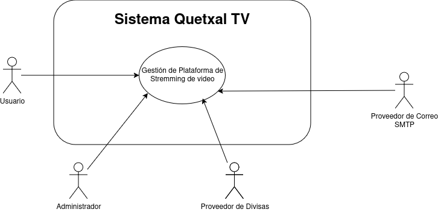
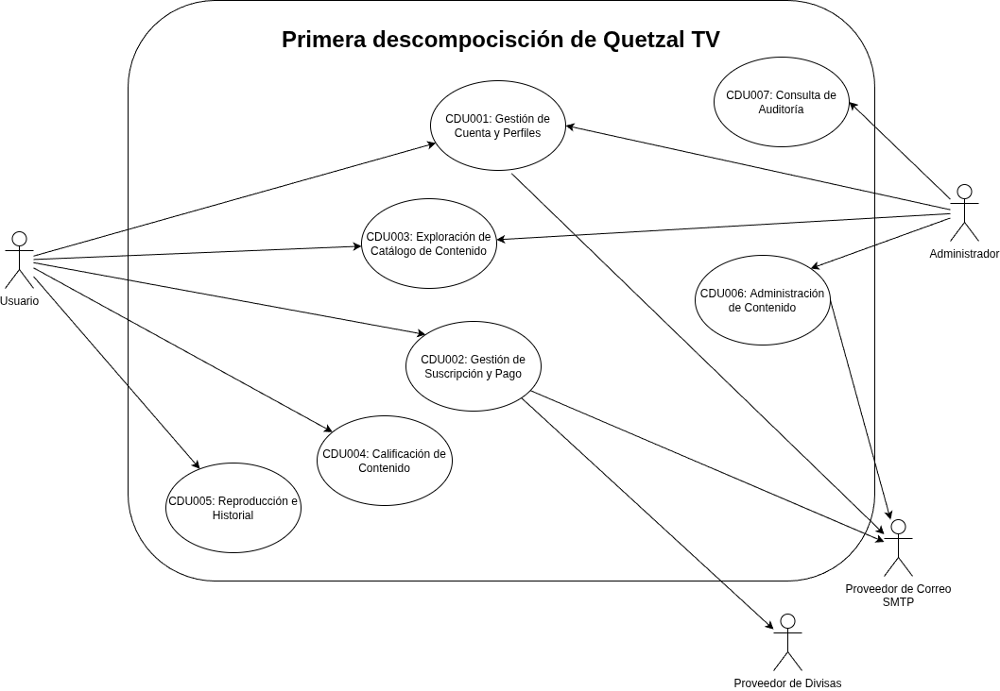
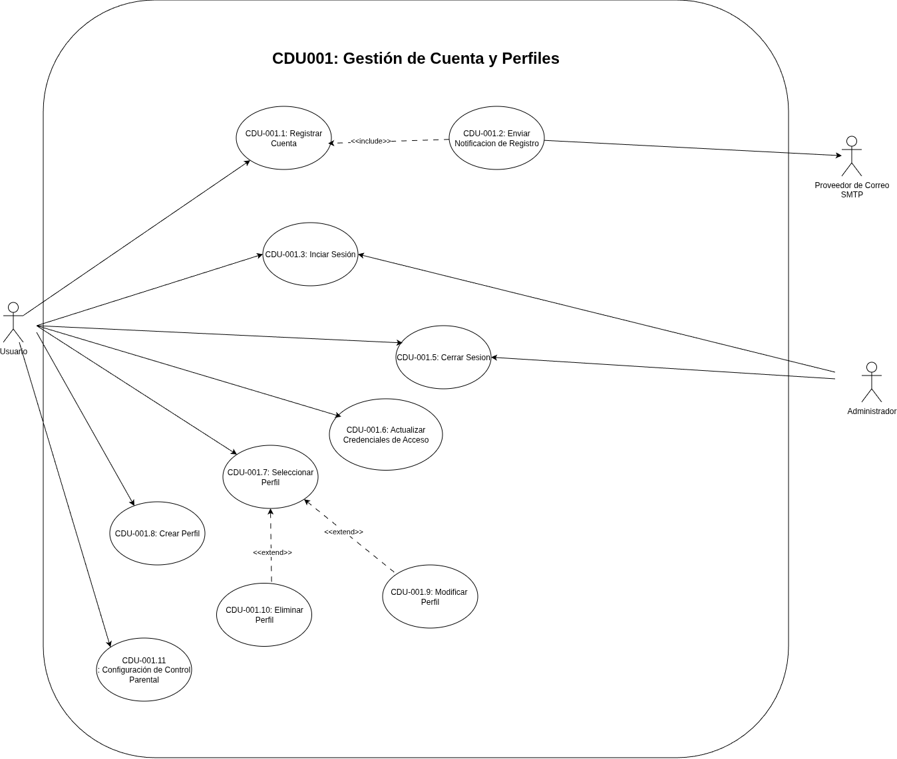
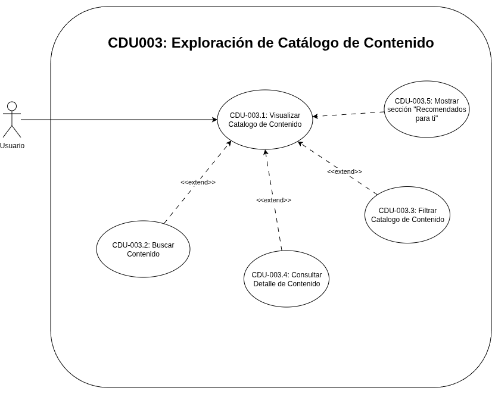
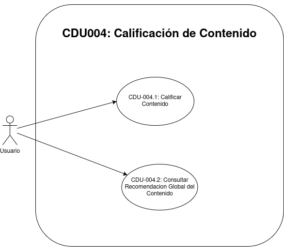
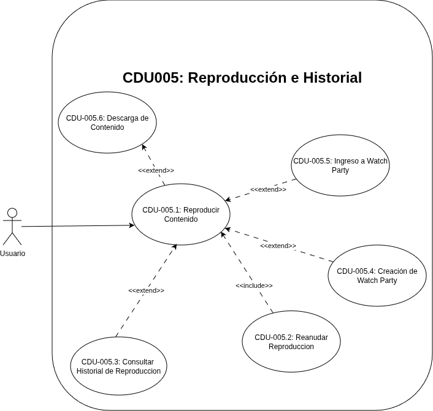
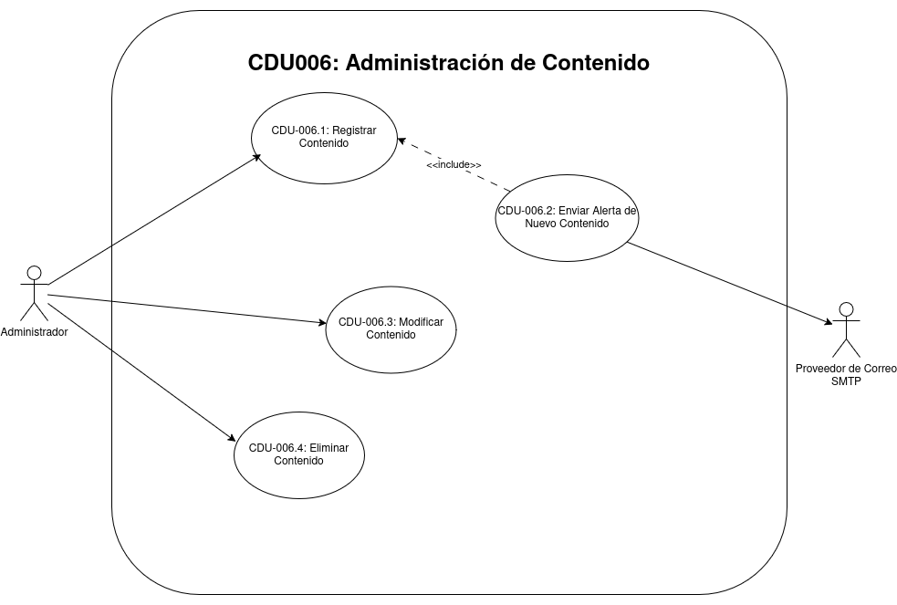
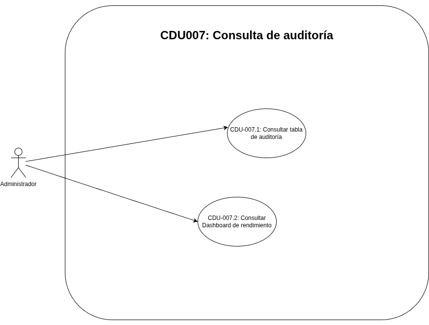

# Casos de Uso

## Core del negocio
| Representación | Actor | Descripción |
|----|-------------|-------------|
|  | **Usuario** | Persona registrada en la plataforma que puede iniciar sesión, administrar perfiles y su control parental, gestionar su suscripción, explorar el catálogo y sus recomendaciones, reproducir o descargar contenido y participar en Watch Parties. |
|  | **Administrador** | Usuario con permisos especiales para gestionar el contenido de la plataforma, permitiendo registrar, modificar, eliminar películas o series y consultar la auditoría del catálogo. |
|  | **Proveedor de Divisas** | Servicio externo que suministra los tipos de cambio utilizados por la plataforma para mostrar precios en la moneda local del usuario. |
|  | **Proveedor de Correo SMTP** | Servicio externo encargado de entregar los correos de confirmación de registro, recibos de compra y alertas de nuevo contenido. |

## Casos de uso de alto nivel

## Primera descomposición

**CDU001**: **Gestión de Cuenta y Perfiles**: Agrupa las operaciones de registro, autenticación, administración de perfiles y configuración de control parental asociadas a una cuenta dentro de la plataforma.

**CDU002**: **Gestión de Suscripción y Pago**: Permite al usuario consultar planes, visualizar precios en moneda local y administrar su suscripción mediante el procesamiento de pagos.

**CDU003**: **Exploración de Catálogo de Contenido**: Permite al usuario explorar el catálogo, consultar la información detallada de películas y series y recibir recomendaciones personalizadas para su perfil.

**CDU004**: **Calificación de Contenido**: Permite al usuario emitir su valoración sobre una película o serie mediante like o dislike y consultar la recomendación global generada por la comunidad.

**CDU005**: **Reproducción e Historial**: Permite al usuario reproducir contenido, reanudarlo, consultar el historial del perfil activo, crear o ingresar a Watch Parties y guardar descargas simuladas cuando su plan lo permite.

**CDU006**: **Administración de Contenido**: Permite al administrador gestionar el catálogo de la plataforma mediante operaciones de registro, modificación y eliminación de películas o series.

**CDU007**: **Consulta de Auditoría del Catálogo**: Permite al administrador consultar los eventos críticos registrados por triggers sobre el catálogo, revisar cambios realizados y exportar la información para trazabilidad.

## Casos de uso expandidos

### Expandidos de CDU001: Gestión de Cuenta y Perfiles

- **CDU-001.1**: Registro de Cuenta
- **CDU-001.2**: Envío de Notificación de Registro
- **CDU-001.3**: Inicio de sesión
- **CDU-001.5**: Cierre de sesión
- **CDU-001.6**: Actualización de Credenciales de Acceso
- **CDU-001.7**: Selección de Perfil
- **CDU-001.8**: Creación de Perfil
- **CDU-001.9**: Modificación de Perfil
- **CDU-001.10**: Eliminación de Perfil
- **CDU-001.11**: Configuración de Control Parental

#### CDU-001.1 Registro de Cuenta

| Campo | Especificación |
|----|----|
| Nombre | Registro de Cuenta |
| Código | CDU-001.1 |
| Actores | Usuario |
| Descripción | Permite a un usuario crear una cuenta en la plataforma ingresando sus datos básicos y su ubicación para habilitar el acceso al sistema y la creación automática de su primer perfil. |
| Precondiciones | El usuario no debe tener una cuenta registrada con el mismo correo electrónico. |
| Postcondiciones | Cuenta registrada correctamente y perfil principal creado con el nombre de la cuenta. |
| Flujo principal | 1. El usuario ingresa nombre, correo, contraseña, confirmando su contraseña y ubicación. 2. El usuario confirma el registro. 3. El sistema valida la información. 4. El sistema crea la cuenta. 5. El sistema crea automáticamente el perfil principal usando el nombre de la cuenta. 6. El sistema confirma el registro exitoso. |
| Flujos alternos | FA1. El correo ya existe. FA1.1 El sistema informa que la cuenta ya está registrada. FA2. Faltan datos obligatorios. FA2.1 El sistema resalta los campos requeridos. |
| Flujos de excepción | FE1. Error de conexión con la base de datos. FE1.1 El sistema informa que no fue posible completar el registro. Intenta nuevamente. FE2. El servicio de notificaciones no responde (timeout SMTP). FE2.1 El sistema registra el fallo de envío de correo de bienvenida, pero confirma el registro exitoso. |
| Reglas de negocio | El correo debe ser único en la plataforma. La ubicación debe registrarse como parte de la cuenta. La cuenta debe crear un perfil principal automáticamente. El nombre del primer perfil debe corresponder al nombre de la cuenta registrada. |
| Reglas de calidad | El formulario debe validar campos obligatorios antes del envío. La confirmación del registro debe mostrarse en un tiempo razonable. |

#### CDU-001.2 Envío de Notificación de Registro

| Campo | Especificación |
|----|----|
| Nombre | Envío de Notificación de Registro |
| Código | CDU-001.2 |
| Actores | Usuario, Proveedor de Correo SMTP |
| Descripción | Permite al sistema enviar un correo de confirmación al usuario luego de completar el registro de cuenta de forma satisfactoria. |
| Precondiciones | La cuenta debe haberse registrado correctamente y el correo electrónico debe estar disponible. |
| Postcondiciones | Correo de bienvenida enviado; o fallo de envío registrado por el sistema. |
| Flujo principal | 1. El sistema detecta que el registro fue exitoso. 2. El sistema construye el mensaje de bienvenida. 3. El sistema realiza el envío al usuario.  |
| Flujos alternos | FA1. El proveedor SMTP no responde o rechaza la solicitud. FA1.1 El servicio SMPT registra el fallo de envío. FA2. El correo de destino es inválido. |
| Flujos de excepción | FE1. Error de conexión con la base de datos. FE1.1 El sistema registra el fallo de envío sin reintentar. FE2. Timeout del proveedor SMTP. FE2.1 El sistema marca la notificación como fallida y continúa. |
| Reglas de negocio | El correo de bienvenida solo se envía después de un registro exitoso. El mensaje debe estar asociado a la cuenta recién creada. |
| Reglas de calidad | El envío no debe bloquear la confirmación visual del registro. |

#### CDU-001.3 Inicio de sesión

| Campo | Especificación |
|----|----|
| Nombre | Inicio de sesión |
| Código | CDU-001.3 |
| Actores | Usuario, Administrador |
| Descripción | Permite a un usuario o administrador autenticarse en la plataforma mediante sus credenciales registradas para acceder a las funciones disponibles de su cuenta. |
| Precondiciones | El usuario o administrador debe tener una cuenta registrada y activa. |
| Postcondiciones | Sesión iniciada correctamente; o acceso denegado por credenciales inválidas. |
| Flujo principal | 1. El usuario o administrador ingresa su correo y contraseña. 2. El usuario o administrador confirma el inicio de sesión. 3. El sistema valida las credenciales. 4. El sistema crea la sesión segura de la cuenta. 5. El sistema muestra acceso a la cuenta. |
| Flujos alternos | FA1. Credenciales incorrectas. FA1.1 El sistema informa que las credenciales son inválidas.|
| Flujos de excepción | FE1. Error de conexión con la base de datos. FE1.1 El sistema informa que no fue posible validar las credenciales. Intenta nuevamente. FE2. Token inválido o sesión expirada. FE2.1 El sistema redirige al usuario a la pantalla de inicio de sesión. |
| Reglas de negocio | Solo cuentas registradas pueden iniciar sesión con correo y contraseña. La sesión debe quedar asociada a una cuenta válida. |
| Reglas de calidad | Las credenciales no deben mostrarse en texto plano. El sistema debe informar errores sin exponer detalles sensibles. |

#### CDU-001.5 Cierre de sesión

| Campo | Especificación |
|----|----|
| Nombre | Cierre de sesión |
| Código | CDU-001.5 |
| Actores | Usuario, Administrador |
| Descripción | Permite al usuario o administrador cerrar su sesión activa para finalizar de forma segura el acceso a la plataforma desde el dispositivo actual. |
| Precondiciones | El usuario o administrador debe tener una sesión activa. |
| Postcondiciones | Sesión cerrada correctamente e invalidada en el cliente; o la solicitud no se procesa por ausencia de sesión válida. |
| Flujo principal | 1. El usuario o administrador selecciona cerrar sesión. 2. El sistema verifica la sesión activa. 3. El sistema invalida el token de sesión. 4. El sistema redirige a la pantalla pública de acceso. |
| Flujos alternos | FA1.1 El sistema fuerza la salida y redirige a la pantalla de acceso. |
| Flujos de excepción | FE1. Error de conexión con la base de datos. FE1.1 El sistema invalida el token localmente y redirige a la pantalla de acceso. FE2. Token inválido o ya expirado. FE2.1 El sistema redirige a la pantalla de acceso. |
| Reglas de negocio | El cierre de sesión debe invalidar el token activo del usuario. La salida debe aplicarse sobre la sesión actual. |
| Reglas de calidad | El cierre de sesión debe ser inmediato y visible para el usuario. El token no debe permanecer activo en el cliente. |

#### CDU-001.6 Actualización de Credenciales de Acceso

| Campo | Especificación |
|----|----|
| Nombre | Actualización de Credenciales de Acceso |
| Código | CDU-001.6 |
| Actores | Usuario |
| Descripción | Permite al usuario actualizar la contraseña asociada a su cuenta desde la configuración para mantener segura su información de acceso. |
| Precondiciones | El usuario debe haber iniciado sesión. |
| Postcondiciones | Contraseña actualizada correctamente; o actualización rechazada por datos inválidos. |
| Flujo principal | 1. El usuario accede a la configuración de cuenta. 2. El usuario ingresa la contraseña actual.  3. El usuario ingresa la nueva contraseña y la reescribe para confirmar. 4. El sistema valida la información proporcionada. 5. El sistema actualiza la contraseña asociada a la cuenta. 6. El sistema confirma la actualización. |
| Flujos alternos | FA1. La nueva contraseña no cumple la validacion de tener la misma. FA1.1 El sistema rechaza la actualización de la contraseña. |
| Flujos de excepción | FE1. Error de conexión con la base de datos. FE1.1 El sistema informa que no fue posible actualizar la contraseña. Intenta nuevamente. FE2. Sesión expirada durante el proceso. FE2.1 El sistema redirige al usuario a la pantalla de inicio de sesión. |
| Reglas de negocio | La contraseña debe cumplir la política de seguridad definida por la plataforma. La nueva contraseña debe ser diferente de la contraseña actual. |
| Reglas de calidad | La actualización debe requerir validaciones claras para el usuario. La información sensible no debe exponerse en pantalla ni en registros. |

#### CDU-001.7 Selección de Perfil

| Campo | Especificación |
|----|----|
| Nombre | Selección de Perfil |
| Código | CDU-001.7 |
| Actores | Usuario |
| Descripción | Permite al usuario elegir uno de los perfiles asociados a su cuenta para navegar con preferencias, historial y valoraciónes aisladas. |
| Precondiciones | El usuario debe haber iniciado sesión y contar con al menos un perfil asociado a su cuenta con su plan de pago. |
| Postcondiciones | Perfil activo seleccionado correctamente. |
| Flujo principal | 1. El sistema muestra los perfiles asociados a la cuenta. 2. El usuario selecciona un perfil disponible. 3. El sistema activa el perfil elegido. 4. El sistema habilita la navegación con el contexto del perfil activo. |
| Flujos alternos |  FA1. El perfil seleccionado ya no se encuentra disponible. FA2.1 El sistema identifica que ya no existe y en la siguiente interacción selecciona automaticamente otro perfil. |
| Flujos de excepción | FE1. Error de conexión con la base de datos. FE1.1 El sistema informa que no fue posible cargar los perfiles. Intenta nuevamente. FE2. Sesión expirada. FE2.1 El sistema redirige al usuario a la pantalla de inicio de sesión. |
| Reglas de negocio | Toda cuenta debe contar con al menos un perfil creado automáticamente al momento del registro. Un usuario solo puede seleccionar perfiles de su propia cuenta. Cada perfil debe mantener su información aislada. |
| Reglas de calidad | La selección debe mostrar claramente cuál perfil quedo activo. El cambio de perfil no debe mezclar historiales ni preferencias. |

#### CDU-001.8 Creación de Perfil

| Campo | Especificación |
|----|----|
| Nombre | Creación de Perfil |
| Código | CDU-001.8 |
| Actores | Usuario |
| Descripción | Permite al usuario crear perfiles adicionales dentro de su cuenta para separar preferencias, historial de reproducción y calificaciónes. |
| Precondiciones | El usuario debe haber iniciado sesión, haber adquirido un plan y no haber alcanzado el limite de perfiles permitidos. |
| Postcondiciones | Perfil creado correctamente; o creación rechazada por datos inválidos. |
| Flujo principal | 1. El usuario accede a la gestión de perfiles. 2. El usuario ingresa nombre y color del perfil. 3. El sistema valida la información ingresada. 4. El sistema crea el nuevo perfil.  5. El usuario puede seleccionar el perfil como el principal o no seleccionarlo. 5. El sistema muestra la creación del perfil. |
| Flujos alternos | FA1. Inhabilita la posibilidad de agregar mas perfiles. FA2. Falta el nombre del perfil. FA2.1 El sistema solicita completar el dato obligatorio. |
| Flujos de excepción | FE1. Error de conexión con la base de datos. FE1.1 El sistema informa que no fue posible crear el perfil. Intenta nuevamente. FE2. Sesión expirada. FE2.1 El sistema redirige al usuario a la pantalla de inicio de sesión. |
| Reglas de negocio | Una cuenta puede tener como máximo cinco perfiles, pero depende del plan escogido. Cada perfil debe pertenecer a una única cuenta. |
| Reglas de calidad | La creación debe completarse con validaciones simples y claras. La respuesta del sistema debe indicar el resultado de la operación. |

#### CDU-001.9 Modificación de Perfil

| Campo | Especificación |
|----|----|
| Nombre | Modificación de Perfil |
| Código | CDU-001.9 |
| Actores | Usuario |
| Descripción | Permite al usuario modificar la información visible de uno de sus perfiles para actualizar su identificación dentro de la cuenta. |
| Precondiciones | El usuario debe haber iniciado sesión, tener un plan de pago y el perfil a modificar debe pertenecer a su cuenta. |
| Postcondiciones | Perfil actualizado correctamente; o modificación rechazada por datos inválidos o perfil no autorizado. |
| Flujo principal | 1. El usuario ingresa al panel de perfiles y selecciona la opción de administrar perfiles. 2. El usuario selecciona un perfil a editar. 3. El usuario modifica nombre o color del perfil. 4. El sistema valida la información. 5. El sistema guarda los cambios. 6. El sistema muestra la actualización del perfil. |
| Flujos alternos | FA1. El usuario puede cambiar el perfil principal a otro.  |
| Flujos de excepción | FE1. Error de conexión con la base de datos. FE1.1 El sistema informa que no fue posible modificar el perfil. Intenta nuevamente. FE2. Sesión expirada. FE2.1 El sistema redirige al usuario a la pantalla de inicio de sesión. |
| Reglas de negocio | Solo pueden modificarse perfiles pertenecientes a la cuenta autenticada. La modificación no debe afectar el historial ni las calificaciónes existentes. |
| Reglas de calidad | La actualización debe reflejarse inmediatamente en la interfaz. Los cambios deben conservar la integridad de la información del perfil. |

#### CDU-001.10 Eliminación de Perfil

| Campo | Especificación |
|----|----|
| Nombre | Eliminación de Perfil |
| Código | CDU-001.10 |
| Actores | Usuario |
| Descripción | Permite al usuario eliminar perfiles adicionales de su cuenta cuando ya no desea conservar su historial y preferencias asociadas. |
| Precondiciones | El usuario debe haber iniciado sesión, tener un plan de pago y el perfil debe pertenecer a su cuenta. |
| Postcondiciones | Perfil eliminado correctamente; o eliminación rechazada por restricciones de negocio o falta de autorización. |
| Flujo principal | 1. El usuario ingresa al panel de perfiles y selecciona la opción de administrar perfiles.   2. El usuario selecciona el perfil que desea eliminar. 3. El sistema solicita confirmación de la acción. 4. El usuario confirma la eliminación. 5. El sistema elimina el perfil seleccionado. 6. El sistema informa el resultado de la operación. |
| Flujos alternos | FA1. El usuario cancela la confirmación. FA1.1 El sistema no realiza cambios. FA2. El perfil seleccionado corresponde al perfil principal de la cuenta. FA2.1 El sistema inhabilita la opcion de poder eliminar el perfil principal. |
| Flujos de excepción | FE1. Error de conexión con la base de datos. FE1.1 El sistema informa que no fue posible eliminar el perfil. Intenta nuevamente. FE2. Sesión expirada. FE2.1 El sistema redirige al usuario a la pantalla de inicio de sesión. |
| Reglas de negocio | Una cuenta debe conservar al menos un perfil activo. Solo se pueden eliminar perfiles pertenecientes a la cuenta autenticada. El perfil principal creado automáticamente con la cuenta no puede eliminarse. |
| Reglas de calidad | La confirmación debe prevenir eliminaciónes accidentales. El sistema debe notificar claramente si la eliminación fue exitosa o rechazada. |

#### CDU-001.11 Configuración de Control Parental

| Campo | Especificación |
|----|----|
| Nombre | Configuración de Control Parental |
| Código | CDU-001.11 |
| Actores | Usuario |
| Descripción | Permite al usuario configurar o retirar un PIN restrictivo y definir la clasificación máxima que uno de sus perfiles puede reproducir sin solicitar dicho PIN. |
| Precondiciones | El usuario debe haber iniciado sesión y el perfil que desea configurar debe pertenecer a su cuenta. La configuración se realiza al editar un perfil existente. |
| Postcondiciones | El PIN queda almacenado de forma protegida y el nivel de control parental queda asociado al perfil; o ambos quedan desactivados cuando el usuario retira el PIN. |
| Flujo principal | 1. El usuario ingresa a la administración de perfiles. 2. El usuario habilita administración de perfiles y abre la edición del perfil deseado. 3. El usuario activa el PIN restrictivo. 4. El usuario ingresa un PIN numérico de cuatro dígitos. 5. El usuario selecciona la clasificación máxima permitida sin PIN: TP, PG-13 o R. 6. El usuario guarda los cambios. 7. El sistema valida y almacena el PIN cifrado mediante hash. 8. El sistema asocia el nivel seleccionado al perfil y confirma su actualización. |
| Flujos alternos | FA1. El usuario desactiva el PIN restrictivo. FA1.1 El sistema limpia el PIN y el nivel de control parental del perfil. FA2. El contenido seleccionado para reproducir supera el nivel configurado. FA2.1 El sistema solicita el PIN antes de reproducir, reanudar o crear una Watch Party. FA3. El usuario cancela la solicitud del PIN durante la reproducción. FA3.1 El sistema no ejecuta la acción protegida. |
| Flujos de excepción | FE1. El PIN no contiene exactamente cuatro dígitos numéricos. FE1.1 El sistema rechaza la configuración e informa la validación requerida. FE2. El perfil no existe o no pertenece a la cuenta autenticada. FE2.1 El sistema informa que el perfil no fue encontrado. FE3. La sesión expiró o falla la persistencia de la configuración. FE3.1 El sistema no completa la operación y muestra el error correspondiente. |
| Reglas de negocio | El PIN debe contener exactamente cuatro dígitos y se almacena mediante hash, no en texto plano. Los únicos niveles admitidos son TP, PG-13 y R. El PIN se solicita únicamente cuando el contenido tiene una clasificación superior al nivel del perfil y el perfil conserva tanto PIN como nivel configurado. La configuración solo puede modificarse desde la cuenta propietaria del perfil. |
| Reglas de calidad | El campo de PIN debe ocultar su valor y aceptar únicamente caracteres numéricos. La interfaz debe explicar qué contenidos requerirán PIN según el nivel seleccionado. La configuración actualizada debe reflejarse en el perfil activo sin mezclar restricciones entre perfiles. |

### Expandidos de CDU002: Gestión de Suscripción y Pago

- **CDU-002.1**: Visualización de Planes Disponibles
- **CDU-002.2**: Consulta de Tipo de Cambio de Moneda
- **CDU-002.3**: Contratación de Suscripción
- **CDU-002.4**: Modificación de Plan de Suscripción
- **CDU-002.5**: Cancelación de Suscripción
- **CDU-002.6**: Procesamiento de Pago
- **CDU-002.7**: Envío de Recibo de Compra

#### CDU-002.1 Visualización de Planes Disponibles

| Campo | Especificación |
|----|----|
| Nombre | Visualización de Planes Disponibles |
| Código | CDU-002.1 |
| Actores | Usuario |
| Descripción | Permite al usuario consultar los planes de suscripción disponibles con sus características y precio base antes de iniciar la contratación o modificación de plan. |
| Precondiciones | El usuario debe haber iniciado sesión. |
| Postcondiciones | Planes disponibles mostrados correctamente; o consulta no completada por falta de información disponible. |
| Flujo principal | 1. El usuario accede a la sección de ver planes de pago. 2. El sistema consulta los planes disponibles. 3. El sistema muestra nombre, características y precio base de cada plan. 4. El usuario revisa las opciones presentadas. |
| Flujos alternos | FA1. No existen planes configurados. FA1.1 El sistema informa que no hay planes disponibles. FA2. Ocurre un error al cargar la información. FA2.1 El sistema informa que no pudo mostrar los planes. |
| Flujos de excepción | FE1. Error de conexión con la base de datos. FE1.1 El sistema informa que no fue posible cargar los planes. Intenta nuevamente. FE2. Servicio no disponible (error 500). FE2.1 El sistema informa que ocurrió un error interno. Intenta nuevamente más tarde. |
| Reglas de negocio | Solo deben mostrarse planes vigentes y habilitados. La visualización debe incluir las características principales del plan y su precio base. |
| Reglas de calidad | La carga de planes debe ser clara y comprensible. Los precios deben presentarse de forma legible para el usuario. |

#### CDU-002.2 Consulta de Tipo de Cambio de Moneda

| Campo | Especificación |
|----|----|
| Nombre | Consulta de Tipo de Cambio de Moneda |
| Código | CDU-002.2 |
| Actores | Usuario, Proveedor de Divisas |
| Descripción | Permite al sistema obtener el tipo de cambio necesario para mostrar al usuario el valor del plan en la moneda local correspondiente a la ubicación registrada en su cuenta cuando inicia el proceso de compra o modificación de plan. |
| Precondiciones | El usuario debe haber seleccionado un plan e iniciado el flujo de compra o modificación, y el proveedor de divisas debe estar disponible. |
| Postcondiciones | Tipo de cambio consultado y precio convertido; o precio mostrado con información no actualizada o no disponible. |
| Flujo principal | 1. El usuario selecciona un plan e inicia el proceso de compra o modificación de plan. 2. El sistema obtiene la ubicación registrada del usuario. 3. El sistema identifica la moneda local correspondiente a esa ubicación. 4. El sistema solicita el tipo de cambio al proveedor de divisas. 5. El proveedor responde con la tasa vigente. 6. El sistema calcula el valor convertido. 7. El sistema muestra el monto en moneda local dentro del flujo de pago. |
| Flujos alternos | FA1. El proveedor de divisas no responde. FA1.1 El sistema usa información en caché si está disponible.  FA2.2 El sistema no encuentra la divisa del usuario y cobra en dólares|
| Flujos de excepción | FE1. Error de conexión con Redis o PostgreSQL (cache de divisas). FE1.1 El sistema consulta directamente la API externa de divisas. FE2. API externa de divisas no responde (timeout). FE2.1 El sistema informa que no fue posible obtener el tipo de cambio y muestra el precio en USD. FE3. Error de conexión con la base de datos. FE3.1 El sistema informa que no fue posible consultar la ubicación del usuario. |
| Reglas de negocio | La conversion depende de la moneda local asociada a la ubicación registrada del usuario. La tasa obtenida puede reutilizarse desde caché según la política vigente. |
| Reglas de calidad | La consulta de tipo de cambio no debe degradar el flujo de compra. La conversion mostrada debe ser consistente dentro de la misma operación. |

#### CDU-002.3 Contratación de Suscripción

| Campo | Especificación |
|----|----|
| Nombre | Contratación de Suscripción |
| Código | CDU-002.3 |
| Actores | Usuario |
| Descripción | Permite al usuario seleccionar un plan y solicitar la activación de una suscripción para obtener acceso al contenido de la plataforma. |
| Precondiciones | El usuario debe haber iniciado sesión y debe existir al menos un plan disponible para contratar. |
| Postcondiciones | Suscripción creada o pendiente de confirmación de pago; o contratación rechazada por error de validación o cobro. |
| Flujo principal | 1. El usuario previamente ha seleccionado un plan. 2. El sistema muestra el resumen de la contratación. 3. El usuario llena un formulario con sus datos de pago y confirma la compra . 4. El sistema inicia el flujo de pago asociado. 5. El sistema registra la solicitud de suscripción. 6. El usuario recibe una confirmacion por correo y es redirigido a una página de confirmación. |
| Flujos alternos |FA2. El usuario cancela la operación. FA2.1 El sistema cierra el flujo sin cambios. |
| Flujos de excepción | FE1. Error de conexión con la base de datos. FE1.1 El sistema informa que no fue posible registrar la suscripción. Intenta nuevamente. FE2. Error en el procesamiento de pago. FE2.1 El sistema informa que el pago fue rechazado y no activa la suscripción. |
| Reglas de negocio | La suscripción solo puede activarse si el plan está vigente. La contratación debe quedar vinculada a la cuenta autenticada. |
| Reglas de calidad | El resumen de compra debe ser claro antes de confirmar. La plataforma debe informar el estado de la contratación de forma visible. |

#### CDU-002.4 Modificación de Plan de Suscripción

| Campo | Especificación |
|----|----|
| Nombre | Modificación de Plan de Suscripción |
| Código | CDU-002.4 |
| Actores | Usuario |
| Descripción | Permite al usuario cambiar su plan activo por otro disponible desde la administración de la cuenta. |
| Precondiciones | El usuario debe haber iniciado sesión y contar con una suscripción activa. |
| Postcondiciones | Plan actualizado correctamente o pendiente de pago; o solicitud rechazada por restricciones de negocio o error de cobro. |
| Flujo principal | 1. El usuario consulta su suscripción activa desde las configuraciones de su cuenta. 2. El usuario selecciona un nuevo plan disponible. 3. El sistema muestra las condiciones del cambio. 4. El usuario confirma la modificación. 5. El sistema procesa la actualización correspondiente. |
| Flujos alternos | FA2. El usuario cancela la confirmación. FA2.1 El sistema no realiza cambios. |
| Flujos de excepción | FE1. Error de conexión con la base de datos. FE1.1 El sistema informa que no fue posible modificar el plan. Intenta nuevamente. FE2. Error en el procesamiento de pago. FE2.1 El sistema informa que el pago fue rechazado y mantiene el plan actual. |
| Reglas de negocio | Solo puede modificarse una suscripción activa. El cambio debe aplicarse a un plan vigente y permitido. |
| Reglas de calidad | La diferencia entre el plan actual y el nuevo plan debe mostrarse claramente. El resultado del cambio debe reflejarse en la cuenta sin ambigüedad. |

#### CDU-002.5 Cancelación de Suscripción

| Campo | Especificación |
|----|----|
| Nombre | Cancelación de Suscripción |
| Código | CDU-002.5 |
| Actores | Usuario |
| Descripción | Permite al usuario cancelar su suscripción activa desde la configuración de cuenta para detener futuras renovacíones o cobros asociados. |
| Precondiciones | El usuario debe haber iniciado sesión y tener una suscripción activa. |
| Postcondiciones | Suscripción cancelada correctamente; o cancelación rechazada por estado inválido o error del sistema. |
| Flujo principal | 1. El usuario accede a la administración de su suscripción desde los ajustes de su cuenta. 2. El usuario selecciona la opción de cancelar. 3. El sistema muestra las implicaciones de la cancelación. 4. El usuario confirma la solicitud. 5. El sistema actualiza el estado de la suscripción. |
| Flujos alternos | FA1. El usuario cancela la confirmación. FA1.1 El sistema no realiza cambios.|
| Flujos de excepción | FE1. Error de conexión con la base de datos. FE1.1 El sistema informa que no fue posible cancelar la suscripción. Intenta nuevamente. |
| Reglas de negocio | Solo puede cancelarse una suscripción vigente. La cuenta debe conservar el estado real de la suscripción después del proceso. |
| Reglas de calidad | La acción de cancelación debe requerir confirmación explícita. El sistema debe mostrar el estado final de la suscripción de forma clara. |

#### CDU-002.6 Procesamiento de Pago

| Campo | Especificación |
|----|----|
| Nombre | Procesamiento de Pago |
| Código | CDU-002.6 |
| Actores | Usuario |
| Descripción | Permite al sistema registrar el cobro correspondiente a la contratación o modificación de un plan de suscripción mediante el procesamiento interno de pago. |
| Precondiciones | El usuario debe haber seleccionado una suscripción. |
| Postcondiciones | Pago registrado correctamente; o pago rechazado, cancelado o pendiente de confirmación. |
| Flujo principal | 1. El sistema presenta el resumen del pago al usuario. 2. El usuario llena un formulario con los datos de pago. 3. El usuario confirma la operación de pago. 4. El sistema valida los datos de la operación. 5. El sistema registra la transacción con estado correspondiente. 6. El sistema confirma el resultado al usuario. |
| Flujos alternos | FA1. El sistema rechaza la transacción por datos inválidos. FA1.1 El sistema informa que el pago fue rechazado. FA2. El usuario abandona el flujo de pago. FA2.1 El sistema cancela la operación asociada. |
| Flujos de excepción | FE1. Error de conexión con la base de datos. FE1.1 El sistema informa que no fue posible registrar el pago. Intenta nuevamente. FE2. Servicio de divisas no responde. FE2.1 El sistema informa que no fue posible calcular el monto en moneda local. FE3. Servicio de notificaciones no responde. FE3.1 El sistema registra el pago pero informa que no fue posible enviar el recibo por correo. |
| Reglas de negocio | El pago debe asociarse a una operación válida de suscripción. La activación o cambio del plan depende del resultado del registro de pago. |
| Reglas de calidad | El resultado de la transacción debe notificarse claramente al usuario. El registro de pago no debe bloquear la operación principal. |

#### CDU-002.7 Envío de Recibo de Compra

| Campo | Especificación |
|----|----|
| Nombre | Envío de Recibo de Compra |
| Código | CDU-002.7 |
| Actores | Usuario, Proveedor de Correo SMTP |
| Descripción | Permite al sistema enviar al usuario el comprobante de la operación de compra una vez confirmado el pago de su suscripción o modificación de plan. |
| Precondiciones | Debe existir una compra confirmada y un correo electrónico asociado a la cuenta del usuario. |
| Postcondiciones | Recibo enviado correctamente; o fallo de envío registrado por el sistema. |
| Flujo principal | 1. El sistema detecta que la compra fue confirmada. 2. El sistema prepara el recibo con el detalle de la operación. 3. El sistema solicita el envío al proveedor SMTP. 4. El servicio confirma el procesamiento del mensaje. 5. El sistema muestra el resultado del envío y permite descargar la constancia. |
| Flujos alternos | FA1. El proveedor SMTP no responde o rechaza la solicitud. FA1.1 El sistema registra el fallo de envío. FA2. No existe correo asociado a la cuenta. FA2.1 El sistema registra la imposibilidad de envío. |
| Flujos de excepción | FE1. Error de conexión con la base de datos. FE1.1 El sistema registra el fallo de envío sin reintentar. FE2. Timeout del proveedor SMTP. FE2.1 El sistema marca el recibo como no enviado y continúa. |
| Reglas de negocio | El recibo solo se envía cuando la compra ha sido confirmada. El detalle del recibo debe corresponder a la operación realizada. |
| Reglas de calidad | El envío del recibo no debe bloquear la confirmación de la compra al usuario. Los errores de envío deben quedar registrados para trazabilidad. |

### Expandidos de CDU003: Exploración de Catálogo de Contenido

- **CDU-003.1**: Visualización de Catálogo de Contenido
- **CDU-003.2**: Búsqueda de Contenido
- **CDU-003.3**: Filtrado de Catálogo de Contenido
- **CDU-003.4**: Consulta de Detalle de Contenido
- **CDU-003.5**: Mostrar sección "Recomendados para ti"

#### CDU-003.1 Visualización de Catálogo de Contenido

| Campo | Especificación |
|----|----|
| Nombre | Visualización de Catálogo de Contenido |
| Código | CDU-003.1 |
| Actores | Usuario |
| Descripción | Permite al usuario visualizar el conjunto de películas y series disponibles en la plataforma junto con su información básica de presentación. |
| Precondiciones | El usuario debe haber iniciado sesión, tener un perfil activo seleccionado y haber adquirido alguno de los planes de pago. |
| Postcondiciones | Catálogo mostrado correctamente. |
| Flujo principal | 1. El usuario accede a la sección principal del catálogo. 2. El sistema consulta el contenido disponible. 3. El sistema muestra la cartelera con títulos, portadas, calificacion, el tipo de contenido y fecha . 4. El usuario navega entre los elementos mostrados.  5. El usuario puede filtrar seleccionando mediante peliculas, series y su genero.   6. El usuario puede ver el detalle de cada contenido.   7. El usuario puede reproducir el contenido. |
| Flujos alternos | FA1. No existe contenido disponible. FA1.1 El sistema informa que el catálogo está vacío. FA2. Ocurre un error de carga. FA2.1 El sistema informa que no pudo mostrar el catálogo. |
| Flujos de excepción | FE1. Error de conexión con la base de datos. FE1.1 El sistema informa que no fue posible cargar el catálogo. Intenta nuevamente. FE2. Error interno del servidor (500). FE2.1 El sistema informa que ocurrió un error inesperado. Intenta nuevamente más tarde. |
| Reglas de negocio | Solo debe mostrarse contenido disponible para la plataforma. La información básica del catálogo debe corresponder al contenido vigente. |
| Reglas de calidad | El catálogo debe cargarse de manera clara y ordenada. La navegación debe ser legible tanto en escritorio como en pantallas reducidas. |

#### CDU-003.2 Búsqueda de Contenido

| Campo | Especificación |
|----|----|
| Nombre | Búsqueda de Contenido |
| Código | CDU-003.2 |
| Actores | Usuario |
| Descripción | Permite al usuario localizar películas o series dentro del catálogo mediante criterios de texto relacionados con el titulo del contenido. |
| Precondiciones | El usuario debe haber iniciado sesión y tener acceso al catálogo. |
| Postcondiciones | Resultados de búsqueda mostrados correctamente; o lista vacía cuando no existen coincidencias. |
| Flujo principal | 1. El usuario ingresa un criterio de búsqueda. 2. El sistema procesa el término ingresado. 3. El sistema consulta los títulos de los contenidos que coinciden. 4. El sistema muestra los resultados encontrados. |
| Flujos alternos | FA1. No existen coincidencias. FA1.1 El sistema informa que no se encontraron resultados.|
| Flujos de excepción | FE1. Error de conexión con la base de datos. FE1.1 El sistema informa que no fue posible realizar la búsqueda. Intenta nuevamente. FE2. Timeout en la búsqueda. FE2.1 El sistema informa que la búsqueda tardó demasiado. Intenta con un criterio más específico. |
| Reglas de negocio | La búsqueda debe operar sobre el contenido disponible en la plataforma. Los resultados deben corresponder a coincidencias con el criterio ingresado. |
| Reglas de calidad | La respuesta de búsqueda debe ser rápida y comprensible. Los resultados deben presentarse con un formato consistente con el catálogo. |

#### CDU-003.3 Filtrado de Catálogo de Contenido

| Campo | Especificación |
|----|----|
| Nombre | Filtrado de Catálogo de Contenido |
| Código | CDU-003.3 |
| Actores | Usuario |
| Descripción | Permite al usuario restringir la visualización del catálogo según géneros o tipos de contenido para ubicar contenido acorde a sus intereses o necesidades de consulta. |
| Precondiciones | El usuario debe haber iniciado sesión y tener acceso al catálogo. |
| Postcondiciones | Catálogo filtrado mostrado correctamente; o sin resultados cuando el criterio aplicado no encuentra coincidencias. |
| Flujo principal | 1. El usuario selecciona uno o más criterios de filtrado. 2. El sistema aplica los filtros elegidos. 3. El sistema consulta los contenidos que cumplen los criterios. 4. El sistema muestra el catálogo filtrado. |
| Flujos alternos | FA1. Ningún contenido coincide con los filtros. FA1.1 El sistema informa que no existen resultados|
| Flujos de excepción | FE1. Error de conexión con la base de datos. FE1.1 El sistema informa que no fue posible aplicar los filtros. Intenta nuevamente. |
| Reglas de negocio | Los filtros solo deben aplicarse sobre categorías y géneros configurados. La combinación de filtros debe respetar el contenido disponible. |
| Reglas de calidad | La aplicación de filtros debe ser clara e intuitiva. El usuario debe poder identificar fácilmente los filtros activos. |

#### CDU-003.4 Consulta de Detalle de Contenido

| Campo | Especificación |
|----|----|
| Nombre | Consulta de Detalle de Contenido |
| Código | CDU-003.4 |
| Actores | Usuario |
| Descripción | Permite al usuario consultar la información detallada de una película o serie, incluyendo ficha técnica: sinopsis, género, director, idioma, subitutlos, clasificación, notas adicionales, junto a su ranking de recomendación. |
| Precondiciones | El usuario debe haber iniciado sesión y seleccionar un contenido existente del catálogo. |
| Postcondiciones | Detalle del contenido mostrado correctamente; o consulta rechazada por contenido inexistente o no disponible. |
| Flujo principal | 1. El usuario selecciona un contenido del catálogo. 2. El sistema consulta la información detallada del contenido. 3. El sistema muestra la ficha técnica  4. El usuario revisa la información presentada. |
| Flujos alternos | FA1. Ocurre un error al consultar la ficha. FA1.1 El sistema informa la imposibilidad de cargar el detalle. |
| Flujos de excepción | FE1. Contenido no encontrado en la base de datos (404). FE1.1 El sistema informa que el contenido no existe o fue retirado. FE2. Error de conexión con la base de datos. FE2.1 El sistema informa que no fue posible cargar el detalle. Intenta nuevamente. |
| Reglas de negocio | La información detallada debe corresponder al contenido seleccionado. Solo debe mostrarse información de contenido disponible en el catálogo. |
| Reglas de calidad | La ficha técnica debe presentarse de forma organizada y legible. La carga del detalle no debe romper la navegación del usuario. |

#### CDU-003.5 Mostrar sección "Recomendados para ti"

| Campo | Especificación |
|----|----|
| Nombre | Mostrar sección "Recomendados para ti" |
| Código | CDU-003.5 |
| Actores | Usuario |
| Descripción | Permite al usuario visualizar en el panel una fila de contenido recomendada específicamente para el perfil activo a partir de su historial, sus calificaciones y los géneros del catálogo. |
| Precondiciones | El usuario debe haber iniciado sesión, tener una suscripción activa y un perfil activo válido. |
| Postcondiciones | La sección muestra hasta diez contenidos ordenados por afinidad para el perfil; o se omite cuando no hay resultados o no se pueden obtener recomendaciones. |
| Flujo principal | 1. El usuario ingresa al panel con un perfil activo. 2. El sistema solicita hasta diez recomendaciones para el identificador del perfil. 3. El servicio de Streaming consulta los últimos 25 registros del historial, las calificaciones del perfil y el catálogo disponible. 4. El sistema calcula la afinidad por géneros, considerando la recencia, el avance, la finalización y las reacciones like o dislike. 5. El sistema excluye el contenido ya reproducido y ordena los candidatos por puntaje; en caso de empate, utiliza el porcentaje de recomendación global. 6. El panel muestra los resultados en la fila "Recomendados para ti". |
| Flujos alternos | FA1. El perfil no posee historial ni calificaciones. FA1.1 El sistema aplica un arranque en frío y ordena el catálogo no visto por su recomendación global, indicando que es popular en el catálogo. FA2. El usuario filtra el panel por películas o series. FA2.1 La sección conserva únicamente recomendaciones del tipo seleccionado. FA3. La lista resultante está vacía. FA3.1 El panel omite la fila "Recomendados para ti". |
| Flujos de excepción | FE1. No se puede consultar el historial, las calificaciones o el catálogo. FE1.1 El servicio informa que no pudo generar las recomendaciones. FE2. El frontend no puede obtener la respuesta del servicio de Streaming. FE2.1 El panel continúa mostrando las demás secciones y omite las recomendaciones personalizadas. |
| Reglas de negocio | Las recomendaciones se calculan por perfil y no se comparten entre perfiles de una cuenta. El contenido ya reproducido no vuelve a recomendarse. Un like incrementa la afinidad por los géneros relacionados y un dislike la reduce. La popularidad global participa en el puntaje de todos los candidatos. La consulta del panel solicita un máximo de diez recomendaciones. |
| Reglas de calidad | Un fallo del recomendador no debe impedir la carga del resto del catálogo. Los resultados deben conservar el formato visual de las demás filas del panel. El cálculo debe producir un orden estable y explicable por afinidad o popularidad. |

### Expandidos de CDU004: Calificación de Contenido

- **CDU-004.1**: Calificación de Contenido
- **CDU-004.2**: Consulta de Recomendación Global del Contenido

#### CDU-004.1 Calificación de Contenido

| Campo | Especificación |
|----|----|
| Nombre | Calificación de Contenido |
| Código | CDU-004.1 |
| Actores | Usuario |
| Descripción | Permite al usuario emitir una reacción de like o dislike sobre una película o serie desde el perfil activo de su cuenta. |
| Precondiciones | El usuario debe haber iniciado sesión, tener un perfil activo y seleccionar un contenido disponible. |
| Postcondiciones | Calificación registrada o actualizada correctamente; o acción rechazada por contenido inválido o perfil no autorizado. |
| Flujo principal | 1. El usuario accede al detalle de un contenido. 2. El usuario selecciona like o dislike. 3. El sistema valida la identidad del perfil activo. 4. El sistema registra o actualiza la calificación. 5. El sistema registra el criterio del usuario |
| Flujos alternos | FA1. El contenido no admite calificación por error de disponibilidad. FA1.1 El sistema rechaza la operación. FA2. El usuario cambia una calificación previa. FA2.1 El sistema reemplaza la reacción anterior por la nueva. |
| Flujos de excepción | FE1. Error de conexión con la base de datos. FE1.1 El sistema informa que no fue posible registrar la calificación. Intenta nuevamente. FE2. Sesión expirada. FE2.1 El sistema redirige al usuario a la pantalla de inicio de sesión. |
| Reglas de negocio | Cada perfil solo puede mantener una calificación vigente por contenido. La calificación puede actualizarse posteriormente. |
| Reglas de calidad | La reacción seleccionada debe reflejarse de forma inmediata en la interfaz. El sistema debe evitar registros duplicados para el mismo perfil y contenido. |

#### CDU-004.2 Consulta de Recomendación Global del Contenido

| Campo | Especificación |
|----|----|
| Nombre | Consulta de Recomendación Global del Contenido |
| Código | CDU-004.2 |
| Actores | Usuario |
| Descripción | Permite al usuario consultar la recomendación global de un contenido, calculada a partir de las reacciones positivas y negativas registradas por la comunidad. |
| Precondiciones | El contenido debe existir y contar con información de recomendación disponible. |
| Postcondiciones | Recomendación global mostrada correctamente; o indicador no disponible por falta de datos. |
| Flujo principal | 1. El usuario visualiza un contenido en el catálogo o su detalle. 2. El sistema obtiene la recomendación global asociada. 3. El sistema presenta el indicador consolidado al usuario. |
| Flujos alternos | FA1. El contenido aún no tiene calificaciónes. FA1.1 El sistema informa que no existe recomendación disponible. FA2. Ocurre un error al consultar el indicador. FA2.1 El sistema omite temporalmente la recomendación. |
| Flujos de excepción | FE1. Error de conexión con la base de datos. FE1.1 El sistema informa que no fue posible calcular la recomendación. Intenta nuevamente. FE2. Contenido sin calificaciones. FE2.1 El sistema informa que aún no hay recomendación disponible. |
| Reglas de negocio | La recomendación global debe basarse en las calificaciónes de la comunidad. El indicador debe corresponder al contenido consultado. |
| Reglas de calidad | El indicador debe mostrarse de forma clara y consistente en la interfaz. La consulta no debe afectar perceptiblemente la carga del catálogo. |

### Expandidos de CDU005: Reproducción e Historial

- **CDU-005.1**: Reproducción de Contenido
- **CDU-005.2**: Reanudación de Reproducción
- **CDU-005.3**: Consulta de Historial de Reproducción
- **CDU-005.4**: Creación de Watch Party
- **CDU-005.5**: Ingreso a Watch Party
- **CDU-005.6**: Descarga de Contenido

#### CDU-005.1 Reproducción de Contenido

| Campo | Especificación |
|----|----|
| Nombre | Reproducción de Contenido |
| Código | CDU-005.1 |
| Actores | Usuario |
| Descripción | Permite al usuario iniciar la reproducción de una película o serie disponible utilizando el perfil activo de su cuenta. |
| Precondiciones | El usuario debe haber iniciado sesión, tener un perfil activo y contar con una suscripción válida para el contenido solicitado. |
| Postcondiciones | Reproducción iniciada correctamente; o acceso denegado por falta de permisos, suscripción o disponibilidad del contenido. |
| Flujo principal | 1. El usuario selecciona un contenido disponible. 2. El sistema valida la suscripción y el acceso del perfil activo. 3. El sistema prepara la reproducción del contenido. 4. El sistema inicia la reproducción para el usuario. |
| Flujos alternos | FA1. El usuario no tiene una suscripción. FA1.1 El sistema incita a comprar una suscripción. FA2. El contenido no está disponible. FA2.1 El sistema informa que no puede reproducirse. FA3. El perfil activo tiene control parental con PIN y el contenido seleccionado supera la clasificación permitida para el perfil. FA3.1 El sistema consulta las restricciones del perfil y solicita el PIN de seguridad antes de iniciar la reproducción. FA3.2 El usuario ingresa el PIN solicitado. FA3.3 El sistema verifica el PIN; si es correcto, inicia la reproducción del contenido. FA4. El usuario cancela la solicitud del PIN o ingresa un PIN incorrecto. FA4.1 El sistema no inicia la reproducción y mantiene al usuario en el detalle del contenido. |
| Flujos de excepción | FE1. Error de conexión con la base de datos. FE1.1 El sistema informa que no fue posible validar la suscripción. Intenta nuevamente. FE2. Error de conexión con el servicio de streaming. FE2.1 El sistema informa que no fue posible iniciar la reproducción. Intenta nuevamente. |
| Reglas de negocio | Solo puede reproducirse contenido disponible para una cuenta con acceso válido. La reproducción debe quedar asociada al perfil activo. Cuando el perfil tiene PIN y control parental configurados, el sistema debe solicitar el PIN si la clasificación del contenido es superior al nivel permitido del perfil. |
| Reglas de calidad | El inicio de reproducción debe ocurrir con el menor retraso posible. Los mensajes de restricción de acceso deben ser claros para el usuario. |

#### CDU-005.2 Reanudación de Reproducción

| Campo | Especificación |
|----|----|
| Nombre | Reanudación de Reproducción |
| Código | CDU-005.2 |
| Actores | Usuario |
| Descripción | Permite al usuario continuar una película o serie desde el ultimo punto registrado en el historial del perfil activo. |
| Precondiciones | El usuario debe haber iniciado sesión, tener un perfil activo y existir un progreso previo registrado para el contenido. |
| Postcondiciones | Reproducción reanudada desde el punto guardado; o reproducción iniciada desde el comienzo si no existe progreso utilizable. |
| Flujo principal | 1. El usuario selecciona reanudar un contenido previamente visto desde su panel de historial. 2. El sistema consulta el ultimo progreso registrado del perfil activo. 3. El sistema posiciona el contenido en el punto recuperado. 4. El sistema inicia la reproducción desde ese punto. |
| Flujos alternos | FA1. El progreso registrado es inválido o inconsistente. FA1.1 El sistema reinicia desde el comienzo. |
| Flujos de excepción | FE1. Error de conexión con la base de datos. FE1.1 El sistema informa que no fue posible recuperar el progreso. Inicia desde el principio. FE2. Progreso inválido o corrupto en la base de datos. FE2.1 El sistema reinicia la reproducción desde el comienzo. |
| Reglas de negocio | La reanudación debe basarse en el historial del perfil activo. El punto de reanudación debe corresponder al contenido seleccionado. |
| Reglas de calidad | El punto recuperado debe ser preciso y consistente. La reanudación no debe requerir pasos innecesarios del usuario. |

#### CDU-005.3 Consulta de Historial de Reproducción

| Campo | Especificación |
|----|----|
| Nombre | Consulta de Historial de Reproducción |
| Código | CDU-005.3 |
| Actores | Usuario |
| Descripción | Permite al usuario revisar el historial reciente del perfil activo para identificar contenidos vistos o pendientes de continuar. |
| Precondiciones | El usuario debe haber iniciado sesión y tener un perfil activo, un plan de pago y un contenido previamente visto. |
| Postcondiciones | Historial mostrado correctamente; o lista vacía si no existen reproducciones registradas. |
| Flujo principal | 1. El usuario accede a la sección de historial. 2. El sistema consulta las reproducciones asociadas al perfil activo. 3. El sistema muestra la lista reciente con su estado de avance. 4. El usuario revisa los contenidos registrados. |
| Flujos alternos | FA1. El perfil no tiene historial registrado. FA1.1 El sistema informa que aún no existen reproducciones recientes. FA2. Ocurre un error al recuperar la información. FA2.1 El sistema informa que no pudo mostrar el historial. |
| Flujos de excepción | FE1. Error de conexión con la base de datos. FE1.1 El sistema informa que no fue posible cargar el historial. Intenta nuevamente. FE2. Sesión expirada. FE2.1 El sistema redirige al usuario a la pantalla de inicio de sesión. |
| Reglas de negocio | El historial debe pertenecer exclusivamente al perfil activo. Las reproducciones de otros perfiles no deben mezclarse. |
| Reglas de calidad | La información del historial debe ser clara y ordenada. La consulta debe responder sin afectar la experiencia de navegación. |

#### CDU-005.4 Creación de Watch Party

| Campo | Especificación |
|----|----|
| Nombre | Creación de Watch Party |
| Código | CDU-005.4 |
| Actores | Usuario |
| Descripción | Permite al usuario con Plan Premium crear desde el detalle de un contenido una sala de reproducción sincronizada y obtener un código de invitación para otros participantes. |
| Precondiciones | El usuario debe haber iniciado sesión, tener un perfil activo, contar con un Plan Premium activo y haber abierto un contenido existente. |
| Postcondiciones | Sala activa creada con el usuario como anfitrión, código único de invitación generado y navegación realizada hacia la Watch Party; o creación rechazada sin abrir una sala. |
| Flujo principal | 1. El usuario abre el detalle de un contenido y selecciona Watch Party. 2. El sistema verifica que la cuenta tenga el Plan Premium. 3. El sistema comprueba las restricciones parentales del perfil. 4. El sistema registra una sala asociada al perfil, la cuenta y el contenido, con reproducción pausada y posición inicial en cero. 5. El sistema genera un código único de invitación de ocho caracteres. 6. El sistema redirige al usuario a la sala usando el código generado. 7. El sistema conecta al anfitrión mediante WebSocket y muestra las opciones para copiar el código o el enlace de invitación. |
| Flujos alternos | FA1. La cuenta no tiene Plan Premium. FA1.1 El sistema muestra la restricción Premium y no crea la sala. FA2. El contenido supera el nivel de control parental del perfil. FA2.1 El sistema solicita el PIN y solo crea la sala si la verificación es correcta. FA3. El usuario cancela la solicitud del PIN o ingresa uno incorrecto. FA3.1 El sistema no crea la sala. |
| Flujos de excepción | FE1. El servicio de Suscripción no responde o no puede verificar el plan. FE1.1 El sistema informa que ocurrió un error al verificar el plan. FE2. La sala no puede persistirse en la base de datos. FE2.1 El sistema informa que no pudo crear la sala. FE3. Falla la conexión WebSocket después de crear la sala. FE3.1 La interfaz informa el error de conexión e intenta restablecerla. |
| Reglas de negocio | Solo una cuenta con el identificador del Plan Premium puede crear una Watch Party. La sala debe quedar asociada al perfil y la cuenta que la crean. El creador de la sala es el anfitrión. El código de invitación debe ser único entre las salas activas. Solo el anfitrión controla la reproducción sincronizada. |
| Reglas de calidad | La creación debe informar claramente los errores de plan, PIN o persistencia. El código y el enlace de invitación deben poder copiarse desde la sala. La reproducción, pausa y desplazamiento del anfitrión deben propagarse en tiempo real. |

#### CDU-005.5 Ingreso a Watch Party

| Campo | Especificación |
|----|----|
| Nombre | Ingreso a Watch Party |
| Código | CDU-005.5 |
| Actores | Usuario |
| Descripción | Permite al usuario ingresar con su perfil activo a una Watch Party mediante el código compartido por el anfitrión para seguir la reproducción sincronizada y utilizar el chat de la sala. |
| Precondiciones | El usuario debe haber iniciado sesión, tener un perfil activo y disponer del código de una sala activa. |
| Postcondiciones | El perfil queda registrado o reconectado como participante y conectado a la sala; o permanece fuera cuando el código no corresponde a una sala activa. |
| Flujo principal | 1. El usuario accede a Watch Party y selecciona "Unirse con código". 2. El usuario ingresa el código de invitación. 3. El sistema normaliza el código a mayúsculas y consulta la sala activa. 4. El sistema actualiza la URL con el código y establece una conexión WebSocket. 5. El sistema registra al perfil como participante, o reutiliza su registro si ya pertenecía a la sala. 6. El sistema obtiene el video mediante una URL vigente y sincroniza el estado y la posición con la sala. 7. El sistema muestra los participantes y habilita el chat en vivo. |
| Flujos alternos | FA1. El usuario abre directamente un enlace que contiene el código. FA1.1 El sistema intenta el ingreso automáticamente. FA2. El perfil ya estaba registrado en la sala. FA2.1 El sistema reutiliza el participante y restablece su conexión. FA3. El anfitrión abandona la sala. FA3.1 El sistema muestra una cuenta regresiva de 15 segundos y devuelve a los participantes a la pantalla de Watch Party. |
| Flujos de excepción | FE1. El código es inválido o la sala ya finalizó. FE1.1 El sistema informa el error y vuelve a mostrar el formulario de ingreso. FE2. Se pierde la conexión WebSocket. FE2.1 El sistema informa la pérdida de conexión e intenta reconectarse cada tres segundos. FE3. No se puede obtener el video. FE3.1 El sistema mantiene la sala e informa que el video no pudo cargarse. |
| Reglas de negocio | El ingreso requiere una sala activa y un perfil identificado. El código generado por el sistema contiene ocho caracteres, aunque la interfaz admite el envío desde cuatro caracteres para validarlo contra el servidor. La validación de Plan Premium se realiza al crear la sala; el flujo actual de ingreso por código no vuelve a exigir dicho plan. Los participantes que no son anfitriones siguen el estado de reproducción del anfitrión. |
| Reglas de calidad | La sincronización debe propagar reproducción, pausa y desplazamientos sin recargar la página. La conexión debe enviar latidos periódicos y reintentar ante una interrupción. La salida o reconexión de participantes debe reflejarse en la lista de la sala. |

#### CDU-005.6 Descarga de Contenido

| Campo | Especificación |
|----|----|
| Nombre | Descarga de Contenido |
| Código | CDU-005.6 |
| Actores | Usuario |
| Descripción | Permite al usuario con Plan Premium guardar localmente y de forma cifrada un registro de una película o episodio para consultarlo desde "Mis descargas". La implementación es una descarga simulada y no almacena el archivo de video. |
| Precondiciones | El usuario debe haber iniciado sesión, tener un perfil activo, contar con un Plan Premium activo y abrir un contenido disponible. Para una serie debe seleccionar un episodio. |
| Postcondiciones | Registro cifrado guardado en IndexedDB e identificado por cuenta, perfil, contenido y episodio; o descarga no creada cuando el permiso o el almacenamiento local no están disponibles. |
| Flujo principal | 1. El usuario abre el detalle de una película o selecciona un episodio de una serie. 2. El usuario presiona el botón de descarga. 3. El sistema verifica la suscripción y el permiso `puede_descargar` de la cuenta. 4. El sistema prepara los metadatos del contenido para la cuenta y el perfil activos. 5. El navegador cifra el registro con AES-GCM de 256 bits y un vector de inicialización aleatorio. 6. El sistema guarda el registro en IndexedDB con una clave no extraíble. 7. El sistema confirma que la descarga simulada fue guardada. 8. El usuario puede consultarla, abrir el contenido en línea o eliminarla desde "Mis descargas". |
| Flujos alternos | FA1. La cuenta no tiene Plan Premium activo. FA1.1 El sistema bloquea la operación e invita al usuario a activar o consultar el Plan Premium. FA2. La serie no tiene un episodio seleccionado. FA2.1 El sistema solicita seleccionar un episodio. FA3. Ya existe un registro para la misma cuenta, perfil, contenido y episodio. FA3.1 El sistema actualiza la descarga simulada existente. FA4. El usuario abre un registro desde "Mis descargas". FA4.1 El sistema navega al contenido y solicita una URL de reproducción vigente; no reproduce un archivo local. |
| Flujos de excepción | FE1. IndexedDB o Web Crypto API no están disponibles o fallan. FE1.1 El sistema informa que no pudo guardar la descarga local. FE2. No se puede consultar el estado de la suscripción. FE2.1 El sistema no habilita la descarga y muestra el error de consulta. FE3. Un registro almacenado no puede descifrarse. FE3.1 El sistema elimina el registro inválido y no lo muestra en la lista. |
| Reglas de negocio | Solo el Plan Premium activo obtiene `puede_descargar: true`. La descarga es simulada: se almacenan metadatos, no el archivo multimedia ni URLs firmadas. Los registros se separan por cuenta, perfil, contenido y episodio. Si la cuenta deja de ser Premium, los registros permanecen cifrados pero no pueden consultarse ni abrirse desde la pantalla de descargas. Las descargas de otros perfiles no deben mostrarse en el perfil activo. |
| Reglas de calidad | Los registros deben cifrarse con AES-GCM de 256 bits y una clave no extraíble. La lista debe ordenarse desde la descarga más reciente. La falta de permiso debe comunicarse sin borrar los registros cifrados existentes. |

### Expandidos de CDU006: Administración de Contenido

- **CDU-006.1**: Registro de Contenido
- **CDU-006.2**: Envío de Alerta de Nuevo Contenido
- **CDU-006.3**: Modificación de Contenido
- **CDU-006.4**: Eliminación de Contenido

#### CDU-006.1 Registro de Contenido

| Campo | Especificación |
|----|----|
| Nombre | Registro de Contenido |
| Código | CDU-006.1 |
| Actores | Administrador |
| Descripción | Permite al administrador registrar una nueva película o serie en el catálogo de la plataforma con su información general y técnica. |
| Precondiciones | El administrador debe haber iniciado sesión con permisos vigentes de gestión de contenido. |
| Postcondiciones | Contenido registrado correctamente y disponible para el catálogo; o registro rechazado por datos inválidos o incompletos. |
| Flujo principal | 1. El administrador accede al módulo de películas o series. 2. El administrador ingresa la información del nuevo contenido por medio de un formulario. 3. El administrador fija la fecha de publicación. 4. El sistema valida los datos proporcionados. 5. El sistema registra el contenido en el catálogo.|
| Flujos alternos | FA1. Faltan datos obligatorios del contenido. FA1.1 El sistema solicita completar la información.|
| Flujos de excepción | FE1. Error de conexión con la base de datos. FE1.1 El sistema informa que no fue posible registrar el contenido. Intenta nuevamente. FE2. Timeout en el envío de alertas de nuevo contenido (20s). FE2.1 El sistema registra el contenido pero informa que no fue posible enviar las alertas. |
| Reglas de negocio | Solo administradores autorizados pueden registrar contenido. El contenido debe contar con la información mínima requerida para publicarse. |
| Reglas de calidad | El formulario administrativo debe validar la información antes de guardar. La confirmación del registro debe ser clara para el administrador. |

#### CDU-006.2 Envío de Alerta de Nuevo Contenido

| Campo | Especificación |
|----|----|
| Nombre | Envío de Alerta de Nuevo Contenido |
| Código | CDU-006.2 |
| Actores | Administrador, Proveedor de Correo SMTP |
| Descripción | Permite al sistema enviar una notificación por correo a los usuarios suscritos cuando un nuevo contenido ha sido registrado y publicado en la plataforma. |
| Precondiciones | Debe existir un contenido nuevo registrado correctamente y una base de usuarios destinatarios habilitados para recibir alertas. |
| Postcondiciones | Alerta enviada correctamente; o fallo de envío registrado por el sistema. |
| Flujo principal | 1. El sistema detecta el registro exitoso de un nuevo contenido. 2. El sistema prepara el mensaje de alerta. 3. El sistema solicita el envío al proveedor SMTP. 4. El proveedor procesa la entrega de los correos. 5. El sistema registra el resultado del envío. |
| Flujos alternos | FA1. El proveedor SMTP no responde o rechaza la solicitud. FA1.1 El sistema registra el fallo de envío. FA2. No existen usuarios elegibles para recibir la alerta. FA2.1 El sistema cierra el proceso sin destinatarios. |
| Flujos de excepción | FE1. Error de conexión con la base de datos. FE1.1 El sistema registra el fallo de envío sin reintentar. FE2. Timeout del proveedor SMTP. FE2.1 El sistema marca las alertas como fallidas y continúa. |
| Reglas de negocio | La alerta solo se envía cuando el contenido es nuevo y ha sido registrado correctamente. Los destinatarios deben corresponder a usuarios habilitados para recibir notificaciones. |
| Reglas de calidad | El resultado del envío debe quedar registrado para auditoría. El envío de la alerta no debe bloquear el flujo principal de registro de contenido. |

#### CDU-006.3 Modificación de Contenido

| Campo | Especificación |
|----|----|
| Nombre | Modificación de Contenido |
| Código | CDU-006.3 |
| Actores | Administrador |
| Descripción | Permite al administrador actualizar la información de una película o serie ya registrada en el catálogo de la plataforma. |
| Precondiciones | El administrador debe haber iniciado sesión y el contenido a modificar debe existir. |
| Postcondiciones | Contenido actualizado correctamente; o modificación rechazada por datos inválidos o contenido inexistente. |
| Flujo principal | 1. El administrador selecciona un contenido existente y selecciona el botón de editar. 2. El administrador actualiza la información necesaria. 3. El sistema valida los cambios propuestos. 4. El sistema guarda la nueva información. 5. El sistema muestra la modificación del contenido. |
| Flujos alternos | FA1. Los cambios no cumplen las validaciones. FA1.1 El sistema solicita corregir la información. |
| Flujos de excepción | FE1. Error de conexión con la base de datos. FE1.1 El sistema informa que no fue posible modificar el contenido. Intenta nuevamente. |
| Reglas de negocio | Solo administradores autorizados pueden modificar contenido. La modificación debe aplicarse sobre contenido previamente registrado. |
| Reglas de calidad | Los cambios deben reflejarse con consistencia en el catálogo. La interfaz debe mostrar claramente si la actualización fue exitosa o rechazada. |

#### CDU-006.4 Eliminación de Contenido

| Campo | Especificación |
|----|----|
| Nombre | Eliminación de Contenido |
| Código | CDU-006.4 |
| Actores | Administrador |
| Descripción | Permite al administrador eliminar una película o serie del catálogo cuando ya no debe permanecer disponible en la plataforma. |
| Precondiciones | El administrador debe haber iniciado sesión y el contenido a eliminar debe existir en el catálogo. |
| Postcondiciones | Contenido eliminado correctamente; o eliminación rechazada por contenido inexistente. |
| Flujo principal | 1. El administrador selecciona el contenido y selecciona el botón de Borrar. 2. El sistema solicita confirmación de la acción. 3. El administrador confirma la eliminación. 4. El sistema retira el contenido del catálogo. |
| Flujos alternos | FA1. El administrador cancela la confirmación. FA1.1 El sistema no realiza cambios. |
| Flujos de excepción | FE1. Error de conexión con la base de datos. FE1.1 El sistema informa que no fue posible eliminar el contenido. Intenta nuevamente. |
| Reglas de negocio | Solo administradores pueden eliminar contenido. La eliminación debe aplicarse únicamente a contenidos existentes. |
| Reglas de calidad | La acción debe requerir confirmación explícita para evitar errores. El sistema debe mostrar un mensaje claro sobre el resultado final. |

### Expandidos de CDU007: Consulta de Auditoría

- **CDU-007.1**: Consulta de Tabla de Auditoría
- **CDU-007.2**: Consultar Dashboard de rendimiento

#### CDU-007.1 Consulta de Tabla de Auditoría

| Campo | Especificación |
|----|----|
| Nombre | Consulta de Tabla de Auditoría |
| Código | CDU-007.1 |
| Actores | Administrador |
| Descripción | Permite al administrador visualizar los registros de auditoría generados automáticamente por triggers de base de datos sobre las operaciones del catálogo. |
| Precondiciones | El administrador debe haber iniciado sesión con una cuenta activa y rol de administrador. Deben existir permisos vigentes para acceder al panel administrativo. La tabla de auditoría del catálogo debe estar disponible. |
| Postcondiciones | Eventos de auditoría mostrados correctamente; o consulta rechazada por falta de autorización, sesión inválida o error de consulta. |
| Flujo principal | 1. El administrador ingresa al panel administrativo. 2. El administrador selecciona la opción Auditoría del menú lateral. 3. El sistema valida que la sesión exista y que la cuenta tenga rol de administrador. 4. El sistema solicita al servicio de catálogo los registros de auditoría más recientes. 5. El servicio de catálogo valida el token administrativo y consulta la tabla `instantaneas` ordenada por fecha de evento descendente. 6. El sistema muestra la tabla de auditoría con fecha, evento, usuario responsable, tabla afectada, entidad y cambios registrados. 7. El administrador revisa los eventos de inserción, actualización o eliminación del catálogo. |
| Flujos alternos | FA1. El administrador actualiza la consulta. FA1.1 El sistema vuelve a solicitar los registros más recientes y refresca la tabla. FA2. El administrador descarga la información. FA2.1 El sistema genera un archivo CSV, Excel o PDF con los eventos cargados en pantalla. FA3. No existen eventos registrados. FA3.1 El sistema muestra la tabla sin registros e informa que no hay eventos disponibles. |
| Flujos de excepción | FE1. Sesión inexistente o token expirado. FE1.1 El sistema redirige al administrador a la pantalla de inicio de sesión. FE2. La cuenta autenticada no tiene rol de administrador. FE2.1 El sistema bloquea el acceso al panel de auditoría y redirige al panel de usuario. FE3. Error de conexión con la base de datos del catálogo. FE3.1 El sistema informa que no fue posible consultar la auditoría del catálogo. |
| Reglas de negocio | Solo administradores autorizados pueden consultar la auditoría del catálogo. Los eventos de auditoría deben originarse desde triggers de base de datos sobre operaciones de inserción, actualización y eliminación. La consulta debe limitar la cantidad de registros retornados para evitar sobrecarga del servicio. |
| Reglas de calidad | La tabla debe presentar los eventos en orden cronológico descendente para facilitar la revisión reciente. La exportación debe conservar los datos relevantes de la auditoría mostrada. Los errores de autorización o sesión deben informarse sin exponer detalles sensibles. |

#### CDU-007.2 Consultar Dashboard de rendimiento

| Campo | Especificación |
|----|----|
| Nombre | Consultar Dashboard de rendimiento |
| Código | CDU-007.2 |
| Actores | Administrador |
| Descripción | Permite al administrador consultar un dashboard de rendimiento del sistema, mostrando métricas clave del estado del sistema de streaming. |
| Precondiciones | El administrador debe haber iniciado sesión con una cuenta activa. El administrador tiene acceso y una sesión activa en Grafana. |
| Postcondiciones | El administrador visualiza el dashboard con las métricas actualizadas. |
| Flujo principal | 1. El administrador accede a la sección de dashboard desde la página principal de Grafana. 2. El sistema recupera y muestra las métricas clave del sistema. 3. El administrador visualiza las métricas y los gráficos para obtener información operativa. |
| Flujos de excepción | FE1. No hay conexión a prometheus para obtener las métricas. FE1.1 El sistema muestra un mensaje de error indicando que no se pueden recuperar las métricas. |

[Volver al documentación](../Documentación.md) 

## Archivo Crudo

[Ver archivo crudo en Google Drive](https://drive.google.com/file/d/1-7d4d3Pj1QFCz0UsUmbK2urZZfRV0hyu/view?usp=sharing)
