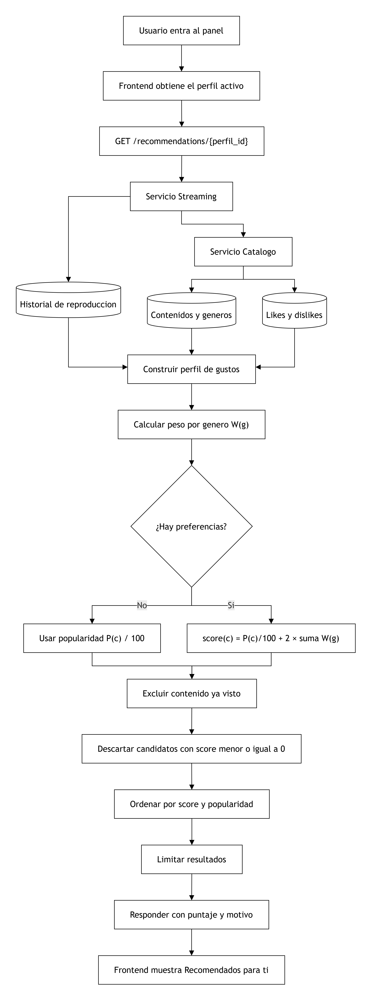

# Motor inteligente de recomendacion

## Objetivo

Se implemento una seccion personalizada llamada **"Recomendados para ti"** en el panel del usuario. Esta seccion usa un motor de recomendacion basado en contenido/generos, inspirado en los sistemas de recomendacion clasicos usados por plataformas como Netflix.

El sistema analiza:

- Historial reciente de reproduccion del perfil.
- Contenido finalizado o en progreso.
- Calificaciones previas del perfil: `like` y `dislike`.
- Generos asociados al catalogo.
- Porcentaje global de recomendacion del contenido.

## Tipo de algoritmo

El algoritmo implementado es un **sistema de recomendacion basado en contenido**.

La idea principal es construir un perfil de gustos a partir de los generos que el usuario ha visto y calificado. Luego, el sistema compara ese perfil con el resto del catalogo y ordena los contenidos por mayor afinidad.

Es una version simplificada de las tecnicas de personalizacion usadas por
plataformas de streaming como Netflix. No pretende reproducir el algoritmo
propietario de Netflix: adopta el principio de representar al usuario y al
contenido mediante caracteristicas, en este caso los generos, y calcular su
afinidad.

### Justificacion de la eleccion

Se eligio el filtrado basado en contenido porque:

- Puede generar resultados con la informacion disponible en el proyecto:
  historial, reacciones, generos y popularidad global.
- No necesita una gran cantidad de usuarios ni una matriz extensa de
  calificaciones, como ocurriria con filtrado colaborativo.
- Las recomendaciones se pueden explicar con motivos comprensibles, por
  ejemplo: `"Porque viste contenido de Accion"`.
- Mantiene separados los perfiles de una misma cuenta; cada perfil produce sus
  propios pesos de preferencia.
- Permite resolver el arranque en frio ordenando por popularidad cuando el
  perfil aun no tiene historial.

La desventaja principal es que tiende a recomendar generos similares a los ya
consumidos y ofrece menos descubrimiento que un modelo hibrido o colaborativo.

Reglas principales:

- Si el perfil termino un contenido, sus generos ganan mas peso.
- Si el perfil marco `like`, esos generos ganan mas relevancia.
- Si el perfil marco `dislike`, esos generos reducen su peso.
- El contenido ya visto por el perfil no se recomienda de nuevo.
- Si no hay suficiente historial, se usa la popularidad global del catalogo como respaldo.

## Modelo matematico y logico

### Variables

Para un perfil se define:

- \(H = (h_0, h_1, \ldots, h_{n-1})\): hasta 25 elementos del historial,
  ordenados desde el mas reciente.
- \(G(c)\): conjunto de generos asociados al contenido \(c\).
- \(P(c)\): porcentaje global de recomendacion del contenido, entre 0 y 100.
- \(R(c)\): reaccion del perfil al contenido: `like`, `dislike` o sin reaccion.
- \(W(g)\): preferencia acumulada del perfil para el genero \(g\).

### Peso de un contenido visto

Para cada elemento \(h_i\) del historial se calcula primero un peso de
recencia:

\[
recencia(i) = \frac{1}{1 + 0.15i}
\]

Luego se agregan las señales de interaccion:

\[
w(h_i) =
recencia(i)
+ 0.75\,I(finalizado)
+ 0.25\,I(progreso > 0)
+ 1.25\,I(like)
- 1.50\,I(dislike)
\]

Donde \(I(condicion)\) vale 1 cuando la condicion se cumple y 0 en caso
contrario. Por tanto, una reproduccion reciente y finalizada con `like` aporta
mas que una reproduccion antigua o incompleta.

Cada genero del contenido recibe ese peso:

\[
W(g) = \sum_{h_i:\,g \in G(h_i)} w(h_i)
\]

Si existe una calificacion sobre un contenido que no aparece en el historial,
sus generos reciben \(+0.75\) para `like` y \(-0.75\) para `dislike`.

### Puntaje de un candidato

Los contenidos que ya aparecen en el historial se excluyen. Para cada candidato
\(c\), el puntaje es:

\[
score(c) =
\frac{P(c)}{100}
+ 2\sum_{g \in G(c)} W(g)
\]

El primer termino representa popularidad global y el segundo personaliza el
resultado según la afinidad de generos. Si existe un perfil de gustos y el
puntaje es menor o igual a cero, el candidato se descarta. Los candidatos se
ordenan por `score` descendente; en caso de empate se utiliza \(P(c)\) como
desempate.

### Arranque en frio

Cuando no hay historial ni calificaciones, todos los pesos de genero son cero:

\[
score(c) = \frac{P(c)}{100}
\]

En este caso, el motor devuelve los contenidos con mayor recomendacion global y
utiliza el motivo `"Popular en el catalogo"`.

### Ejemplo

El elemento mas reciente fue finalizado, tiene progreso y recibio `like`. Su
peso es:

\[
1 + 0.75 + 0.25 + 1.25 = 3.25
\]

Si pertenece a `Accion`, ese genero recibe 3.25 puntos. Un candidato de Accion
con 80 % de recomendacion global obtiene, suponiendo que no tiene otros generos:

\[
score = 0.80 + 2(3.25) = 7.30
\]

### Pseudocodigo

```text
historial = obtenerUltimosRegistros(perfil, 25)
calificaciones = obtenerCalificaciones(perfil)
catalogo = obtenerCatalogo()

para cada elemento visto, desde el mas reciente:
    peso = 1 / (1 + indice * 0.15)
    sumar 0.75 si finalizo
    sumar 0.25 si tiene progreso
    sumar 1.25 si dio like
    restar 1.50 si dio dislike
    acumular peso en cada genero del contenido

para cada calificacion que no aparezca en el historial:
    acumular 0.75 por like o -0.75 por dislike en sus generos

para cada contenido no visto:
    puntaje = popularidad / 100
    puntaje += 2 * suma de pesos de sus generos
    descartar si hay preferencias y puntaje <= 0

ordenar por puntaje y luego por popularidad
devolver los primeros limit resultados
```

## Modelado y justificacion arquitectonica

El motor sigue la separacion de responsabilidades de los microservicios y una
estructura de puertos y adaptadores:

- **Streaming** es responsable de orquestar la recomendacion porque posee el
  historial y el progreso de reproduccion.
- **Catalogo** conserva los contenidos, generos, detalles y reacciones. Expone
  esos datos mediante HTTP sin transferir la propiedad de la informacion.
- **Frontend** solamente solicita y presenta resultados; no replica el
  algoritmo ni calcula puntajes.
- La interfaz de dominio `CatalogRecommendationRepository` desacopla el caso de
  uso del cliente HTTP concreto. Esto permite sustituir el adaptador o probar el
  motor con repositorios simulados.
- `contentBasedRecommender` concentra las reglas y pesos. El servicio de
  aplicacion obtiene los datos y delega el calculo, evitando mezclar transporte,
  persistencia y logica de recomendacion.

### Diagrama del algoritmo



El diagrama muestra que el frontend no calcula recomendaciones. El servicio
`streaming` combina el historial que administra localmente con los metadatos y
calificaciones proporcionados por `catalogo`. Después construye los pesos por
genero, puntua los candidatos y devuelve una lista ordenada.

Esta distribucion evita acceso directo a la base de datos de otro
microservicio. El intercambio utiliza identificadores (`perfil_id` y
`contenido_id`) y contratos HTTP, respetando la autonomia de cada servicio.

### Complejidad y limites

- El calculo principal es lineal respecto al historial y al catalogo, seguido
  por el ordenamiento: aproximadamente \(O(H + C\log C)\).
- La implementacion consulta detalles individuales cuando necesita generos, por
  lo que puede realizar varias solicitudes HTTP. Es apropiado para el volumen
  academico actual, pero en mayor escala convendria incluir generos en la
  respuesta del catalogo, usar cache o procesar perfiles de forma asincrona.
- El modelo no considera actores, idioma, hora de consumo ni similitud entre
  usuarios.
- Los pesos son heuristicas explicables, no parametros entrenados
  estadisticamente. Una evolucion natural seria medir interacciones y ajustar
  los pesos con experimentos.

## Backend

### Servicio catalogo

Se agrego un endpoint para consultar las calificaciones previas de un perfil:

```http
GET /api/v1/catalog/profile/{perfil_id}/ratings
```

Respuesta:

```json
{
  "calificaciones": [
    {
      "contenido_id": "uuid-del-contenido",
      "perfil_id": "uuid-del-perfil",
      "reaccion": "like"
    }
  ]
}
```

Archivos modificados:

- `backend/services/catalogo/internal/domain/content.go`
- `backend/services/catalogo/internal/application/service.go`
- `backend/services/catalogo/internal/infrastructure/postgres/repository.go`
- `backend/services/catalogo/internal/interfaces/http/handler.go`

### Servicio streaming

Se agrego el endpoint principal del motor:

```http
GET /api/v1/recommendations/{perfil_id}?limit=10
```

Respuesta:

```json
{
  "algoritmo": "basado_en_contenido_generos",
  "titulo_seccion": "Recomendados para ti",
  "recomendaciones": [
    {
      "id": "uuid-del-contenido",
      "titulo": "Nombre del contenido",
      "tipo": "pelicula",
      "sinopsis": "Descripcion",
      "idioma": "es",
      "url_portada": "https://...",
      "fecha_lanzamiento": "2026-06-24",
      "porcentaje_recomendacion": 85,
      "url_trailer": "https://...",
      "puntaje": 7.8,
      "motivo": "Porque viste contenido de Accion"
    }
  ]
}
```

Archivos agregados:

- `backend/services/streaming/internal/application/recommendation.go`
- `backend/services/streaming/internal/infrastructure/catalog/client.go`

Archivos modificados:

- `backend/services/streaming/internal/domain/playback.go`
- `backend/services/streaming/internal/application/service.go`
- `backend/services/streaming/internal/interfaces/http/handler.go`
- `backend/services/streaming/cmd/server/main.go`

## Frontend

En el panel del usuario se agrego la fila:

```text
Recomendados para ti
```

Esta fila se carga solo cuando existe un perfil activo. El frontend consulta el endpoint de `streaming`, convierte la respuesta al formato de tarjetas existente y la muestra antes de las recomendaciones globales.

Archivos modificados:

- `frontend/src/types/streaming.ts`
- `frontend/src/lib/streaming-api.ts`
- `frontend/src/pages/private/PanelPage/PanelPage.tsx`

## Configuracion

El servicio `streaming` necesita conocer la URL HTTP del servicio `catalogo` mediante:

```env
CATALOGO_API_URL=http://catalogo-service:8003
```

Se agrego esta variable en:

- `docker-compose.local.yml`
- `docker-compose.cloud-vm2.yml`
- `backend/deploy/compose/docker-compose.yml`
- `backend/deploy/compose/docker-compose.cloud-vm2.yml`
- `k8s/01-configmap.yaml`
- `k8s/06-streaming.yaml`

## Flujo de ejecucion

1. El frontend detecta el perfil activo.
2. El frontend llama a `GET /api/v1/recommendations/{perfil_id}` en `streaming`.
3. `streaming` consulta el historial reciente del perfil en su base de datos.
4. `streaming` consulta a `catalogo` para obtener:
   - catalogo disponible,
   - detalle de generos,
   - calificaciones del perfil.
5. El motor calcula puntajes por afinidad de generos.
6. El frontend renderiza la seccion **"Recomendados para ti"**.

## Pruebas ejecutadas

Se verifico que los cambios compilen y no rompan pruebas existentes:

```bash
go test ./...
```

Ejecutado en:

- `backend/services/catalogo`
- `backend/services/streaming`

Tambien se valido TypeScript del frontend:

```bash
pnpm -s tsc -b
```

Ejecutado en:

- `frontend`

[ Volver a documentación](../Documentaci%C3%B3n.md)