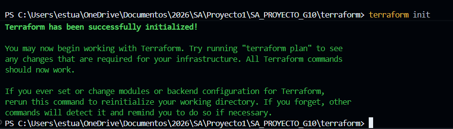
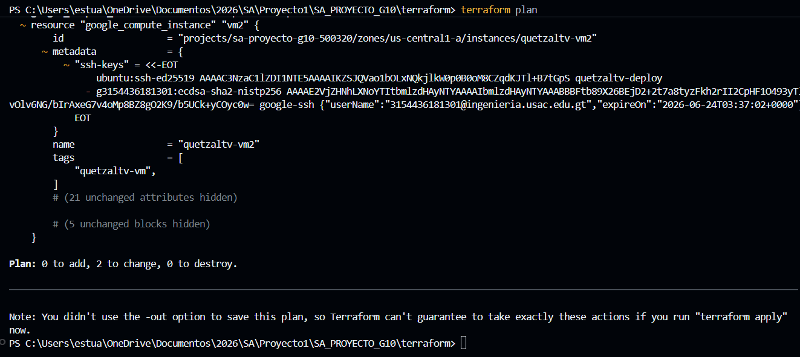
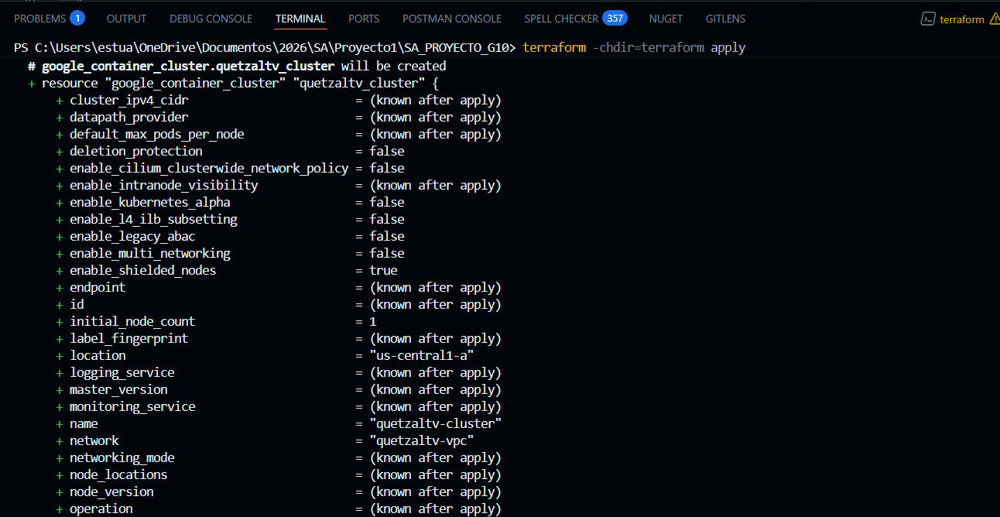
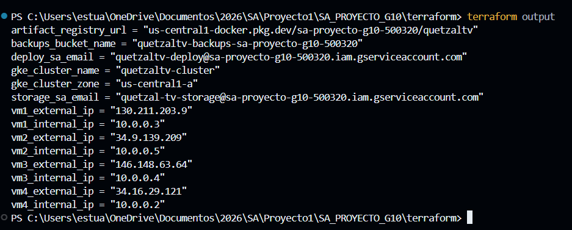

# Creación de Infraestructura

## Índice

1. [Terraform — Qué es y cómo funciona](#1-terraform--qué-es-y-cómo-funciona)
2. [Infraestructura declarada](#2-infraestructura-declarada)
3. [Configuración paso a paso con Terraform](#3-configuración-paso-a-paso-con-terraform)

---

## Terraform
### 1. ¿Qué es y cómo funciona?

**Terraform** es una herramienta de infraestructura como código (IaC) desarrollada por HashiCorp. Permite declarar en archivos `.tf` el estado deseado de la infraestructura y Terraform se encarga de crearla, modificarla o destruirla para que coincida con esa declaración.

### Ciclo de trabajo


---

## 2. Infraestructura declarada

### Archivos Terraform

- **main.tf**: Es el archivo principal donde se declara el provider de GCP y el backend remoto en GCS.
- **variables.tf**: Contiene las variables parametrizables como project ID, zona y tipo de máquina.
- **vpc.tf**: Define la VPC, subredes con rangos secundarios para GKE y reglas de firewall.
- **compute_vms.tf**: Declara las 4 VMs de Compute Engine.
- **gke.tf**: Configura el clúster GKE y el node pool.
- **artifact_registry.tf**: Crea el repositorio Docker en Artifact Registry.
- **storage.tf**: Define los buckets GCS para backups y streaming.
- **iam.tf**: Configura las service accounts y roles IAM.
- **outputs.tf**: Exporta IPs, nombre del clúster, URL del registry, etc.
- **terraform.tfvars.example**: Plantilla de variables que se debe copiar a `terraform.tfvars` y completar con los valores reales.

---

## 3. Configuración

#### Prerrequisitos

```bash
# Instalar Terraform >= 1.6
# https://developer.hashicorp.com/terraform/install

# Autenticarse con GCP (Application Default Credentials)
gcloud auth application-default login

# Establecer el proyecto activo
gcloud config set project sa-proyecto-g10-500320
```

#### Crear el bucket de estado

El bucket de Terraform state debe existir antes de ejecutar `terraform init`:

```bash
gcloud storage buckets create gs://quetzaltv-tf-state \
  --location=us-central1 \
  --project=sa-proyecto-g10-500320
```

#### Generar par de claves SSH

Esta clave será usada por Ansible y el CI/CD para acceder a las VMs:

```bash
ssh-keygen -t ed25519 -f ~/.ssh/quetzaltv_deploy -C "quetzaltv-deploy"
# La clave pública (~/.ssh/quetzaltv_deploy.pub) va en terraform.tfvars
# La clave privada (~/.ssh/quetzaltv_deploy) va en el secret VM_SSH_KEY de GitHub
```

#### Configurar variables

```bash
cd terraform/
cp terraform.tfvars.example terraform.tfvars
# Editar terraform.tfvars y pegar la clave pública en ssh_public_key
```

#### Inicializar Terraform

```bash
terraform init
```

Este comando descarga el provider de GCP y configura el backend remoto en GCS.



#### Revisar el plan

```bash
terraform plan
```

Muestra todos los recursos que se crearán sin aplicar cambios.



#### Aplicar la infraestructura

```bash
terraform apply
```

Escribir `yes` cuando lo solicite. El proceso toma entre 10 y 15 minutos (el clúster GKE es lo más lento).



#### Obtener los outputs

```bash
terraform output
```

Es importante anotar estos valores para el siguiente paso (Ansible) y para actualizar los secrets de GitHub:

```
vm1_external_ip     = "X.X.X.X"
vm1_internal_ip     = "10.0.0.X"
vm2_external_ip     = "X.X.X.X"
vm2_internal_ip     = "10.0.0.X"
vm3_external_ip     = "X.X.X.X"   ← GitHub Secret: VM3_HOST
vm3_internal_ip     = "10.0.0.X"  ← GitHub Secret: VM3_INTERNAL_IP
vm4_external_ip     = "X.X.X.X"   ← URL pública del entorno develop
gke_cluster_name    = "quetzaltv-cluster"
gke_cluster_zone    = "us-central1-a"
artifact_registry_url = "us-central1-docker.pkg.dev/sa-proyecto-g10-500320/quetzaltv"
```




#### Destruir la infraestructura

```bash
terraform destroy
```

Escribir `yes` cuando lo solicite. Elimina todos los recursos gestionados por Terraform. **Se pierden permanentemente:** archivos en los buckets GCS, imágenes Docker en Artifact Registry y datos en las BDs de las VMs si no hay backup.

---

## 4. Recrear la infraestructura desde cero

Después de un `terraform destroy`, seguir estos pasos en orden:

#### 1. Volver a crear la infraestructura

```bash
terraform apply
```

Anotar las nuevas IPs del output — cambiarán respecto a las anteriores.

#### 2. Actualizar el inventario de Ansible

Editar `ansible/inventory.ini` y reemplazar todas las IPs con los nuevos valores de `terraform output`.

#### 3. Correr Ansible

```bash
ansible-playbook playbooks/site.yml -i inventory.ini \
  -e "db_password=TuPasswordAqui" \
  -e "jwt_secret=TuJwtSecretAqui" \
  -e "email_user=correo@gmail.com" \
  -e "email_pass=tu_app_password" \
  -e "email_from=QuetzalTV"
```

#### 4. Generar nueva clave de service account

La service account es destruida y recreada — la clave anterior queda inválida:

```bash
gcloud iam service-accounts keys create key.json \
  --iam-account=quetzaltv-deploy@sa-proyecto-g10-500320.iam.gserviceaccount.com
```

#### 5. Actualizar secretos en GitHub

| Secreto | Valor |
|---|---|
| `GKE_SA_KEY` | Contenido del `key.json` generado en el paso anterior |
| `VM3_HOST` | Nueva `vm3_external_ip` del output |
| `VM3_INTERNAL_IP` | Nueva `vm3_internal_ip` del output |

#### 6. Reconectar kubectl

```bash
gcloud container clusters get-credentials quetzaltv-cluster \
  --zone us-central1-a \
  --project sa-proyecto-g10-500320
```

#### 7. Configurar permisos GKE

> **Prerequisito:** Ansible debe haberse ejecutado correctamente antes de este paso.

Reconectar kubectl al nuevo clúster:

```powershell
gcloud container clusters get-credentials quetzaltv-cluster --zone us-central1-a --project sa-proyecto-g10-500320
```

Re-grant del permiso signBlob (necesario para signed URLs de portadas en catálogo-service):

```powershell
gcloud iam service-accounts add-iam-policy-binding quetzaltv-deploy@sa-proyecto-g10-500320.iam.gserviceaccount.com --member=serviceAccount:quetzaltv-deploy@sa-proyecto-g10-500320.iam.gserviceaccount.com --role=roles/iam.serviceAccountTokenCreator
```

ClusterRoleBinding para que el pipeline CD pueda aplicar manifiestos en GKE:

```powershell
kubectl create clusterrolebinding quetzaltv-deploy-cluster-admin --clusterrole=cluster-admin --user=quetzaltv-deploy@sa-proyecto-g10-500320.iam.gserviceaccount.com
```

#### 8. Redesplegar a GKE

Hacer push a la rama `release` para que el pipeline CD reconstruya las imágenes y las despliegue, o aplicar manualmente:

```bash
kubectl apply -f k8s/
```

---

[Volver a la documentacion](../Documentación.md)