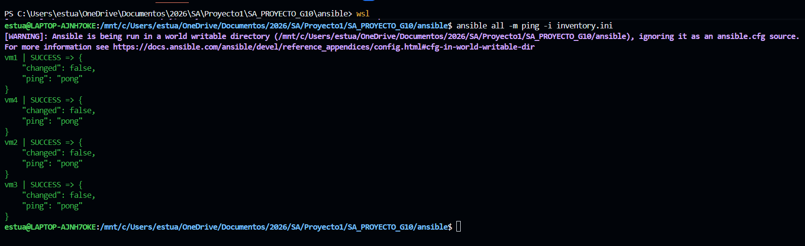
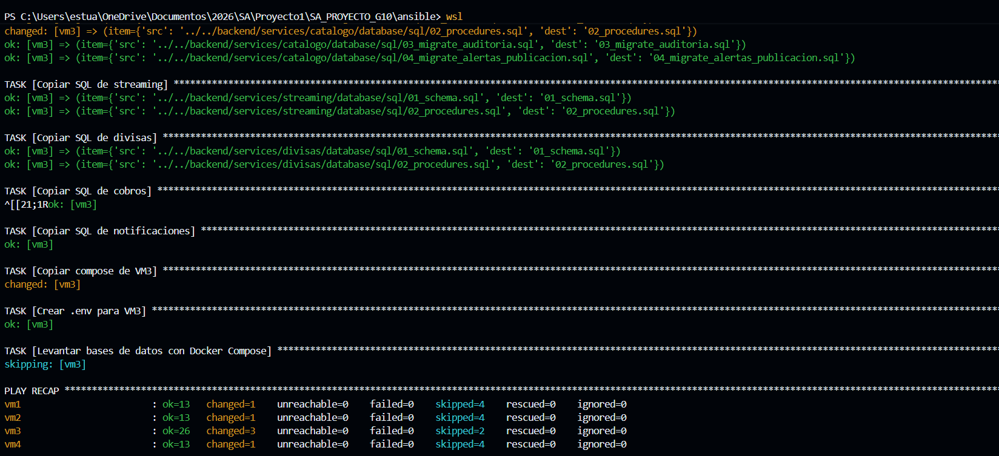
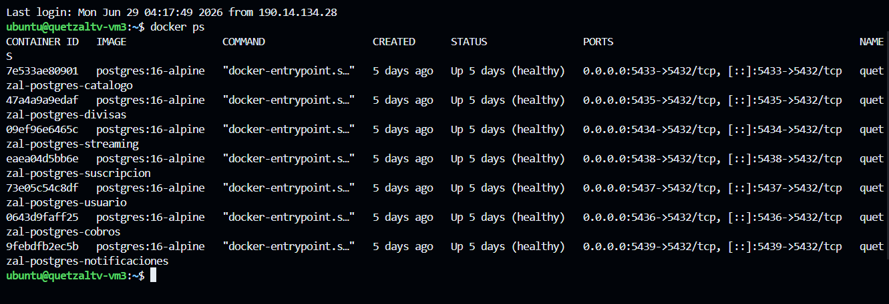

# Ansible
## configuración de infraestructura
---

## Qué es y cómo funciona?
Es una herramienta de automatización de configuración agentless o sea que no requiere instalar nada en los servidores remotos. Se conecta a las VMs por SSH desde la máquina de control y ejecuta las tareas declaradas en los **Playbooks**.

### Conceptos clave

- **Playbook**: Archivo YAML que describe las tareas a ejecutar en los hosts.
- **Inventory**: Lista de hosts con sus IPs y variables de conexión.
- **Task**: Unidad mínima de trabajo.
- **Module**: Función predefinida de Ansible.
- **Template**: Archivo con variables que Ansible rellena al copiar al servidor.
- **become**: Equivalente a `sudo`, este permite ejecutar tareas con privilegios de root.
- **Agentless**: Ansible solo necesita SSH y Python en el servidor remoto. No instala ningún daemon.


### Estructura de archivos

```
└── ansible
    └── group_vars
        ├── all.yml
    └── playbooks
        ├── app_vms.yml
        ├── db_vm.yml
        ├── monitoring_vm3.yml
        ├── site.yml
    └── emplates
        ├── env_vm1.j2
        ├── env_vm2.j2
        ├── env_vm3.j2
        ├── env_vm4.j2
    ├── ansible.cfg
    └── inventory.ini
```

---

## Configuración paso a paso con Ansible

#### Instalar Ansible

```bash
pip install ansible
# O en Ubuntu/Debian:
sudo apt install ansible
```

#### Completar el inventario con las IPs de Terraform

```bash
# Obtener IPs
terraform -chdir=terraform output
# si estas dentro de terraform
terraform output
# Editar ansible/inventory.ini y reemplazar los placeholders REEMPLAZAR_*
# con las IPs reales del output anterior
```

#### Completar las variables internas de inventario

En `ansible/inventory.ini`, también reemplazar los valores `REEMPLAZAR_VMX_INTERNAL_IP`
con las IPs internas obtenidas del output de Terraform.

#### Verificar conectividad SSH

```bash
cd ansible/
ansible all -m ping -i inventory.ini
```

Debe responder `pong` en las 4 VMs.



#### Ejecutar el playbook

```bash
ansible-playbook playbooks/site.yml \
  -e "db_password=TuPasswordAqui" \
  -e "jwt_secret=TuJwtSecretAqui" \
  -e "email_user=correo@gmail.com" \
  -e "email_pass=tu_app_password" \
  -e "email_from=QuetzalTV"
```

Ansible ejecuta en orden:
1. `app_vms.yml` — configura VM1, VM2, VM4
2. `db_vm.yml` — configura VM3 y levanta los 7 contenedores PostgreSQL

El proceso toma aproximadamente 5-10 minutos.



#### Verificar que las BDs están corriendo en VM3

```bash
ssh -i ~/.ssh/quetzaltv_deploy ubuntu@146.148.63.64
docker ps
```

Deben aparecer 7 contenedores PostgreSQL corriendo.



---

## Verificación del aprovisionamiento con Ansible

Los siguientes comandos se ejecutan desde el directorio `ansible/` y verifican que el playbook se aplicó correctamente en todas las VMs. No modifican nada — solo leen el estado actual.

#### contenedores PostgreSQL corriendo en VM3

```bash
ansible vm_db -m command -a "docker ps --format 'table {{.Names}}\t{{.Status}}\t{{.Ports}}'"
```

Deben aparecer los 7 contenedores:

| Nombre | Puerto |
|---|---|
| `quetzal-postgres-usuario` | 5432 |
| `quetzal-postgres-suscripcion` | 5438 |
| `quetzal-postgres-catalogo` | 5433 |
| `quetzal-postgres-streaming` | 5434 |
| `quetzal-postgres-divisas` | 5435 |
| `quetzal-postgres-cobros` | 5436 |
| `quetzal-postgres-notificaciones` | 5439 |

[Volver a la documentacion](../Documentación.md)
