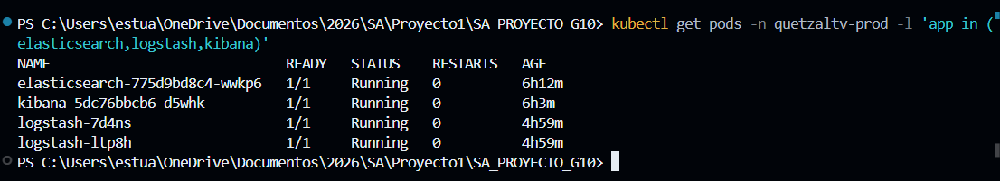
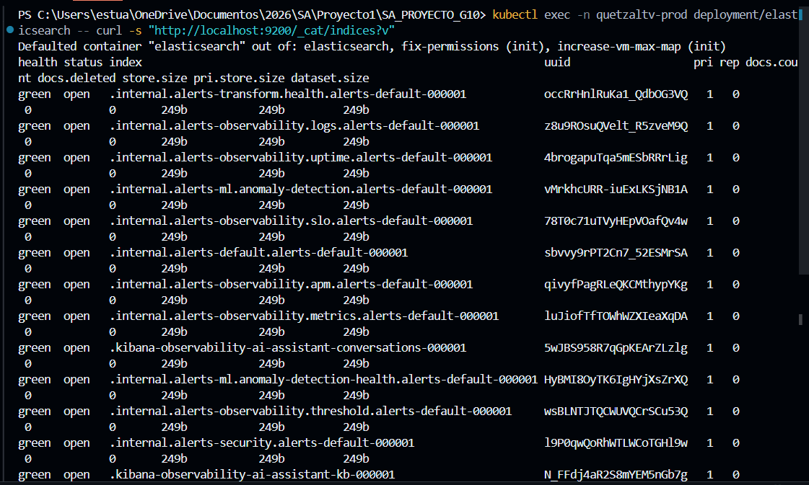
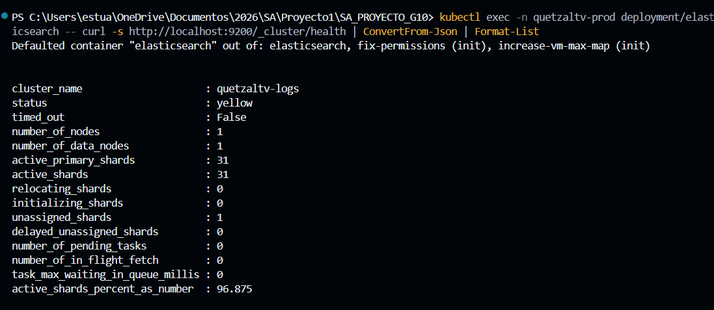
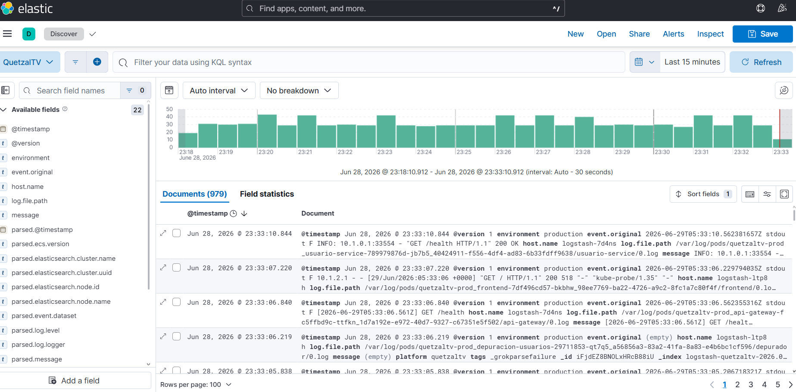

# ELK Stack
## Centralización de logs

```js
Archivos: `k8s/14-elasticsearch.yaml`, `k8s/15-kibana.yaml`, `k8s/16-logstash.yaml`
Namespace: `quetzaltv-prod`
```

### Arquitectura


### Instalar / aplicar el stack

```bash
kubectl apply -f k8s/14-elasticsearch.yaml
kubectl apply -f k8s/15-kibana.yaml
kubectl apply -f k8s/16-logstash.yaml
```

Elasticsearch tarda ~2 minutos en estar listo. Kibana tarda ~3 minutos.

### Verificar que los pods están corriendo

```bash
kubectl get pods -n quetzaltv-prod -l 'app in (elasticsearch,logstash,kibana)'
```

Salida esperada:

```
NAME                             READY   STATUS    RESTARTS   AGE
elasticsearch-775d9bd8c4-xxxx    1/1     Running   0          10m
kibana-5dc76bbcb6-xxxx           1/1     Running   0          10m
logstash-xxxx                    1/1     Running   0          5m
logstash-yyyy                    1/1     Running   0          5m
```

Logstash aparece dos veces porque es un DaemonSet: un pod por nodo del clúster.



### Verificar que Elasticsearch está recibiendo logs

```bash
kubectl exec -n quetzaltv-prod deployment/elasticsearch -- curl -s "http://localhost:9200/_cat/indices/logstash-quetzaltv-*?v"
```

Salida esperada:

```
health status index                              docs.count store.size
yellow open   logstash-quetzaltv-2026.06.28      80114      35.3mb
yellow open   logstash-quetzaltv-2026.06.29        896       1.6mb
```

`docs.count` > 0 confirma que Logstash está enviando logs. Se crea un índice nuevo por día.



### Verificar salud de Elasticsearch

```bash
kubectl exec -n quetzaltv-prod deployment/elasticsearch -- curl -s http://localhost:9200/_cluster/health | ConvertFrom-Json | Format-List
```

`"status": "green"` o `"yellow"` es normal (yellow = réplica sin asignar por ser nodo único).



### Acceder a Kibana

```bash
kubectl port-forward svc/kibana 5601:5601 -n quetzaltv-prod
```

Luego abre `http://localhost:5601`.

#### Creacion del Data View:
1. Menú lateral **Discover**
2. **Create data view**
3. Index pattern: `logstash-quetzaltv-*`
4. Timestamp field: `@timestamp`
5. **Save data view to Kibana**

#### Buscar logs en Kibana (KQL)

```
# Todos los logs de un servicio
k8s_pod_name : usuario-service*

# Solo errores
message : "error" or message : "ERROR"

# Errores en un servicio específico
k8s_pod_name : streaming-service* and message : "error"

# Logs de watch party
k8s_pod_name : streaming-service* and message : "watchparty"

# Respuestas 500 o 401
message : "500" or message : "401"
```

Combina las búsquedas con el filtro de tiempo (arriba a la derecha).

### Ver logs de Logstash (para diagnosticar)

```bash
kubectl logs -n quetzaltv-prod -l app=logstash --tail=20
```

#### Causas comunes de que no lleguen logs

- Logstash en CrashLoopBackOff: revisar límites de memoria (necesita mínimo 512Mi)
- Índices no creados: Elasticsearch no está listo aún, esperar 2 minutos
- Kibana no abre: aumentar límite de memoria a 1.5Gi si hay OOMKilled

---

#### Kibana — Búsqueda de logs por servicio

Una vez abierto Kibana (`kubectl port-forward svc/kibana 5601:5601 -n quetzaltv-prod` → `http://localhost:5601`), ve a **Discover** con el data view `logstash-quetzaltv-*`.

El campo clave para filtrar por servicio es **`k8s_pod_name`**, que Logstash extrae automáticamente del nombre del archivo de log. También puedes buscar por **`message`** para filtrar por contenido del log.

##### Comandos KQL por servicio

###### API Gateway
```
k8s_pod_name : api-gateway*
```
Qué buscar: rutas bloqueadas, JWT inválidos, errores de proxy.
```
k8s_pod_name : api-gateway* and message : "401"
k8s_pod_name : api-gateway* and message : "403"
k8s_pod_name : api-gateway* and message : "upstream"
```

###### Servicio de Usuarios
```
k8s_pod_name : usuario-service*
```
Qué buscar: registros, logins, errores de BD.
```
k8s_pod_name : usuario-service* and message : "login"
k8s_pod_name : usuario-service* and message : "registro"
k8s_pod_name : usuario-service* and message : "error"
k8s_pod_name : usuario-service* and message : "UniqueViolation"
```

###### Servicio de Suscripciones
```
k8s_pod_name : suscripcion-service*
```
Qué buscar: cambios de plan, verificación premium, pagos.
```
k8s_pod_name : suscripcion-service* and message : "plan"
k8s_pod_name : suscripcion-service* and message : "premium"
k8s_pod_name : suscripcion-service* and message : "error"
```

###### Servicio de Catálogo
```
k8s_pod_name : catalogo-service*
```
Qué buscar: búsquedas, URLs firmadas de GCS, errores de permisos IAM.
```
k8s_pod_name : catalogo-service* and message : "error"
k8s_pod_name : catalogo-service* and message : "GCS"
k8s_pod_name : catalogo-service* and message : "signBlob"
k8s_pod_name : catalogo-service* and message : "catalogo"
```

###### Servicio de Streaming y Watch Party
```
k8s_pod_name : streaming-service*
```
Qué buscar: creación de salas, verificación premium, reproducción.
```
k8s_pod_name : streaming-service* and message : "watchparty"
k8s_pod_name : streaming-service* and message : "premium"
k8s_pod_name : streaming-service* and message : "error"
k8s_pod_name : streaming-service* and message : "websocket"
```

###### Servicio de Cobros
```
k8s_pod_name : cobros-service*
```
Qué buscar: transacciones, pagos fallidos.
```
k8s_pod_name : cobros-service* and message : "error"
k8s_pod_name : cobros-service* and message : "pago"
```

###### Servicio de Divisas / FX
```
k8s_pod_name : divisas-service*
```
Qué buscar: consultas de tipo de cambio, hits/misses de caché Redis.
```
k8s_pod_name : divisas-service* and message : "cache"
k8s_pod_name : divisas-service* and message : "error"
k8s_pod_name : divisas-service* and message : "tipo-cambio"
```

###### Servicio de Notificaciones
```
k8s_pod_name : notificaciones-service*
```
Qué buscar: envíos de correo, fallos SMTP.
```
k8s_pod_name : notificaciones-service* and message : "email"
k8s_pod_name : notificaciones-service* and message : "error"
k8s_pod_name : notificaciones-service* and message : "correo"
```

###### CronJob — Depuración de usuarios
```
k8s_pod_name : depuracion-usuarios*
```
Qué buscar: ejecuciones del cron, cuentas eliminadas.
```
k8s_pod_name : depuracion-usuarios* and message : "COMMIT"
k8s_pod_name : depuracion-usuarios* and message : "UPDATE"
```

###### Ver errores de TODOS los servicios a la vez

```
k8s_namespace : quetzaltv-prod and (message : "error" or message : "ERROR" or message : "Error")
```

###### Ver actividad en los últimos minutos (todos los servicios)

Cambia el rango de tiempo arriba a la derecha a **Last 5 minutes** y deja la búsqueda vacía — verás el flujo completo de todos los servicios en tiempo real.

###### Columnas recomendadas en Discover

Haz clic en **Columns** (arriba a la derecha de la tabla) y agrega:
- `k8s_pod_name` — qué servicio generó el log
- `stream` — `stdout` o `stderr`
- `message` — el texto del log

Esto hace mucho más fácil leer los resultados sin tener que abrir cada documento.




[Volver a la Documentación](../Documentación.md)