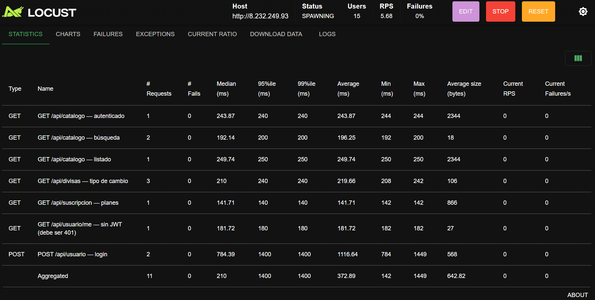
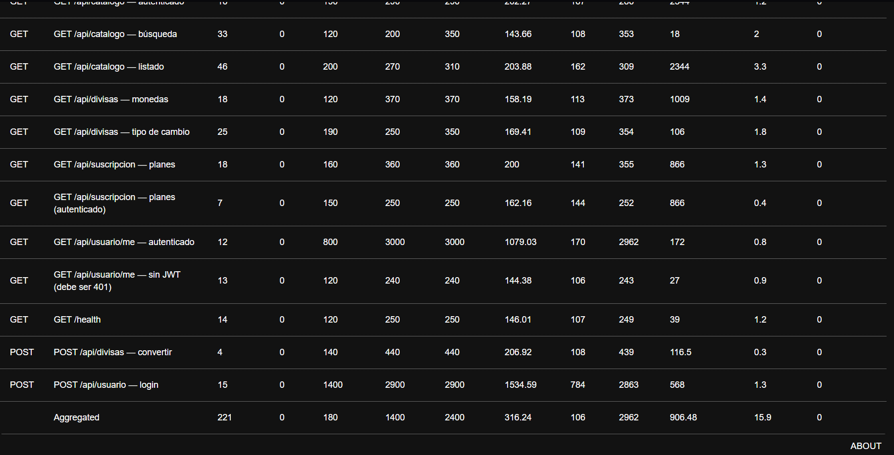
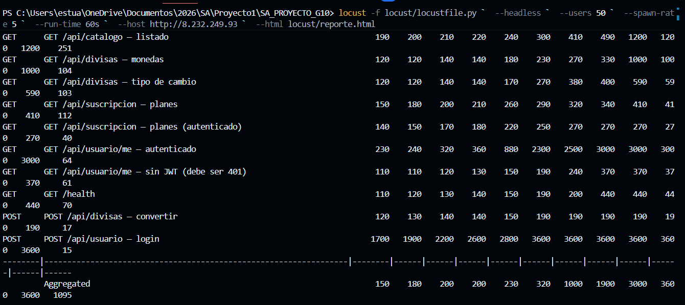

# Locust
## Pruebas de carga distribuidas

```js
Directorio: `locust/` · Archivo principal: `locust/locustfile.py`
```

### ¿Qué es y cómo funciona?

Es una herramienta de pruebas de carga distribuida basada en código Python que simula flujos de usuarios reales. Permite definir comportamientos de usuario mediante clases que heredan de `HttpUser`, donde cada tarea representa una interacción con el sistema.

Los usuarios se crean como "locusts", o langostas, que atacan el sistema de forma concurrente. Locust mide en tiempo real:

- **RPS** (requests per second)
- **Tiempos de respuesta** (mediana, p95, p99)
- **Tasa de errores** por endpoint
- **Throughput** general del sistema

Soporta dos modos de ejecución:

1. **Interfaz web**: ideal para monitoreo en vivo. Se abre `http://localhost:8089` donde se configura el número de usuarios, tasa de spawn y se visualizan gráficas.
3. **Headless**: ejecución desde terminal ideal para CI/CD, generando un reporte HTML al finalizar.

### Perfiles de usuario simulados

| Clase | Peso | Comportamiento |
|---|---|---|
| `UsuarioAnonimo` | 70 % | Navega catálogo, planes y divisas sin autenticarse |
| `UsuarioAutenticado` | 30 % | Inicia sesión y consulta su perfil, catálogo y monedas |

### Endpoints probados

| Endpoint | Perfil | Peso |
|---|---|---|
| `GET /health` | Anónimo | bajo |
| `GET /api/catalogo/api/v1/catalog` | Ambos | alto |
| `GET /api/catalogo/api/v1/catalog/search?q=<término>` | Anónimo | medio |
| `GET /api/suscripcion/api/v1/plans` | Ambos | medio |
| `GET /api/divisas/api/v1/monedas` | Anónimo | medio |
| `GET /api/divisas/api/v1/tipo-cambio?...` | Anónimo | medio |
| `GET /api/usuario/api/v1/auth/me` (sin JWT) | Anónimo | bajo (debe retornar 401) |
| `POST /api/usuario/api/v1/auth/login` | Autenticado | una vez al iniciar |
| `GET /api/usuario/api/v1/auth/me` (con JWT) | Autenticado | alto |
| `POST /api/divisas/api/v1/convertir` | Autenticado | bajo |

### Instalación

```powershell
pip install locust
# o usando el requirements del proyecto:
pip install -r locust/requirements.txt
```

Verificar la instalación:

```powershell
locust --version
```

### Credenciales para usuario autenticado

El `UsuarioAutenticado` necesita una cuenta real. Crear una desde el frontend y exportar las variables:

```powershell
# PowerShell
$env:LOCUST_EMAIL    = "correo@ejemplo.com"
$env:LOCUST_PASSWORD = "contraseña"
```

```bash
# Bash/Linux
export LOCUST_EMAIL="correo@ejemplo.com"
export LOCUST_PASSWORD="contraseña"
```

Si no se exportan, se usan los defaults `test@quetzaltv.com` / `Test1234!` y el login fallará con 401 — las tareas autenticadas se saltan automáticamente.

### Ejecución

#### Interfaz web

```powershell
locust -f locust/locustfile.py --host http://34.111.20.79
```

Abrir `http://localhost:8089`. Configurar:
- **Number of users:** 50
- **Spawn rate:** 5

Click en **Start swarming**. La UI muestra en tiempo real: RPS, tiempos de respuesta (mediana, p95), tasa de fallos, gráficas por endpoint y pestaña **Failures** con detalle de errores. Al terminar, descargar el reporte desde **Download Report**.





#### Headless

```powershell
locust -f locust/locustfile.py `
  --headless `
  --users 50 `
  --spawn-rate 5 `
  --run-time 60s `
  --host http://34.111.20.79 `
  --html reporte.html
```

```bash
# Bash/Linux
locust -f locust/locustfile.py \
  --headless \
  --users 50 \
  --spawn-rate 5 \
  --run-time 60s \
  --host http://34.111.20.79 \
  --html reporte.html
```



El reporte se guarda en `locust/reporte.html`. Al finalizar se imprime un resumen en consola:

```
╔══════════════════════════════════════════════════════╗
║         RESUMEN — Prueba de carga Quetzal TV        ║
╚══════════════════════════════════════════════════════╝
  Peticiones totales : 3247
  Fallos             : 0
  RPS promedio       : 54.1
  Tiempo resp. medio : 312 ms
  Tiempo resp. p95   : 780 ms
  Tiempo resp. p99   : 1203 ms
```

## Interpretación de resultados

- **Failures = 0**: ningún endpoint retornó error inesperado
- `GET /api/usuario/me` sin JWT debe retornar 401; si no lo hace, es un fallo de seguridad
- **p95 < 1 000 ms**: comportamiento aceptable bajo carga
- **RPS > 30** con 50 usuarios concurrentes es el mínimo esperado

## Causas comunes de fallos

- **Login 401**: la cuenta no existe o fue eliminada por el CronJob de depuración. Mientras Locust corre, el login genera sesiones activas y el CronJob no elimina la cuenta.
- **Timeout en catálogo**: el servicio puede tardar en el primer request por cold-start de la conexión a BD.
- **500 en algún endpoint**: revisar logs del pod con `kubectl logs <pod> -n quetzaltv-prod`.

[Volver a la documentacion](../Documentación.md)