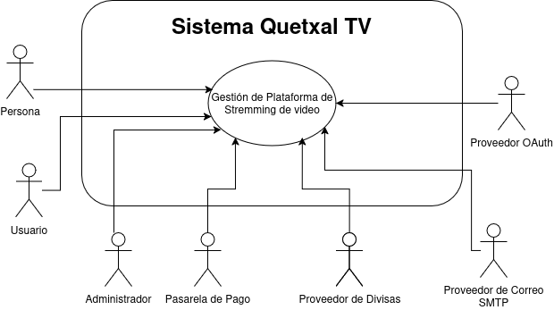
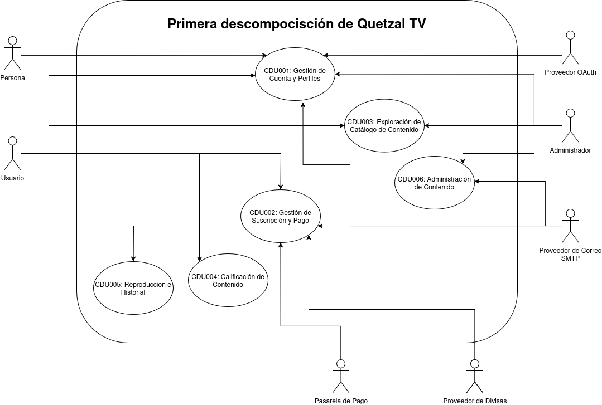
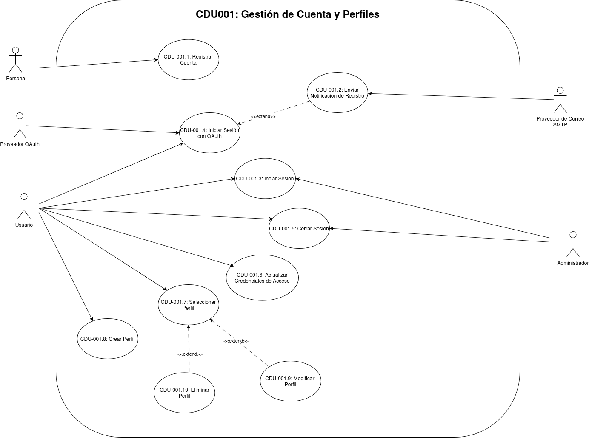
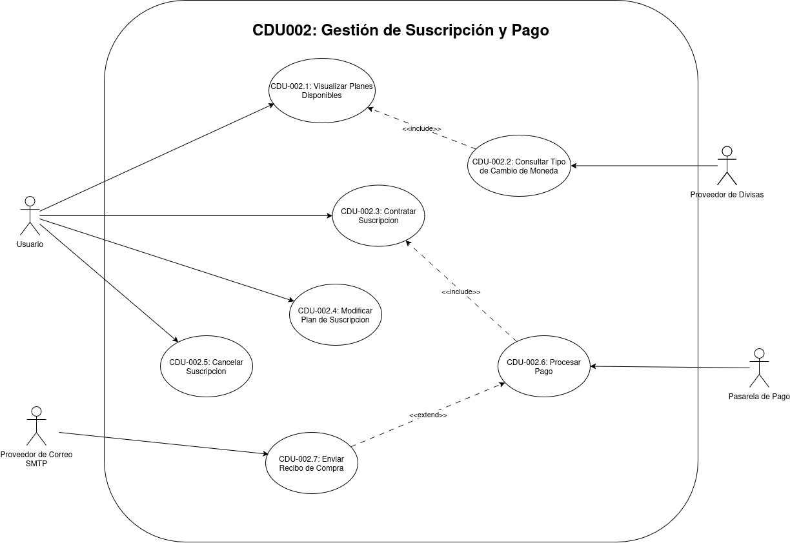
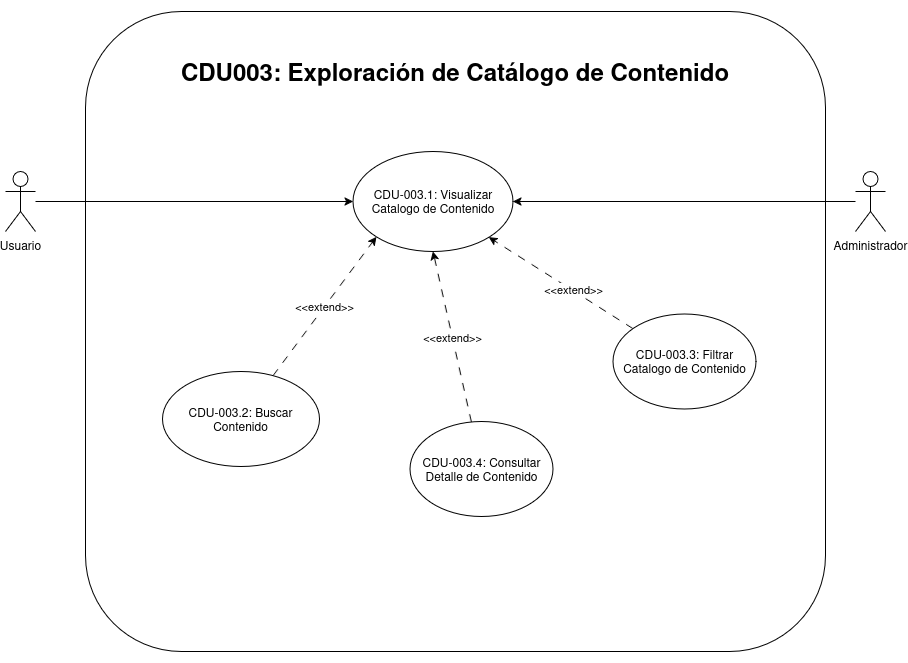
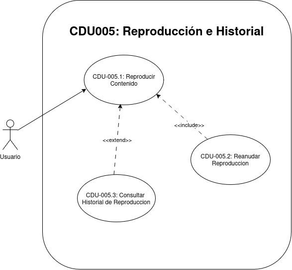
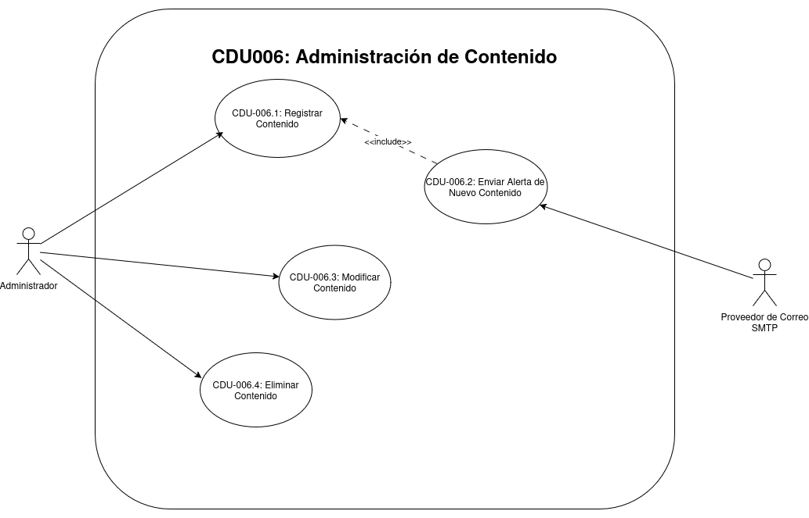

# Casos de Uso

## Core del negocio
| Representación | Actor | Descripción |
|----|-------------|-------------|
|  | **Persona** | Persona que no está registrada en el sistema. |
|  | **Usuario** | Persona registrada en la plataforma que puede iniciar sesión, administrar perfiles, gestionar su suscripción, explorar el catálogo, reproducir contenido y calificarlo. |
|  | **Administrador** | Usuario con permisos especiales para gestionar el contenido de la plataforma, permitiendo registrar, modificar y eliminar películas o series. |
|  | **Pasarela de Pago** | Servicio externo que procesa las transacciones asociadas a la contratación, modificación o cancelación de planes de suscripción. |
|  | **Proveedor de Divisas** | Servicio externo que suministra los tipos de cambio utilizados por la plataforma para mostrar precios en la moneda local del usuario. |
|  | **Proveedor de Correo SMTP** | Servicio externo encargado de entregar los correos de confirmación de registro, recibos de compra y alertas de nuevo contenido. |
|  | **Proveedor OAuth** | Servicio externo de identidad utilizado cuando la plataforma delega procesos de autenticación o autorización mediante OAuth. |

## Casos de uso de alto nivel

## Primera descomposición

**CDU001**: **Gestión de Cuenta y Perfiles**: Agrupa las operaciones de registro, autenticación y administración de perfiles asociadas a una cuenta dentro de la plataforma.

**CDU002**: **Gestión de Suscripción y Pago**: Permite al usuario consultar planes, visualizar precios en moneda local y administrar su suscripción mediante el procesamiento de pagos.

**CDU003**: **Exploración de Catálogo de Contenido**: Permite al usuario y al administrador explorar el catálogo de contenido disponible en la plataforma y consultar la información detallada de películas y series.

**CDU004**: **Calificación de Contenido**: Permite al usuario emitir su valoración sobre una película o serie mediante like o dislike y consultar la recomendación global generada por la comunidad.

**CDU005**: **Reproducción e Historial**: Permite al usuario reproducir contenido, reanudarlo desde el punto en que lo dejó y consultar el historial reciente de su perfil activo.

**CDU006**: **Administración de Contenido**: Permite al administrador gestionar el catálogo de la plataforma mediante operaciones de registro, modificación y eliminación de películas o series.

## Casos de uso expandidos

### Expandidos de CDU001: Gestión de Cuenta y Perfiles

- **CDU-001.1**: Registro de Cuenta
- **CDU-001.2**: Envío de Notificación de Registro
- **CDU-001.3**: Inicio de sesión
- **CDU-001.4**: Inicio de sesión con OAuth
- **CDU-001.5**: Cierre de sesión
- **CDU-001.6**: Actualización de Credenciales de Acceso
- **CDU-001.7**: Selección de Perfil
- **CDU-001.8**: Creación de Perfil
- **CDU-001.9**: Modificación de Perfil
- **CDU-001.10**: Eliminación de Perfil

#### CDU-001.1 Registro de Cuenta

| Campo | Especificación |
|----|----|
| Nombre | Registro de Cuenta |
| Código | CDU-001.1 |
| Actores | Persona |
| Descripción | Permite a una persona crear una cuenta en la plataforma ingresando sus datos básicos y su ubicación para habilitar el acceso al sistema y la creación automática de su primer perfil. |
| Precondiciones | La persona no debe tener una cuenta registrada con el mismo correo electrónico. |
| Postcondiciones | Cuenta registrada correctamente y perfil principal creado con el nombre de la cuenta; o registro rechazado por datos inválidos o duplicados. |
| Flujo principal | 1. La persona ingresa nombre, correo, contraseña y ubicación. 2. La persona confirma el registro. 3. El sistema valida la información. 4. El sistema crea la cuenta. 5. El sistema crea automáticamente el perfil principal usando el nombre de la cuenta. 6. El sistema confirma el registro exitoso. |
| Flujos alternos | FA1. El correo ya existe. FA1.1 El sistema informa que la cuenta ya está registrada. FA2. Faltan datos obligatorios. FA2.1 El sistema solicita completar la información requerida. |
| Reglas de negocio | El correo debe ser único en la plataforma. La ubicación debe registrarse como parte de la cuenta. La cuenta debe crear un perfil principal automáticamente. El nombre del primer perfil debe corresponder al nombre de la cuenta registrada. |
| Reglas de calidad | El formulario debe validar campos obligatorios antes del envío. La confirmación del registro debe mostrarse en un tiempo razonable. |

#### CDU-001.2 Envío de Notificación de Registro

| Campo | Especificación |
|----|----|
| Nombre | Envío de Notificación de Registro |
| Código | CDU-001.2 |
| Actores | Persona, Proveedor de Correo SMTP |
| Descripción | Permite al sistema enviar un correo de confirmación al usuario luego de completar el registro de cuenta de forma satisfactoria. |
| Precondiciones | La cuenta debe haberse registrado correctamente y el correo electrónico debe estar disponible. |
| Postcondiciones | Correo de bienvenida enviado; o fallo de envío registrado por el sistema. |
| Flujo principal | 1. El sistema detecta que el registro fue exitoso. 2. El sistema construye el mensaje de bienvenida. 3. El sistema solicita el envío al proveedor SMTP. 4. El proveedor SMTP confirma la entrega del mensaje. |
| Flujos alternos | FA1. El proveedor SMTP no responde o rechaza la solicitud. FA1.1 El sistema registra el fallo de envío. FA2. El correo de destino es inválido. FA2.1 El sistema registra el error de entrega. |
| Reglas de negocio | El correo de bienvenida solo se envía después de un registro exitoso. El mensaje debe estar asociado a la cuenta recién creada. |
| Reglas de calidad | El envío no debe bloquear la confirmación visual del registro. |

#### CDU-001.3 Inicio de sesión

| Campo | Especificación |
|----|----|
| Nombre | Inicio de sesión |
| Código | CDU-001.3 |
| Actores | Usuario, Administrador |
| Descripción | Permite a un usuario o administrador autenticarse en la plataforma mediante sus credenciales registradas para acceder a las funciones disponibles de su cuenta. |
| Precondiciones | El usuario o administrador debe tener una cuenta registrada y activa. |
| Postcondiciones | sesión iniciada correctamente; o acceso denegado por credenciales inválidas. |
| Flujo principal | 1. El usuario o administrador ingresa su correo y contraseña. 2. El usuario o administrador confirma el inicio de sesión. 3. El sistema valida las credenciales. 4. El sistema crea la sesión segura de la cuenta. 5. El sistema muestra acceso a la cuenta. |
| Flujos alternos | FA1. Credenciales incorrectas. FA1.1 El sistema informa que el acceso fue rechazado. FA2. La cuenta no existe. FA2.1 El sistema informa que no fue posible autenticar la cuenta. |
| Reglas de negocio | Solo cuentas registradas pueden iniciar sesión con correo y contraseña. La sesión debe quedar asociada a una cuenta válida. |
| Reglas de calidad | Las credenciales no deben mostrarse en texto plano. El sistema debe informar errores sin exponer detalles sensibles. |

#### CDU-001.4 Inicio de sesión con OAuth

| Campo | Especificación |
|----|----|
| Nombre | Inicio de sesión con OAuth |
| Código | CDU-001.4 |
| Actores | Usuario, Proveedor OAuth |
| Descripción | Permite a un usuario autenticarse en la plataforma mediante un proveedor OAuth externo para acceder a una cuenta previamente registrada en el sistema. |
| Precondiciones | El proveedor OAuth debe estar disponible y configurado en la plataforma. |
| Postcondiciones | sesión iniciada correctamente sobre una cuenta registrada; o autenticación rechazada por el proveedor externo o por inexistencia de la cuenta en la plataforma. |
| Flujo principal | 1. El usuario selecciona iniciar sesión con OAuth. 2. El sistema redirige al proveedor OAuth. 3. El usuario autoriza el acceso con su cuenta externa. 4. El proveedor OAuth devuelve la identidad validada y el correo asociado. 5. El sistema verifica si el correo existe en su base de datos. 6. El sistema abre la sesión de la cuenta registrada sin solicitar la contraseña local. |
| Flujos alternos | FA1. El usuario cancela la autorización externa. FA1.1 El sistema cancela el proceso de acceso. FA2. El proveedor OAuth rechaza o no valida la identidad. FA2.1 El sistema informa que no pudo completarse la autenticación. FA3. El correo devuelto por el proveedor no existe en la plataforma. FA3.1 El sistema rechaza el acceso y solicita registro previo. |
| Reglas de negocio | El acceso con OAuth solo aplica para cuentas previamente registradas en la plataforma. El sistema debe validar la existencia del correo en su base de datos antes de abrir la sesión. La identidad devuelta por el proveedor debe ser válida y verificable. |
| Reglas de calidad | El flujo de redireccion debe ser claro para el usuario. Los errores del proveedor externo deben manejarse sin interrumpir la aplicación. |

#### CDU-001.5 Cierre de sesión

| Campo | Especificación |
|----|----|
| Nombre | Cierre de sesión |
| Código | CDU-001.5 |
| Actores | Usuario, Administrador |
| Descripción | Permite al usuario o administrador cerrar su sesión activa para finalizar de forma segura el acceso a la plataforma desde el dispositivo actual. |
| Precondiciones | El usuario o administrador debe tener una sesión activa. |
| Postcondiciones | sesión cerrada correctamente e invalidada en el cliente; o la solicitud no se procesa por ausencia de sesión válida. |
| Flujo principal | 1. El usuario o administrador selecciona cerrar sesión. 2. El sistema verifica la sesión activa. 3. El sistema inválida la sesión y limpia las credenciales de acceso del cliente. 4. El sistema redirige a la pantalla pública de acceso. |
| Flujos alternos | FA1. La sesión ya no es válida. FA1.1 El sistema fuerza la salida y redirige a la pantalla de acceso. FA2. Ocurre un error al inválidar la sesión o limpiar las credenciales locales. FA2.1 El sistema informa que no fue posible completar el cierre de sesión e invita a reintentar. |
| Reglas de negocio | El cierre de sesión debe inválidar el acceso activo del usuario. La salida debe aplicarse sobre la sesión actual. |
| Reglas de calidad | El cierre de sesión debe ser inmediato y visible para el usuario. Las credenciales no deben permanecer activas en el cliente. |

#### CDU-001.6 Actualización de Credenciales de Acceso

| Campo | Especificación |
|----|----|
| Nombre | Actualización de Credenciales de Acceso |
| Código | CDU-001.6 |
| Actores | Usuario |
| Descripción | Permite al usuario actualizar la contraseña asociada a su cuenta desde la configuración para mantener segura su información de acceso. |
| Precondiciones | El usuario debe haber iniciado sesión. |
| Postcondiciones | Contraseña actualizada correctamente; o actualización rechazada por datos inválidos. |
| Flujo principal | 1. El usuario accede a la configuración de cuenta. 2. El usuario ingresa la nueva contraseña. 3. El sistema valida la información proporcionada. 4. El sistema actualiza la contraseña asociada a la cuenta. 5. El sistema confirma la actualización. |
| Flujos alternos | FA1. La nueva contraseña no cumple la política definida. FA1.1 El sistema rechaza la actualización. FA2. La nueva contraseña coincide con la contraseña actual. FA2.1 El sistema solicita ingresar una contraseña diferente. |
| Reglas de negocio | La contraseña debe cumplir la política de seguridad definida por la plataforma. La nueva contraseña debe ser diferente de la contraseña actual. |
| Reglas de calidad | La actualización debe requerir validaciones claras para el usuario. La información sensible no debe exponerse en pantalla ni en registros. |

#### CDU-001.7 Selección de Perfil

| Campo | Especificación |
|----|----|
| Nombre | Selección de Perfil |
| Código | CDU-001.7 |
| Actores | Usuario |
| Descripción | Permite al usuario elegir uno de los perfiles asociados a su cuenta para navegar con preferencias, historial y valoraciónes aisladas. |
| Precondiciones | El usuario debe haber iniciado sesión y contar con al menos un perfil asociado a su cuenta. |
| Postcondiciones | Perfil activo seleccionado correctamente; o selección no completada por perfil inexistente o no disponible. |
| Flujo principal | 1. El sistema muestra los perfiles asociados a la cuenta. 2. El usuario selecciona un perfil disponible. 3. El sistema activa el perfil elegido. 4. El sistema habilita la navegación con el contexto del perfil activo. |
| Flujos alternos | FA1. El perfil seleccionado no pertenece a la cuenta activa. FA1.1 El sistema rechaza la selección. FA2. El perfil seleccionado ya no se encuentra disponible. FA2.1 El sistema solicita seleccionar otro perfil válido. |
| Reglas de negocio | Toda cuenta debe contar con al menos un perfil creado automáticamente al momento del registro. Un usuario solo puede seleccionar perfiles de su propia cuenta. Cada perfil debe mantener su información aislada. |
| Reglas de calidad | La selección debe mostrar claramente cuál perfil quedo activo. El cambio de perfil no debe mezclar historiales ni preferencias. |

#### CDU-001.8 Creación de Perfil

| Campo | Especificación |
|----|----|
| Nombre | Creación de Perfil |
| Código | CDU-001.8 |
| Actores | Usuario |
| Descripción | Permite al usuario crear perfiles adicionales dentro de su cuenta para separar preferencias, historial de reproducción y calificaciónes. |
| Precondiciones | El usuario debe haber iniciado sesión y no haber alcanzado el limite de perfiles permitidos. |
| Postcondiciones | Perfil creado correctamente; o creación rechazada por datos inválidos o limite alcanzado. |
| Flujo principal | 1. El usuario accede a la gestión de perfiles. 2. El usuario ingresa nombre y color del perfil. 3. El sistema valida la información ingresada. 4. El sistema crea el nuevo perfil. 5. El sistema confirma la creación. |
| Flujos alternos | FA1. Se alcanzo el máximo permitido de perfiles. FA1.1 El sistema rechaza la creación. FA2. Falta el nombre del perfil. FA2.1 El sistema solicita completar el dato obligatorio. |
| Reglas de negocio | Una cuenta puede tener como máximo cinco perfiles. Cada perfil debe pertenecer a una única cuenta. |
| Reglas de calidad | La creación debe completarse con validaciones simples y claras. La respuesta del sistema debe indicar el resultado de la operación. |

#### CDU-001.9 Modificación de Perfil

| Campo | Especificación |
|----|----|
| Nombre | Modificación de Perfil |
| Código | CDU-001.9 |
| Actores | Usuario |
| Descripción | Permite al usuario modificar la información visible de uno de sus perfiles para actualizar su identificación dentro de la cuenta. |
| Precondiciones | El usuario debe haber iniciado sesión y el perfil a modificar debe pertenecer a su cuenta. |
| Postcondiciones | Perfil actualizado correctamente; o modificación rechazada por datos inválidos o perfil no autorizado. |
| Flujo principal | 1. El usuario selecciona un perfil a editar. 2. El usuario modifica nombre o color del perfil. 3. El sistema valida la información. 4. El sistema guarda los cambios. 5. El sistema confirma la actualización del perfil. |
| Flujos alternos | FA1. El perfil no pertenece a la cuenta activa. FA1.1 El sistema rechaza la operación. FA2. Los datos ingresados son inválidos. FA2.1 El sistema solicita corregir la información. |
| Reglas de negocio | Solo pueden modificarse perfiles pertenecientes a la cuenta autenticada. La modificación no debe afectar el historial ni las calificaciónes existentes. |
| Reglas de calidad | La actualización debe reflejarse inmediatamente en la interfaz. Los cambios deben conservar la integridad de la información del perfil. |

#### CDU-001.10 Eliminación de Perfil

| Campo | Especificación |
|----|----|
| Nombre | Eliminación de Perfil |
| Código | CDU-001.10 |
| Actores | Usuario |
| Descripción | Permite al usuario eliminar perfiles adicionales de su cuenta cuando ya no desea conservar su historial y preferencias asociadas. |
| Precondiciones | El usuario debe haber iniciado sesión y el perfil debe pertenecer a su cuenta. |
| Postcondiciones | Perfil eliminado correctamente; o eliminación rechazada por restricciones de negocio o falta de autorización. |
| Flujo principal | 1. El usuario selecciona el perfil que desea eliminar. 2. El sistema solicita confirmación de la acción. 3. El usuario confirma la eliminación. 4. El sistema elimina el perfil seleccionado. 5. El sistema informa el resultado de la operación. |
| Flujos alternos | FA1. El usuario cancela la confirmación. FA1.1 El sistema no realiza cambios. FA2. El perfil seleccionado corresponde al perfil principal de la cuenta. FA2.1 El sistema rechaza la eliminación e informa que el perfil principal no puede eliminarse. FA3. El perfil no puede eliminarse por otra regla de negocio. FA3.1 El sistema informa la restricción aplicable. |
| Reglas de negocio | Una cuenta debe conservar al menos un perfil activo. Solo se pueden eliminar perfiles pertenecientes a la cuenta autenticada. El perfil principal creado automáticamente con la cuenta no puede eliminarse. |
| Reglas de calidad | La confirmación debe prevenir eliminaciónes accidentales. El sistema debe notificar claramente si la eliminación fue exitosa o rechazada. |

### Expandidos de CDU002: Gestión de Suscripción y Pago

- **CDU-002.1**: Visualización de Planes Disponibles
- **CDU-002.2**: Consulta de Tipo de Cambio de Moneda
- **CDU-002.3**: Contratación de Suscripción
- **CDU-002.4**: Modificación de Plan de Suscripción
- **CDU-002.5**: Cancelación de Suscripción
- **CDU-002.6**: Procesamiento de Pago
- **CDU-002.7**: Envío de Recibo de Compra

#### CDU-002.1 Visualización de Planes Disponibles

| Campo | Especificación |
|----|----|
| Nombre | Visualización de Planes Disponibles |
| Código | CDU-002.1 |
| Actores | Usuario |
| Descripción | Permite al usuario consultar los planes de suscripción disponibles con sus características y precio base antes de iniciar la contratación o modificación de plan. |
| Precondiciones | El usuario debe haber iniciado sesión. |
| Postcondiciones | Planes disponibles mostrados correctamente; o consulta no completada por falta de información disponible. |
| Flujo principal | 1. El usuario accede a la sección de suscripciones. 2. El sistema consulta los planes disponibles. 3. El sistema muestra nombre, características y precio base de cada plan. 4. El usuario revisa las opciones presentadas. |
| Flujos alternos | FA1. No existen planes configurados. FA1.1 El sistema informa que no hay planes disponibles. FA2. Ocurre un error al cargar la información. FA2.1 El sistema informa que no pudo mostrar los planes. |
| Reglas de negocio | Solo deben mostrarse planes vigentes y habilitados. La visualización debe incluir las características principales del plan y su precio base. |
| Reglas de calidad | La carga de planes debe ser clara y comprensible. Los precios deben presentarse de forma legible para el usuario. |

#### CDU-002.2 Consulta de Tipo de Cambio de Moneda

| Campo | Especificación |
|----|----|
| Nombre | Consulta de Tipo de Cambio de Moneda |
| Código | CDU-002.2 |
| Actores | Usuario, Proveedor de Divisas |
| Descripción | Permite al sistema obtener el tipo de cambio necesario para mostrar al usuario el valor del plan en la moneda local correspondiente a la ubicación registrada en su cuenta cuando inicia el proceso de compra o modificación de plan. |
| Precondiciones | El usuario debe haber seleccionado un plan e iniciado el flujo de compra o modificación, y el proveedor de divisas debe estar disponible. |
| Postcondiciones | Tipo de cambio consultado y precio convertido; o precio mostrado con información no actualizada o no disponible. |
| Flujo principal | 1. El usuario selecciona un plan e inicia el proceso de compra o modificación de plan. 2. El sistema obtiene la ubicación registrada del usuario. 3. El sistema identifica la moneda local correspondiente a esa ubicación. 4. El sistema solicita el tipo de cambio al proveedor de divisas. 5. El proveedor responde con la tasa vigente. 6. El sistema calcula el valor convertido. 7. El sistema muestra el monto en moneda local dentro del flujo de pago. |
| Flujos alternos | FA1. El proveedor de divisas no responde. FA1.1 El sistema usa información en caché si está disponible. FA2. No existe tasa para la moneda solicitada. FA2.1 El sistema informa que no fue posible convertir el precio. |
| Reglas de negocio | La conversion depende de la moneda local asociada a la ubicación registrada del usuario. La tasa obtenida puede reutilizarse desde caché según la política vigente. |
| Reglas de calidad | La consulta de tipo de cambio no debe degradar el flujo de compra. La conversion mostrada debe ser consistente dentro de la misma operación. |

#### CDU-002.3 Contratación de Suscripción

| Campo | Especificación |
|----|----|
| Nombre | Contratación de Suscripción |
| Código | CDU-002.3 |
| Actores | Usuario |
| Descripción | Permite al usuario seleccionar un plan y solicitar la activación de una suscripción para obtener acceso al contenido de la plataforma. |
| Precondiciones | El usuario debe haber iniciado sesión y debe existir al menos un plan disponible para contratar. |
| Postcondiciones | Suscripción creada o pendiente de confirmación de pago; o contratación rechazada por error de validación o cobro. |
| Flujo principal | 1. El usuario selecciona un plan disponible. 2. El sistema muestra el resumen de la contratación. 3. El usuario confirma su intención de contratar. 4. El sistema inicia el flujo de pago asociado. 5. El sistema registra la solicitud de suscripción. |
| Flujos alternos | FA1. El plan seleccionado ya no está disponible. FA1.1 El sistema solicita elegir otro plan. FA2. El usuario cancela la operación. FA2.1 El sistema cierra el flujo sin cambios. |
| Reglas de negocio | La suscripción solo puede activarse si el plan está vigente. La contratación debe quedar vinculada a la cuenta autenticada. |
| Reglas de calidad | El resumen de compra debe ser claro antes de confirmar. La plataforma debe informar el estado de la contratación de forma visible. |

#### CDU-002.4 Modificación de Plan de Suscripción

| Campo | Especificación |
|----|----|
| Nombre | Modificación de Plan de Suscripción |
| Código | CDU-002.4 |
| Actores | Usuario |
| Descripción | Permite al usuario cambiar su plan activo por otro disponible desde la administración de la cuenta. |
| Precondiciones | El usuario debe haber iniciado sesión y contar con una suscripción activa. |
| Postcondiciones | Plan actualizado correctamente o pendiente de pago; o solicitud rechazada por restricciones de negocio o error de cobro. |
| Flujo principal | 1. El usuario consulta su suscripción activa. 2. El usuario selecciona un nuevo plan disponible. 3. El sistema muestra las condiciones del cambio. 4. El usuario confirma la modificación. 5. El sistema procesa la actualización correspondiente. |
| Flujos alternos | FA1. El nuevo plan no es válido para cambio. FA1.1 El sistema rechaza la solicitud. FA2. El usuario cancela la confirmación. FA2.1 El sistema no realiza cambios. |
| Reglas de negocio | Solo puede modificarse una suscripción activa. El cambio debe aplicarse a un plan vigente y permitido. |
| Reglas de calidad | La diferencia entre el plan actual y el nuevo plan debe mostrarse claramente. El resultado del cambio debe reflejarse en la cuenta sin ambigüedad. |

#### CDU-002.5 Cancelación de Suscripción

| Campo | Especificación |
|----|----|
| Nombre | Cancelación de Suscripción |
| Código | CDU-002.5 |
| Actores | Usuario |
| Descripción | Permite al usuario cancelar su suscripción activa desde la configuración de cuenta para detener futuras renovacíones o cobros asociados. |
| Precondiciones | El usuario debe haber iniciado sesión y tener una suscripción activa. |
| Postcondiciones | Suscripción cancelada correctamente; o cancelación rechazada por estado inválido o error del sistema. |
| Flujo principal | 1. El usuario accede a la administración de su suscripción. 2. El usuario selecciona la opción de cancelar. 3. El sistema muestra las implicaciones de la cancelación. 4. El usuario confirma la solicitud. 5. El sistema actualiza el estado de la suscripción. |
| Flujos alternos | FA1. El usuario cancela la confirmación. FA1.1 El sistema no realiza cambios. FA2. La suscripción ya no se encuentra activa. FA2.1 El sistema informa que no es posible cancelar. |
| Reglas de negocio | Solo puede cancelarse una suscripción vigente. La cuenta debe conservar el estado real de la suscripción después del proceso. |
| Reglas de calidad | La acción de cancelación debe requerir confirmación explícita. El sistema debe mostrar el estado final de la suscripción de forma clara. |

#### CDU-002.6 Procesamiento de Pago

| Campo | Especificación |
|----|----|
| Nombre | Procesamiento de Pago |
| Código | CDU-002.6 |
| Actores | Usuario, Pasarela de Pago |
| Descripción | Permite procesar el cobro correspondiente a la contratación o modificación de un plan de suscripción mediante una pasarela de pago externa. |
| Precondiciones | El usuario debe haber confirmado una operación de suscripción y la pasarela de pago debe estar disponible. |
| Postcondiciones | Pago aprobado y operación continuada; o pago rechazado, cancelado o pendiente de confirmación. |
| Flujo principal | 1. El sistema presenta el resumen del pago al usuario. 2. El usuario ingresa la información requerida de pago. 3. El sistema envía la transacción a la pasarela externa. 4. La pasarela procesa el cobro y responde con el resultado. 5. El sistema registra el estado final del pago. |
| Flujos alternos | FA1. La pasarela rechaza la transacción. FA1.1 El sistema informa que el pago fue rechazado. FA2. El usuario abandona el flujo de pago. FA2.1 El sistema cancela la operación asociada. |
| Reglas de negocio | El pago debe asociarse a una operación válida de suscripción. La activación o cambio del plan depende del resultado del cobro. |
| Reglas de calidad | El formulario de pago debe proteger la información sensible. El resultado de la transacción debe notificarse claramente al usuario. |

#### CDU-002.7 Envío de Recibo de Compra

| Campo | Especificación |
|----|----|
| Nombre | Envío de Recibo de Compra |
| Código | CDU-002.7 |
| Actores | Usuario, Proveedor de Correo SMTP |
| Descripción | Permite al sistema enviar al usuario el comprobante de la operación de compra una vez confirmado el pago de su suscripción o modificación de plan. |
| Precondiciones | Debe existir una compra confirmada y un correo electrónico asociado a la cuenta del usuario. |
| Postcondiciones | Recibo enviado correctamente; o fallo de envío registrado por el sistema. |
| Flujo principal | 1. El sistema detecta que la compra fue confirmada. 2. El sistema prepara el recibo con el detalle de la operación. 3. El sistema solicita el envío al proveedor SMTP. 4. El proveedor confirma el procesamiento del mensaje. 5. El sistema registra el resultado del envío. |
| Flujos alternos | FA1. El proveedor SMTP no responde o rechaza la solicitud. FA1.1 El sistema registra el fallo de envío. FA2. No existe correo asociado a la cuenta. FA2.1 El sistema registra la imposibilidad de envío. |
| Reglas de negocio | El recibo solo se envía cuando la compra ha sido confirmada. El detalle del recibo debe corresponder a la operación realizada. |
| Reglas de calidad | El envío del recibo no debe bloquear la confirmación de la compra al usuario. Los errores de envío deben quedar registrados para trazabilidad. |

### Expandidos de CDU003: Exploración de Catálogo de Contenido

- **CDU-003.1**: Visualización de Catálogo de Contenido
- **CDU-003.2**: Búsqueda de Contenido
- **CDU-003.3**: Filtrado de Catálogo de Contenido
- **CDU-003.4**: Consulta de Detalle de Contenido

#### CDU-003.1 Visualización de Catálogo de Contenido

| Campo | Especificación |
|----|----|
| Nombre | Visualización de Catálogo de Contenido |
| Código | CDU-003.1 |
| Actores | Usuario, Administrador |
| Descripción | Permite al usuario o al administrador visualizar el conjunto de películas y series disponibles en la plataforma junto con su información básica de presentación. |
| Precondiciones | El usuario debe haber iniciado sesión y tener un perfil activo seleccionado; el administrador debe haber iniciado sesión. |
| Postcondiciones | Catálogo mostrado correctamente; o visualización incompleta por falta de datos o error de carga. |
| Flujo principal | 1. El usuario accede a la sección principal del catálogo. 2. El sistema consulta el contenido disponible. 3. El sistema muestra la cartelera con títulos, portadas y recomendación global. 4. El usuario navega entre los elementos mostrados. |
| Flujos alternos | FA1. No existe contenido disponible. FA1.1 El sistema informa que el catálogo está vacío. FA2. Ocurre un error de carga. FA2.1 El sistema informa que no pudo mostrar el catálogo. |
| Reglas de negocio | Solo debe mostrarse contenido disponible para la plataforma. La información básica del catálogo debe corresponder al contenido vigente. |
| Reglas de calidad | El catálogo debe cargarse de manera clara y ordenada. La navegación debe ser legible tanto en escritorio como en pantallas reducidas. |

#### CDU-003.2 Búsqueda de Contenido

| Campo | Especificación |
|----|----|
| Nombre | Búsqueda de Contenido |
| Código | CDU-003.2 |
| Actores | Usuario, Administrador |
| Descripción | Permite al usuario o al administrador localizar películas o series dentro del catálogo mediante criterios de texto relacionados con el titulo del contenido. |
| Precondiciones | El usuario debe haber iniciado sesión y tener acceso al catálogo; el administrador debe haber iniciado sesión. |
| Postcondiciones | Resultados de búsqueda mostrados correctamente; o lista vacía cuando no existen coincidencias. |
| Flujo principal | 1. El usuario ingresa un criterio de búsqueda. 2. El sistema procesa el término ingresado. 3. El sistema consulta los contenidos que coinciden. 4. El sistema muestra los resultados encontrados. |
| Flujos alternos | FA1. No existen coincidencias. FA1.1 El sistema informa que no se encontraron resultados. FA2. El criterio ingresado está vacío. FA2.1 El sistema mantiene la visualización general del catálogo. |
| Reglas de negocio | La búsqueda debe operar sobre el contenido disponible en la plataforma. Los resultados deben corresponder a coincidencias con el criterio ingresado. |
| Reglas de calidad | La respuesta de búsqueda debe ser rápida y comprensible. Los resultados deben presentarse con un formato consistente con el catálogo. |

#### CDU-003.3 Filtrado de Catálogo de Contenido

| Campo | Especificación |
|----|----|
| Nombre | Filtrado de Catálogo de Contenido |
| Código | CDU-003.3 |
| Actores | Usuario, Administrador |
| Descripción | Permite al usuario o al administrador restringir la visualización del catálogo según categorías o géneros para ubicar contenido acorde a sus intereses o necesidades de consulta. |
| Precondiciones | El usuario debe haber iniciado sesión y tener acceso al catálogo; el administrador debe haber iniciado sesión. |
| Postcondiciones | Catálogo filtrado mostrado correctamente; o sin resultados cuando el criterio aplicado no encuentra coincidencias. |
| Flujo principal | 1. El usuario selecciona uno o más criterios de filtrado. 2. El sistema aplica los filtros elegidos. 3. El sistema consulta los contenidos que cumplen los criterios. 4. El sistema muestra el catálogo filtrado. |
| Flujos alternos | FA1. Ningún contenido coincide con los filtros. FA1.1 El sistema informa que no existen resultados. FA2. El usuario limpia los filtros. FA2.1 El sistema muestra nuevamente el catálogo general. |
| Reglas de negocio | Los filtros solo deben aplicarse sobre categorías y géneros configurados. La combinación de filtros debe respetar el contenido disponible. |
| Reglas de calidad | La aplicación de filtros debe ser clara e intuitiva. El usuario debe poder identificar fácilmente los filtros activos. |

#### CDU-003.4 Consulta de Detalle de Contenido

| Campo | Especificación |
|----|----|
| Nombre | Consulta de Detalle de Contenido |
| Código | CDU-003.4 |
| Actores | Usuario, Administrador |
| Descripción | Permite al usuario o al administrador consultar la información detallada de una película o serie, incluyendo ficha técnica, sinopsis, géneros y reparto asociado. |
| Precondiciones | El usuario debe haber iniciado sesión y seleccionar un contenido existente del catálogo; el administrador debe haber iniciado sesión. |
| Postcondiciones | Detalle del contenido mostrado correctamente; o consulta rechazada por contenido inexistente o no disponible. |
| Flujo principal | 1. El usuario selecciona un contenido del catálogo. 2. El sistema consulta la información detallada del contenido. 3. El sistema muestra la ficha técnica, sinopsis, géneros y reparto. 4. El usuario revisa la información presentada. |
| Flujos alternos | FA1. El contenido ya no está disponible. FA1.1 El sistema informa que el detalle no puede mostrarse. FA2. Ocurre un error al consultar la ficha. FA2.1 El sistema informa la imposibilidad de cargar el detalle. |
| Reglas de negocio | La información detallada debe corresponder al contenido seleccionado. Solo debe mostrarse información de contenido disponible en el catálogo. |
| Reglas de calidad | La ficha técnica debe presentarse de forma organizada y legible. La carga del detalle no debe romper la navegación del usuario. |

### Expandidos de CDU004: Calificación de Contenido

- **CDU-004.1**: Calificación de Contenido
- **CDU-004.2**: Consulta de Recomendación Global del Contenido

#### CDU-004.1 Calificación de Contenido

| Campo | Especificación |
|----|----|
| Nombre | Calificación de Contenido |
| Código | CDU-004.1 |
| Actores | Usuario |
| Descripción | Permite al usuario emitir una reacción de like o dislike sobre una película o serie desde el perfil activo de su cuenta. |
| Precondiciones | El usuario debe haber iniciado sesión, tener un perfil activo y seleccionar un contenido disponible. |
| Postcondiciones | Calificación registrada o actualizada correctamente; o acción rechazada por contenido inválido o perfil no autorizado. |
| Flujo principal | 1. El usuario accede al detalle de un contenido. 2. El usuario selecciona like o dislike. 3. El sistema valida la identidad del perfil activo. 4. El sistema registra o actualiza la calificación. 5. El sistema confirma el resultado al usuario. |
| Flujos alternos | FA1. El contenido no admite calificación por error de disponibilidad. FA1.1 El sistema rechaza la operación. FA2. El usuario cambia una calificación previa. FA2.1 El sistema reemplaza la reacción anterior por la nueva. |
| Reglas de negocio | Cada perfil solo puede mantener una calificación vigente por contenido. La calificación puede actualizarse posteriormente. |
| Reglas de calidad | La reacción seleccionada debe reflejarse de forma inmediata en la interfaz. El sistema debe evitar registros duplicados para el mismo perfil y contenido. |

#### CDU-004.2 Consulta de Recomendación Global del Contenido

| Campo | Especificación |
|----|----|
| Nombre | Consulta de Recomendación Global del Contenido |
| Código | CDU-004.2 |
| Actores | Usuario |
| Descripción | Permite al usuario consultar la recomendación global de un contenido, calculada a partir de las reacciones positivas y negativas registradas por la comunidad. |
| Precondiciones | El contenido debe existir y contar con información de recomendación disponible. |
| Postcondiciones | Recomendación global mostrada correctamente; o indicador no disponible por falta de datos. |
| Flujo principal | 1. El usuario visualiza un contenido en el catálogo o su detalle. 2. El sistema obtiene la recomendación global asociada. 3. El sistema presenta el indicador consolidado al usuario. |
| Flujos alternos | FA1. El contenido aún no tiene calificaciónes. FA1.1 El sistema informa que no existe recomendación disponible. FA2. Ocurre un error al consultar el indicador. FA2.1 El sistema omite temporalmente la recomendación. |
| Reglas de negocio | La recomendación global debe basarse en las calificaciónes de la comunidad. El indicador debe corresponder al contenido consultado. |
| Reglas de calidad | El indicador debe mostrarse de forma clara y consistente en la interfaz. La consulta no debe afectar perceptiblemente la carga del catálogo. |

### Expandidos de CDU005: Reproducción e Historial

- **CDU-005.1**: Reproducción de Contenido
- **CDU-005.2**: Reanudación de Reproducción
- **CDU-005.3**: Consulta de Historial de Reproducción

#### CDU-005.1 Reproducción de Contenido

| Campo | Especificación |
|----|----|
| Nombre | Reproducción de Contenido |
| Código | CDU-005.1 |
| Actores | Usuario |
| Descripción | Permite al usuario iniciar la reproducción de una película o serie disponible utilizando el perfil activo de su cuenta. |
| Precondiciones | El usuario debe haber iniciado sesión, tener un perfil activo y contar con una suscripción válida para el contenido solicitado. |
| Postcondiciones | Reproducción iniciada correctamente; o acceso denegado por falta de permisos, suscripción o disponibilidad del contenido. |
| Flujo principal | 1. El usuario selecciona un contenido disponible. 2. El sistema valida la suscripción y el acceso del perfil activo. 3. El sistema prepara la reproducción del contenido. 4. El sistema inicia la reproducción para el usuario. |
| Flujos alternos | FA1. El usuario no tiene una suscripción válida. FA1.1 El sistema rechaza la reproducción. FA2. El contenido no está disponible. FA2.1 El sistema informa que no puede reproducirse. |
| Reglas de negocio | Solo puede reproducirse contenido disponible para una cuenta con acceso válido. La reproducción debe quedar asociada al perfil activo. |
| Reglas de calidad | El inicio de reproducción debe ocurrir con el menor retraso posible. Los mensajes de restricción de acceso deben ser claros para el usuario. |

#### CDU-005.2 Reanudación de Reproducción

| Campo | Especificación |
|----|----|
| Nombre | Reanudación de Reproducción |
| Código | CDU-005.2 |
| Actores | Usuario |
| Descripción | Permite al usuario continuar una película o serie desde el ultimo punto registrado en el historial del perfil activo. |
| Precondiciones | El usuario debe haber iniciado sesión, tener un perfil activo y existir un progreso previo registrado para el contenido. |
| Postcondiciones | Reproducción reanudada desde el punto guardado; o reproducción iniciada desde el comienzo si no existe progreso utilizable. |
| Flujo principal | 1. El usuario selecciona reanudar un contenido previamente visto. 2. El sistema consulta el ultimo progreso registrado del perfil activo. 3. El sistema posiciona el contenido en el punto recuperado. 4. El sistema inicia la reproducción desde ese punto. |
| Flujos alternos | FA1. No existe progreso previo para el contenido. FA1.1 El sistema ofrece iniciar desde el principio. FA2. El progreso registrado es inválido o inconsistente. FA2.1 El sistema reinicia desde el comienzo o informa la situacion. |
| Reglas de negocio | La reanudación debe basarse en el historial del perfil activo. El punto de reanudación debe corresponder al contenido seleccionado. |
| Reglas de calidad | El punto recuperado debe ser preciso y consistente. La reanudación no debe requerir pasos innecesarios del usuario. |

#### CDU-005.3 Consulta de Historial de Reproducción

| Campo | Especificación |
|----|----|
| Nombre | Consulta de Historial de Reproducción |
| Código | CDU-005.3 |
| Actores | Usuario |
| Descripción | Permite al usuario revisar el historial reciente del perfil activo para identificar contenidos vistos o pendientes de continuar. |
| Precondiciones | El usuario debe haber iniciado sesión y tener un perfil activo. |
| Postcondiciones | Historial mostrado correctamente; o lista vacía si no existen reproducciones registradas. |
| Flujo principal | 1. El usuario accede a la sección de historial. 2. El sistema consulta las reproducciones asociadas al perfil activo. 3. El sistema muestra la lista reciente con su estado de avance. 4. El usuario revisa los contenidos registrados. |
| Flujos alternos | FA1. El perfil no tiene historial registrado. FA1.1 El sistema informa que aún no existen reproducciones recientes. FA2. Ocurre un error al recuperar la información. FA2.1 El sistema informa que no pudo mostrar el historial. |
| Reglas de negocio | El historial debe pertenecer exclusivamente al perfil activo. Las reproducciones de otros perfiles no deben mezclarse. |
| Reglas de calidad | La información del historial debe ser clara y ordenada. La consulta debe responder sin afectar la experiencia de navegación. |

### Expandidos de CDU006: Administración de Contenido

- **CDU-006.1**: Registro de Contenido
- **CDU-006.2**: Envío de Alerta de Nuevo Contenido
- **CDU-006.3**: Modificación de Contenido
- **CDU-006.4**: Eliminación de Contenido

#### CDU-006.1 Registro de Contenido

| Campo | Especificación |
|----|----|
| Nombre | Registro de Contenido |
| Código | CDU-006.1 |
| Actores | Administrador |
| Descripción | Permite al administrador registrar una nueva película o serie en el catálogo de la plataforma con su información general y técnica. |
| Precondiciones | El administrador debe haber iniciado sesión con permisos vigentes de gestión de contenido. |
| Postcondiciones | Contenido registrado correctamente y disponible para el catálogo; o registro rechazado por datos inválidos o incompletos. |
| Flujo principal | 1. El administrador accede al módulo de contenido. 2. El administrador ingresa la información del nuevo contenido. 3. El sistema valida los datos proporcionados. 4. El sistema registra el contenido en el catálogo. 5. El sistema confirma el registro del contenido. |
| Flujos alternos | FA1. Faltan datos obligatorios del contenido. FA1.1 El sistema solicita completar la información. FA2. El contenido ya existe con información equivalente. FA2.1 El sistema rechaza el registro duplicado. |
| Reglas de negocio | Solo administradores autorizados pueden registrar contenido. El contenido debe contar con la información mínima requerida para publicarse. |
| Reglas de calidad | El formulario administrativo debe validar la información antes de guardar. La confirmación del registro debe ser clara para el administrador. |

#### CDU-006.2 Envío de Alerta de Nuevo Contenido

| Campo | Especificación |
|----|----|
| Nombre | Envío de Alerta de Nuevo Contenido |
| Código | CDU-006.2 |
| Actores | Administrador, Proveedor de Correo SMTP |
| Descripción | Permite al sistema enviar una notificación por correo a los usuarios suscritos cuando un nuevo contenido ha sido registrado y publicado en la plataforma. |
| Precondiciones | Debe existir un contenido nuevo registrado correctamente y una base de usuarios destinatarios habilitados para recibir alertas. |
| Postcondiciones | Alerta enviada correctamente; o fallo de envío registrado por el sistema. |
| Flujo principal | 1. El sistema detecta el registro exitoso de un nuevo contenido. 2. El sistema prepara el mensaje de alerta. 3. El sistema solicita el envío al proveedor SMTP. 4. El proveedor procesa la entrega de los correos. 5. El sistema registra el resultado del envío. |
| Flujos alternos | FA1. El proveedor SMTP no responde o rechaza la solicitud. FA1.1 El sistema registra el fallo de envío. FA2. No existen usuarios elegibles para recibir la alerta. FA2.1 El sistema cierra el proceso sin destinatarios. |
| Reglas de negocio | La alerta solo se envía cuando el contenido es nuevo y ha sido registrado correctamente. Los destinatarios deben corresponder a usuarios habilitados para recibir notificaciones. |
| Reglas de calidad | El resultado del envío debe quedar registrado para auditoría. El envío de la alerta no debe bloquear el flujo principal de registro de contenido. |

#### CDU-006.3 Modificación de Contenido

| Campo | Especificación |
|----|----|
| Nombre | Modificación de Contenido |
| Código | CDU-006.3 |
| Actores | Administrador |
| Descripción | Permite al administrador actualizar la información de una película o serie ya registrada en el catálogo de la plataforma. |
| Precondiciones | El administrador debe haber iniciado sesión y el contenido a modificar debe existir. |
| Postcondiciones | Contenido actualizado correctamente; o modificación rechazada por datos inválidos o contenido inexistente. |
| Flujo principal | 1. El administrador selecciona un contenido existente. 2. El administrador actualiza la información necesaria. 3. El sistema valida los cambios propuestos. 4. El sistema guarda la nueva información. 5. El sistema confirma la modificación del contenido. |
| Flujos alternos | FA1. El contenido no existe o fue retirado. FA1.1 El sistema rechaza la modificación. FA2. Los cambios no cumplen las validaciones. FA2.1 El sistema solicita corregir la información. |
| Reglas de negocio | Solo administradores autorizados pueden modificar contenido. La modificación debe aplicarse sobre contenido previamente registrado. |
| Reglas de calidad | Los cambios deben reflejarse con consistencia en el catálogo. La interfaz debe mostrar claramente si la actualización fue exitosa o rechazada. |

#### CDU-006.4 Eliminación de Contenido

| Campo | Especificación |
|----|----|
| Nombre | Eliminación de Contenido |
| Código | CDU-006.4 |
| Actores | Administrador |
| Descripción | Permite al administrador eliminar una película o serie del catálogo cuando ya no debe permanecer disponible en la plataforma. |
| Precondiciones | El administrador debe haber iniciado sesión y el contenido a eliminar debe existir en el catálogo. |
| Postcondiciones | Contenido eliminado correctamente; o eliminación rechazada por contenido inexistente. |
| Flujo principal | 1. El administrador selecciona el contenido a eliminar. 2. El sistema solicita confirmación de la acción. 3. El administrador confirma la eliminación. 4. El sistema retira el contenido del catálogo. 5. El sistema informa el resultado de la operación. |
| Flujos alternos | FA1. El administrador cancela la confirmación. FA1.1 El sistema no realiza cambios. FA2. El contenido seleccionado no existe o ya fue retirado. FA2.1 El sistema informa que no es posible completar la eliminación. |
| Reglas de negocio | Solo administradores pueden eliminar contenido. La eliminación debe aplicarse únicamente a contenidos existentes. |
| Reglas de calidad | La acción debe requerir confirmación explícita para evitar errores. El sistema debe mostrar un mensaje claro sobre el resultado final. |

## Archivo Crudo

[Ver archivo crudo en Google Drive](https://drive.google.com/file/d/1-7d4d3Pj1QFCz0UsUmbK2urZZfRV0hyu/view?usp=sharing)
