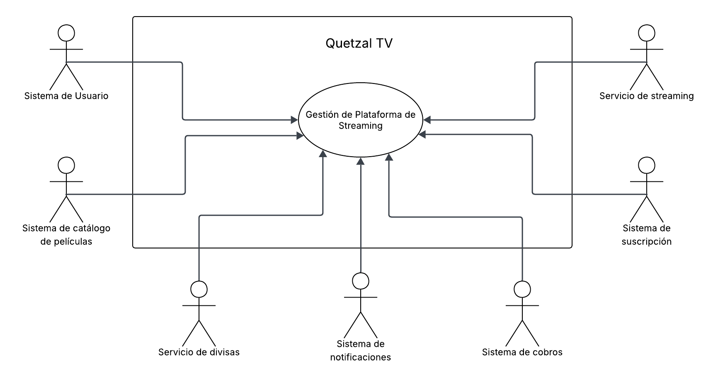
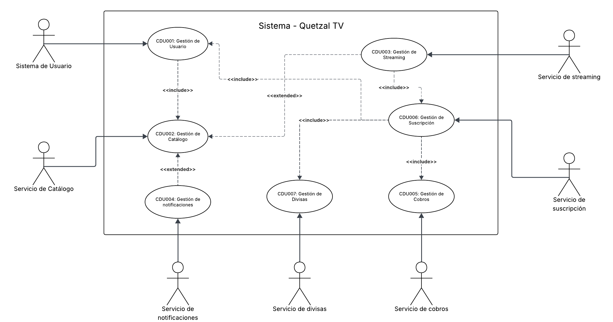

# Casos de Uso

## Core del negocio
| Representación | Actor | Descripción |
|----|-------------|-------------|
|  | **Cliente** | Usuario que interactúa con el sistema para registrarse, iniciar sesión, buscar cines por ciudad, visualizar cartelera, seleccionar asientos y comprar boletos |
|  | **Administrador** | Usuario con permisos especiales para gestionar el sistema, incluyendo la administración de películas, funciones y usuarios. |
|  | **Servicio de Divisas** | Servicio externo que proporciona la conversión de monedas para las transacciones en el sistema. |
|  | **Sistema de Usuarios** | Sistema interno que gestiona la creación y administración de cuentas de usuario. |
|  | **Servicio de Cobros** | Servicio externo que maneja el proceso de pago para las transacciones en el sistema. |
|  | **Servicio de Notificaciones** | Servicio externo que se encarga de enviar notificaciones a los usuarios del sistema. |
|  | **Servicio de Streaming** | Servicio externo que proporciona la transmisión de contenido para las transacciones en el sistema. |
|  | **Servicio de Catalogo** | Servicio externo que proporciona el catálogo de películas para las transacciones en el sistema. |

## Casos de uso de alto nivel

## Primera descomposición

**CDU01**: **Gestión de Usuario**: Es el punto central del sistema para cualquier usuario. Permite el registro y manejo de datos personales de los usuarios, así como la gestión de sesión y preferencias en la aplicación.

- **CDU-001.1**: Registrar Cliente
- **CDU-001.2**: Iniciar Sesión
- **CDU-001.3**: Actualizar Datos Personales
- **CDU-001.4**: Cambiar Contraseña
- **CDU-001.5**: Cerrar Sesión
- **CDU-001.6**: Crear Perfil
- **CDU-001.7**: Modificar Perfil
- **CDU-001.8**: Eliminar Perfil
- **CDU-001.9**: Consultar Historial de Reproducción

**CDU02**: **Gestión de Catálogo**: Permite a los usuarios explorar, consultar y administrar el contenido disponible en la plataforma (películas y series).

- **CDU-002.1**: Visualizar Catálogo
- **CDU-002.2**: Buscar Contenido
- **CDU-002.3**: Filtrar Catálogo
- **CDU-002.4**: Ver Detalle de Contenido
- **CDU-002.5**: Registrar Contenido
- **CDU-002.6**: Cargar Contenido
- **CDU-002.7**: Modificar Contenido
- **CDU-002.8**: Eliminar Contenido
- **CDU-002.9**: Calificar Contenido

**CDU03**: **Gestión de Streaming**: Administra el contenido solicitado por los usuarios del sistema.

- **CDU-003.1**: Reproducir Contenido
- **CDU-003.2**: Controlar Reproducción (pausar, reanudar, avanzar)
- **CDU-003.3**: Registrar Progreso de Visualización

**CDU04**: **Gestión de Notificaciones**: Gestiona las notificaciones del sistema, informandole a los usuarios acerca de nuevo contenido, actualización de suscripción, pago procesado, entre otros.

- **CDU-004.1**: Enviar Confirmación de Registro
- **CDU-004.2**: Enviar Recibo de Pago
- **CDU-004.3**: Enviar Confirmación de Actualización de Suscripción
- **CDU-004.4**: Enviar Alerta de Nuevo Contenido

**CDU05**: **Gestión de Cobros**: Maneja los cobros asociados a las transacciones del sistema.

- **CDU-005.1**: Procesar Pago
- **CDU-005.2**: Consultar Historial de Pagos
- **CDU-005.3**: Generar Recibo de Pago

**CDU06**: **Gestión de Suscripción**: Permite a los usuarios consultar, contratar y gestionar sus planes de suscripción dentro del sistema.

- **CDU-006.1**: Ver Planes Disponibles
- **CDU-006.2**: Contratar Suscripción
- **CDU-006.3**: Modificar Plan de Suscripción
- **CDU-006.4**: Cancelar Suscripción

**CDU07**: **Gestión de Divisas**: Administra la conversión de precios entre diferentes monedas.

- **CDU-007.1**: Consultar Tipo de Cambio
- **CDU-007.2**: Convertir Precio a Moneda Local
- **CDU-007.3**: Actualizar Caché de Tasas de Cambio

