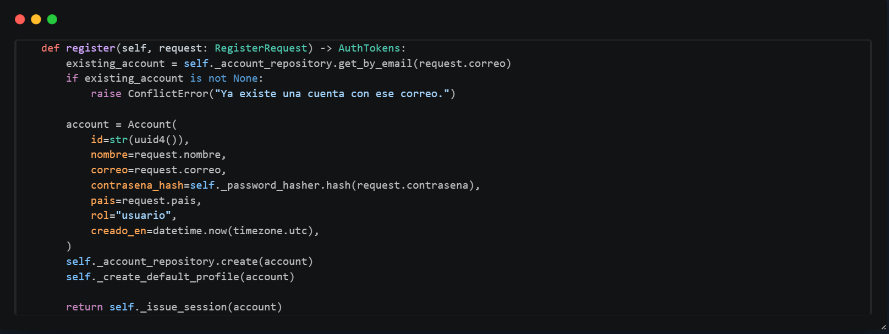

# Principios SOLID por microservicio del backend

Este documento explica un ejemplo de cada principio SOLID en cada microservicio principal del backend:

- Usuarios
- Suscripcion
- Catalogo
- Notificaciones
- Streaming
- Pagos, implementado en el repositorio como `cobros`

Cada ruta es un enlace directo al archivo donde se puede revisar el codigo.

## 1. Microservicio de usuarios

### S - Single Responsibility Principle

**Ruta:** [auth_service.py](../../backend/services/usuario/app/application/auth_service.py)

`AuthService` se encarga de coordinar los casos de uso de usuarios: registro, login, validacion de token, cierre de sesion, cambio de contrasena y manejo de perfiles. No guarda datos directamente en PostgreSQL ni genera tokens por su cuenta; esas tareas se delegan a repositorios, `PasswordHasher` y `JwtService`.

**Ejemplo:** en `register`, el servicio valida si el correo ya existe, crea la entidad `Account`, delega el hash de contrasena y luego guarda la cuenta usando el repositorio.



```python
def register(self, request: RegisterRequest) -> AuthTokens:
    existing_account = self._account_repository.get_by_email(request.correo)
    if existing_account is not None:
        raise ConflictError("Ya existe una cuenta con ese correo.")

    account = Account(
        id=str(uuid4()),
        nombre=request.nombre,
        correo=request.correo,
        contrasena_hash=self._password_hasher.hash(request.contrasena),
        pais=request.pais,
        rol="usuario",
        creado_en=datetime.now(timezone.utc),
    )
    self._account_repository.create(account)
```

### O - Open/Closed Principle

**Ruta:** [repositories.py](../../backend/services/usuario/app/application/repositories.py)

El servicio esta abierto a nuevas implementaciones de persistencia porque depende de contratos como `AccountRepository`, `ProfileRepository` y `SessionRepository`. Se puede agregar otro repositorio sin modificar la logica de `AuthService`.

**Ejemplo:** `AccountRepository` define los metodos que debe cumplir cualquier implementacion, ya sea PostgreSQL, memoria u otra tecnologia.


```python
class AccountRepository(Protocol):
    def create(self, account: Account) -> None: ...
    def get_by_email(self, email: str) -> Account | None: ...
    def get_by_id(self, account_id: str) -> Account | None: ...
    def update(self, account: Account) -> None: ...
```

### L - Liskov Substitution Principle

**Rutas:** [postgres_account_repository.py](../../backend/services/usuario/app/infrastructure/repositories/postgres_account_repository.py) y [in_memory_account_repository.py](../../backend/services/usuario/app/infrastructure/repositories/in_memory_account_repository.py)

Ambas clases pueden sustituir al contrato `AccountRepository` porque exponen los mismos metodos esperados por la capa de aplicacion.

**Ejemplo:** `AuthService` puede recibir `PostgresAccountRepository` o `InMemoryAccountRepository` y seguir funcionando porque ambos respetan el contrato de creacion, busqueda y actualizacion de cuentas.

```python
if settings.storage_backend == "postgres":
    account_repository = PostgresAccountRepository(database)
else:
    account_repository = InMemoryAccountRepository()
```

### I - Interface Segregation Principle

**Ruta:** [repositories.py](../../backend/services/usuario/app/application/repositories.py)

Los contratos estan separados por responsabilidad: cuentas, sesiones y perfiles. Asi cada implementacion solo cumple los metodos que corresponden a su entidad.

**Ejemplo:** `SessionRepository` solo define `create`, `get_by_id` y `update`; no obliga a implementar metodos de cuentas o perfiles.

```python
class SessionRepository(Protocol):
    def create(self, session: Session) -> None: ...
    def get_by_id(self, session_id: str) -> Session | None: ...
    def update(self, session: Session) -> None: ...
```

### D - Dependency Inversion Principle

**Ruta:** [container.py](../../backend/services/usuario/app/infrastructure/container.py)

`AuthService` no crea sus dependencias concretas. El contenedor arma los repositorios, servicios de seguridad y configuracion, y luego los inyecta al servicio.

**Ejemplo:** `build_container` decide si usar repositorios PostgreSQL o en memoria y despues construye `AuthService` con esas dependencias.

```python
auth_service = AuthService(
    account_repository=account_repository,
    profile_repository=profile_repository,
    session_repository=session_repository,
    password_hasher=password_hasher,
    jwt_service=jwt_service,
    jwt_expire_minutes=settings.jwt_expire_minutes,
)
```

## 2. Microservicio de suscripcion

### S - Single Responsibility Principle

**Ruta:** [subscription_service.py](../../backend/services/suscripcion/app/application/subscription_service.py)

`SubscriptionService` concentra las reglas de planes y suscripciones: crear planes, listar planes activos, cotizar precios, crear suscripciones, cambiar plan y cancelar suscripcion.

**Ejemplo:** `create_subscription` valida que el plan exista, verifica que la cuenta no tenga otra suscripcion activa y luego crea la suscripcion.

```python
def create_subscription(self, request: CreateSubscriptionRequest) -> Subscription:
    plan = self._plan_repository.get_by_id(request.plan_id)
    if plan is None or not plan.activo:
        raise NotFoundError("Plan no encontrado.")

    existing_subscription = self._subscription_repository.get_active_by_account_id(
        request.cuenta_id
    )
    if existing_subscription is not None:
        raise ConflictError("La cuenta ya tiene una suscripcion activa.")
```

### O - Open/Closed Principle

**Ruta:** [repositories.py](../../backend/services/suscripcion/app/application/repositories.py)

El servicio depende de abstracciones (`PlanRepository` y `SubscriptionRepository`), por lo que se pueden agregar nuevas implementaciones sin cambiar la logica de negocio.

**Ejemplo:** si se quisiera guardar planes en otra base de datos, bastaria con crear otra clase que implemente `PlanRepository`.

```python
class PlanRepository(Protocol):
    def create(self, plan: Plan) -> Plan: ...
    def list_active(self) -> list[Plan]: ...
    def get_by_id(self, plan_id: str) -> Plan | None: ...
```

### L - Liskov Substitution Principle

**Ruta:** [postgres_plan_repository.py](../../backend/services/suscripcion/app/infrastructure/repositories/postgres_plan_repository.py)

`PostgresPlanRepository` puede usarse donde el servicio espera un `PlanRepository`, porque cumple con los metodos definidos en el contrato.

**Ejemplo:** `SubscriptionService` llama `get_by_id` y `list_active` sin conocer si el repositorio usa PostgreSQL u otra tecnologia.

```python
def list_active_plans(self) -> list[Plan]:
    return self._plan_repository.list_active()
```

### I - Interface Segregation Principle

**Ruta:** [repositories.py](../../backend/services/suscripcion/app/application/repositories.py)

Las operaciones de planes y suscripciones estan divididas en interfaces distintas. Esto evita una interfaz grande que mezcle responsabilidades.

**Ejemplo:** `PlanRepository` solo maneja planes, mientras `SubscriptionRepository` maneja suscripciones activas, busqueda por cuenta y actualizacion.

```python
class SubscriptionRepository(Protocol):
    def create(self, subscription: Subscription) -> Subscription: ...
    def get_active_by_account_id(self, account_id: str) -> Subscription | None: ...
    def list_active_account_ids(self) -> list[str]: ...
    def get_by_id(self, subscription_id: str) -> Subscription | None: ...
    def update(self, subscription: Subscription) -> Subscription: ...
```

### D - Dependency Inversion Principle

**Ruta:** [container.py](../../backend/services/suscripcion/app/infrastructure/container.py)

El contenedor crea las dependencias concretas y las entrega a `SubscriptionService`. La capa de aplicacion no instancia directamente PostgreSQL ni el cliente de divisas.

**Ejemplo:** `SubscriptionService` recibe `PostgresPlanRepository`, `PostgresSubscriptionRepository` y `DivisasClient` desde `build_container`.

```python
subscription_service = SubscriptionService(
    plan_repository=PostgresPlanRepository(database),
    subscription_repository=PostgresSubscriptionRepository(database),
    divisas_client=DivisasClient(
        target=settings.api_gateway_url,
        timeout_seconds=settings.conversion_timeout_seconds,
    ),
)
```

## 3. Microservicio de catalogo

### S - Single Responsibility Principle

**Ruta:** [service.go](../../backend/services/catalogo/internal/application/service.go)

`CatalogoService` orquesta los casos de uso del catalogo: listar contenido, buscar, filtrar, crear, actualizar, eliminar, calificar y administrar episodios.

**Ejemplo:** `Create` normaliza datos del contenido, valida duplicados y delega la persistencia al repositorio.

```go
func (s *CatalogoService) Create(ctx context.Context, c *domain.Content, genreIDs []int64) (string, error) {
    c.Title = strings.TrimSpace(c.Title)

    exists, err := s.repo.ExistsByTitleAndType(ctx, c.Title, c.Type)
    if err != nil {
        return "", err
    }
    if exists {
        return "", domain.ErrDuplicateContent
    }

    return s.repo.Create(ctx, c, genreIDs)
}
```

### O - Open/Closed Principle

**Ruta:** [content.go](../../backend/services/catalogo/internal/domain/content.go)

La capa de aplicacion depende de la interfaz `ContentRepository`. Esto permite extender la infraestructura con otro repositorio sin cambiar `CatalogoService`.

**Ejemplo:** se podria agregar un repositorio basado en otro motor de datos mientras mantenga los metodos de `ContentRepository`.

```go
type CatalogoService struct {
    repo domain.ContentRepository
}

func New(repo domain.ContentRepository) *CatalogoService {
    return &CatalogoService{repo: repo}
}
```

### L - Liskov Substitution Principle

**Rutas:** [content.go](../../backend/services/catalogo/internal/domain/content.go) y [repository.go](../../backend/services/catalogo/internal/infrastructure/postgres/repository.go)

El repositorio PostgreSQL puede sustituir a `ContentRepository` porque implementa las operaciones esperadas por el servicio.

**Ejemplo:** `CatalogoService` usa `s.repo.List`, `s.repo.Search` y `s.repo.Create` sin depender del tipo concreto del repositorio.

```go
func (s *CatalogoService) Search(ctx context.Context, query string) ([]domain.Content, error) {
    if query == "" {
        return s.repo.List(ctx)
    }
    return s.repo.Search(ctx, query)
}
```

### I - Interface Segregation Principle

**Ruta:** [content.go](../../backend/services/catalogo/internal/domain/content.go)

El contrato `ContentRepository` agrupa solo operaciones relacionadas con catalogo y contenido. No mezcla responsabilidades de pagos, usuarios o streaming.

**Ejemplo:** la interfaz incluye metodos como `List`, `Search`, `FilterByGenres`, `Rate` y `CreateEpisodeBatch`, todos relacionados con el dominio de catalogo.

```go
type ContentRepository interface {
    List(ctx context.Context) ([]Content, error)
    Search(ctx context.Context, query string) ([]Content, error)
    FilterByGenres(ctx context.Context, genreIDs []int64) ([]Content, error)
    Rate(ctx context.Context, r *Rating) (float64, error)
    CreateEpisodeBatch(ctx context.Context, contentID string, batch EpisodeBatch) ([]Episode, error)
}
```

### D - Dependency Inversion Principle

**Ruta:** [main.go](../../backend/services/catalogo/cmd/server/main.go)

El servicio de aplicacion recibe un repositorio ya construido. La funcion `main` se encarga de crear la conexion a PostgreSQL, el repositorio y luego inyectarlo.

**Ejemplo:** `repo := postgres.NewContentRepository(pool)` y despues `svc := application.New(repo)`.

```go
repo := postgres.NewContentRepository(pool)
svc := application.New(repo)
handler := grpchandler.NewHandler(svc, alertDispatcher)
httpHandler := httphandler.NewHandler(svc, alertDispatcher)
```

## 4. Microservicio de notificaciones

### S - Single Responsibility Principle

**Ruta:** [service.ts](../../backend/services/notificaciones/src/application/service.ts)

El servicio de aplicacion se encarga de los casos de uso de notificaciones: confirmacion de registro, recibo y alerta de nueva publicacion.

**Ejemplo:** `enviarRecibo` prepara el correo de recibo, intenta enviarlo y registra el resultado de la notificacion.

```ts
export async function enviarRecibo(opts: {
  correo_destino: string;
  nombre_usuario: string;
  id_transaccion: string;
  descripcion_plan: string;
  monto: number;
  moneda: string;
  fecha: string;
}): Promise<ResultadoEnvioNotificacion> {
  const { asunto, html } = tmplRecibo({
    nombre: opts.nombre_usuario,
    id_transaccion: opts.id_transaccion,
    descripcion_plan: opts.descripcion_plan,
    monto: opts.monto,
    moneda: opts.moneda,
    fecha: opts.fecha,
  });
```

### O - Open/Closed Principle

**Ruta:** [notification.ts](../../backend/services/notificaciones/src/domain/notification.ts)

Los tipos de dominio permiten extender los casos de notificacion de forma controlada. El sistema ya diferencia tipos como `confirmacion_registro`, `recibo` y `alerta_publicacion`.

**Ejemplo:** para agregar una nueva notificacion se puede extender `TipoNotificacion` y crear un nuevo caso de uso sin alterar la estructura base de `Notificacion`.

```ts
export type TipoNotificacion =
  | 'confirmacion_registro'
  | 'recibo'
  | 'alerta_publicacion';
```

### L - Liskov Substitution Principle

**Ruta:** [mailer.ts](../../backend/services/notificaciones/src/infrastructure/mailer.ts)

La funcion `sendMail` expone una forma estable de enviar correos. Mientras otra implementacion respete la misma entrada (`to`, `subject`, `html`) y devuelva una promesa, puede sustituir al envio actual con Nodemailer.

**Ejemplo:** un mailer SMTP diferente o un proveedor externo podria reemplazar `transporter.sendMail` manteniendo la firma de `sendMail`.

```ts
export async function sendMail(opts: {
  to: string | string[];
  subject: string;
  html: string;
}): Promise<void> {
  await transporter.sendMail({
    from: emailFrom,
    to: Array.isArray(opts.to) ? opts.to.join(', ') : opts.to,
    subject: opts.subject,
    html: opts.html,
  });
}
```

### I - Interface Segregation Principle

**Ruta:** [handler.ts](../../backend/services/notificaciones/src/interfaces/grpc/handler.ts)

Los handlers gRPC estan separados por operacion: confirmacion de registro, recibo y alerta de publicacion. Cada funcion recibe solo los datos necesarios para ese caso.

**Ejemplo:** `handleEnviarRecibo` valida `id_transaccion` y llama `enviarRecibo`; no procesa confirmaciones de registro ni alertas.

```ts
async function handleEnviarRecibo(call: AnyCall, callback: AnyCallback): Promise<void> {
  const req = call.request as {
    correo_destino: string;
    nombre_usuario: string;
    id_transaccion: string;
    descripcion_plan: string;
    monto: number;
    moneda: string;
    fecha: string;
  };
  const result = await enviarRecibo(req);
}
```

### D - Dependency Inversion Principle

**Ruta:** [server.ts](../../backend/services/notificaciones/src/server.ts)

El servidor de entrada no implementa la logica de notificacion. Solo registra rutas HTTP/gRPC y llama a la capa de aplicacion.

**Ejemplo:** para `/api/v1/recibo`, el servidor lee el cuerpo HTTP y delega el caso de uso a `enviarRecibo`.

```ts
if (method === 'POST' && url === '/api/v1/recibo') {
  const body = await readBody(req);
  const result = await enviarRecibo({
    correo_destino: String(body['correo_destino'] ?? ''),
    nombre_usuario: String(body['nombre_usuario'] ?? ''),
    id_transaccion,
    descripcion_plan: String(body['descripcion_plan'] ?? ''),
    monto: Number(body['monto'] ?? 0),
    moneda: String(body['moneda'] ?? ''),
    fecha: String(body['fecha'] ?? ''),
  });
}
```

## 5. Microservicio de streaming

### S - Single Responsibility Principle

**Ruta:** [service.go](../../backend/services/streaming/internal/application/service.go)

`StreamingService` se enfoca en reproduccion: actualizar progreso, consultar progreso y obtener historial.

**Ejemplo:** `UpdateProgress` solo coordina la actualizacion del historial y delega la persistencia a `PlaybackRepository`.

```go
func (s *StreamingService) UpdateProgress(
    ctx context.Context,
    h *domain.PlaybackHistory,
    totalDuration int,
) (domain.PlaybackState, error) {
    return s.repo.Upsert(ctx, h, totalDuration)
}
```

### O - Open/Closed Principle

**Ruta:** [playback.go](../../backend/services/streaming/internal/domain/playback.go)

El servicio depende de la interfaz `PlaybackRepository`, lo que permite extender o cambiar la infraestructura sin modificar la logica de aplicacion.

**Ejemplo:** se podria agregar otro repositorio para almacenar progreso en otra base de datos manteniendo `Upsert`, `GetProgress` y `GetHistory`.

```go
type StreamingService struct {
    repo domain.PlaybackRepository
}

func New(repo domain.PlaybackRepository) *StreamingService {
    return &StreamingService{repo: repo}
}
```

### L - Liskov Substitution Principle

**Rutas:** [playback.go](../../backend/services/streaming/internal/domain/playback.go) y [repository.go](../../backend/services/streaming/internal/infrastructure/postgres/repository.go)

El repositorio PostgreSQL puede sustituir a `PlaybackRepository` porque cumple con los metodos que el servicio necesita.

**Ejemplo:** `StreamingService` invoca `s.repo.GetHistory` sin conocer la implementacion concreta.

```go
func (s *StreamingService) GetHistory(
    ctx context.Context,
    profileID string,
    limit int,
) ([]domain.PlaybackHistory, error) {
    return s.repo.GetHistory(ctx, profileID, limit)
}
```

### I - Interface Segregation Principle

**Ruta:** [playback.go](../../backend/services/streaming/internal/domain/playback.go)

`PlaybackRepository` es una interfaz pequena y especifica del dominio de reproduccion.

**Ejemplo:** solo define `Upsert`, `GetProgress` y `GetHistory`; no obliga a implementar operaciones de catalogo, usuarios o pagos.

```go
type PlaybackRepository interface {
    Upsert(ctx context.Context, h *PlaybackHistory, totalDuration int) (PlaybackState, error)
    GetProgress(ctx context.Context, profileID, contentID, episodeID string) (*PlaybackHistory, error)
    GetHistory(ctx context.Context, profileID string, limit int) ([]PlaybackHistory, error)
}
```

### D - Dependency Inversion Principle

**Ruta:** [main.go](../../backend/services/streaming/cmd/server/main.go)

La funcion `main` crea la infraestructura concreta y luego inyecta el repositorio al servicio.

**Ejemplo:** `repo := postgres.NewPlaybackRepository(pool)` y despues `svc := application.New(repo)`.

```go
repo := postgres.NewPlaybackRepository(pool)
svc := application.New(repo)
handler := grpchandler.NewHandler(svc)
httpHandler := httphandler.NewHandler(svc)
```

## 6. Microservicio de pagos (`cobros`)

### S - Single Responsibility Principle

**Ruta:** [cobros-service.ts](../../backend/services/cobros/src/application/cobros-service.ts)

El servicio de cobros se encarga del caso de uso de pagos: procesar transacciones, consultar transacciones, listar transacciones y obtener recibos.

**Ejemplo:** `procesarPago` coordina la conversion de monto, registra la compra, recupera la transaccion y gestiona el envio del recibo.

```ts
export async function procesarPago(input: ProcesarPagoInput): Promise<ProcesarPagoResult> {
  const referencia = `SIM-${randomUUID()}`;
  const estado: EstadoPago = 'aprobado';
  const montoLocal = await convertirMontoDesdeBase(input.monto_base, input.moneda_local);

  const client = await pool.connect();
  try {
    await client.query('BEGIN');
    await client.query(
      `CALL sp_registrar_compra($1, $2, $3, $4::tipo_operacion_pago, $5, $6, $7, $8::estado_pago, $9, $10)`,
      [input.cuenta_id, input.suscripcion_id, input.plan_id, input.tipo_operacion, input.monto_base, montoLocal, input.moneda_local, estado, referencia, input.correo_destino],
    );
```

### O - Open/Closed Principle

**Ruta:** [payment.ts](../../backend/services/cobros/src/domain/payment.ts)

Los tipos de dominio separan estados, operaciones, transacciones, recibos y entradas del proceso de pago. Esto permite extender el dominio agregando nuevos estados u operaciones de forma controlada.

**Ejemplo:** `TipoOperacion` diferencia `contratacion` y `modificacion_plan`; se puede agregar otra operacion sin cambiar la forma base de `Transaccion`.

```ts
export type EstadoPago = 'pendiente' | 'aprobado' | 'rechazado' | 'cancelado';
export type TipoOperacion = 'contratacion' | 'modificacion_plan';

export interface Transaccion {
  id: string;
  cuenta_id: string;
  plan_id: string;
  tipo_operacion: TipoOperacion;
  estado: EstadoPago;
}
```

### L - Liskov Substitution Principle

**Ruta:** [divisas-client.ts](../../backend/services/cobros/src/infrastructure/divisas-client.ts)

`procesarPago` depende de una funcion que convierte montos desde la moneda base. Otra implementacion podria reemplazarla si mantiene el mismo contrato de entrada y salida.

**Ejemplo:** `convertirMontoDesdeBase(montoBase, monedaDestino)` devuelve un `Promise<number>`; puede sustituirse por un cliente gRPC o un mock en pruebas si conserva esa firma.

```ts
export async function convertirMontoDesdeBase(
  montoBase: number,
  monedaDestino: string,
): Promise<number> {
  const destino = monedaDestino.toUpperCase();

  if (destino === BASE_CURRENCY) {
    return montoBase;
  }
```

### I - Interface Segregation Principle

**Ruta:** [handler.ts](../../backend/services/cobros/src/interfaces/grpc/handler.ts)

Los handlers gRPC estan separados por caso de uso: procesar pago, obtener transaccion, listar transacciones y obtener recibo.

**Ejemplo:** `handleObtenerRecibo` solo recibe `transaccion_id` y devuelve el recibo; no necesita conocer datos de procesamiento de pago.

```ts
async function handleObtenerRecibo(call: AnyCall, callback: AnyCallback): Promise<void> {
  const req = call.request as { transaccion_id: string };
  const recibo = await obtenerRecibo(req.transaccion_id);
  callback(null, reciboToProto(recibo));
}
```

### D - Dependency Inversion Principle

**Ruta:** [server.ts](../../backend/services/cobros/src/server.ts)

El servidor HTTP/gRPC actua como capa de entrada y delega la logica a la capa de aplicacion.

**Ejemplo:** la ruta `/api/v1/payments/process` valida el request y luego llama `procesarPago`, en lugar de implementar el procesamiento directamente en el servidor.

```ts
if (req.method === 'POST' && parsedUrl.pathname === '/api/v1/payments/process') {
  const result = await procesarPago({
    cuenta_id: cuentaId,
    suscripcion_id: suscripcionIdRaw || null,
    plan_id: planId,
    tipo_operacion: tipoOperacion,
    monto_base: montoBase,
    moneda_local: monedaLocal,
    correo_destino: correoDestino,
  });
}
```

## Resumen

Cada microservicio aplica los principios SOLID con una separacion general entre:

- `domain`: entidades, tipos, errores y contratos.
- `application`: casos de uso y reglas de negocio.
- `infrastructure`: base de datos, clientes externos, correo y seguridad.
- `interfaces`: entrada HTTP o gRPC.

Los ejemplos anteriores muestran una aplicacion concreta de los cinco principios en cada servicio solicitado.
