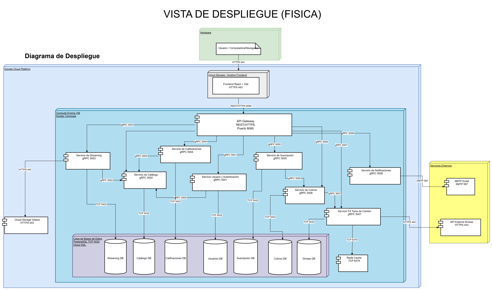

# Vista de Arquitectura 4+1

## Introducción

El modelo **4+1** permite describir la arquitectura del sistema desde diferentes perspectivas para explicar no solo cómo está construido el software, sino también cómo se ejecuta e interactúa en un entorno real. Para **Quetxal TV**, este enfoque resulta adecuado porque el proyecto exige una arquitectura de microservicios, comunicación interna por `gRPC`, un `API Gateway` como punto único de entrada, backend políglota con `TypeScript`, `Go` y `Python`, y despliegue en `Google Cloud Platform`.

En esta sección se documentan dos vistas apoyadas por las imágenes proporcionadas por el equipo:

- La **vista de despliegue**, representada por `VISTAFISICA.png`.
- La **vista de desarrollo**, representada por `VISTA DE COMPONENTES.png`.

## Vista de Desarrollo

La **vista de desarrollo** describe cómo está organizado el sistema desde la perspectiva del diseño del software. Su objetivo no es mostrar puertos o nodos físicos, sino la forma en que el sistema se divide en capas, paquetes y componentes para facilitar su construcción, mantenimiento y evolución.

### Naturaleza del diagrama

La imagen utilizada para esta vista no representa un diagrama de despliegue, sino una combinación entre:

- **Diagrama de paquetes**, porque agrupa el sistema en capas o bloques lógicos.
- **Diagrama de componentes**, porque dentro de esas capas identifica piezas concretas del sistema.

Por ello, esta vista de desarrollo puede explicarse como una representación estructural del software.

### Organización por capas

El sistema se divide en cinco grandes áreas:

- **Capa UI**
- **Capa de Aplicación**
- **Capa de Negocio**
- **Capa de Infraestructura**
- **Capa de Datos**

Esta organización permite separar responsabilidades y mantener una arquitectura más clara y desacoplada.

### Capa UI

La **Capa UI** contiene el componente `frontend-react-vite`, que representa la interfaz de usuario de la plataforma. Desde esta capa se ofrecen las funciones visibles para el cliente, como autenticación, navegación por el catálogo, gestión de suscripción, reproducción de contenido y calificaciones.

### Capa de Aplicación

La **Capa de Aplicación** contiene el `Api-Gateway`. Desde la vista de desarrollo, este componente se entiende como el coordinador de acceso al backend, encargado de recibir las solicitudes del frontend y delegarlas al microservicio correspondiente.

### Capa de Negocio

La **Capa de Negocio** concentra los servicios que implementan las reglas funcionales del sistema:

- `Servicio Usuario y autenticación`
- `Servicio de Catálogo`
- `Servicio de Streaming`
- `Servicio de Calificación`
- `Servicio de Suscripción`
- `Servicio de Cobros`
- `Servicio de Notificaciones`
- `Servicio FX Tipos de cambio`

Aquí se representa la descomposición del dominio en microservicios autónomos. Cada uno responde a una necesidad específica del enunciado y encapsula su propia lógica de negocio.

### Capa de Infraestructura

La **Capa de Infraestructura** contiene dependencias técnicas externas necesarias para la operación del sistema:

- `smtp-email`
- `api-externa-divisas`
- `cloud-storage-videos`

Desde la vista de desarrollo, estos elementos se presentan como recursos o integraciones que los componentes internos consumen, pero no forman parte de la lógica principal del negocio.

### Capa de Datos

La **Capa de Datos** agrupa los repositorios persistentes del sistema:

- `Usuarios Base de Datos PostgreSQL`
- `Catálogo Base de Datos PostgreSQL`
- `Streaming Base de Datos PostgreSQL`
- `Calificaciones Base de Datos PostgreSQL`
- `Suscripción Base de Datos PostgreSQL`
- `Cobros Base de Datos PostgreSQL`
- `Divisas Base de Datos PostgreSQL`
- `Redis-cache TTL divisas`

Aunque aquí aparecen bases de datos concretas, en la vista de desarrollo su función es mostrar qué componentes de software dependen de qué almacenes de información, reforzando la separación por dominio.

### Interpretación de la vista de desarrollo

Esta vista deja ver que el sistema no está organizado como una aplicación monolítica, sino como una solución modular con capas bien definidas. También permite identificar que:

- El frontend está separado del backend.
- El acceso al backend está centralizado en el `API Gateway`.
- La lógica del negocio está dividida por microservicios.
- La persistencia está desacoplada por dominio.
- Las integraciones externas están aisladas en una capa propia.

Esto hace que la arquitectura sea más mantenible, escalable y coherente con los principios de desacoplamiento solicitados en el proyecto.

## Vista de Despliegue

La **vista de despliegue** describe cómo se distribuyen físicamente los componentes del sistema dentro de la infraestructura tecnológica. Esta vista muestra nodos, servicios desplegados, protocolos de comunicación, puertos, bases de datos, caché e integraciones externas.

### Descripción general

El diagrama ubica la solución dentro de **Google Cloud Platform**. Desde el punto de vista físico, el usuario accede al sistema por medio de un navegador o computadora, estableciendo una conexión segura `HTTPS` por el puerto `443`. A partir de ahí, la arquitectura se divide en varios nodos y recursos claramente identificables.

### Cliente y frontend

El cliente consume la aplicación web desde un navegador. El frontend desarrollado con **React + Vite** se encuentra alojado en un servicio de **Cloud Storage / Hosting Frontend**, el cual expone acceso por `HTTPS 443`. Este frontend no accede de forma directa a los microservicios, sino que envía sus solicitudes al `API Gateway`.

### API Gateway

El `API Gateway` actúa como punto central de entrada a la plataforma y expone comunicación `REST/HTTPS` por el puerto `8080`. Este componente concentra el enrutamiento y la seguridad, y desde aquí se redirigen las peticiones hacia los microservicios internos.

Su presencia cumple con uno de los requisitos principales del enunciado: ningún cliente externo debe consumir directamente los servicios internos del backend.

### Microservicios internos

Dentro de una **VM de Compute Engine** administrada con **Docker Compose** se despliegan los microservicios principales del sistema:

- `Servicio de Usuario y Autenticación`
- `Servicio de Catálogo`
- `Servicio de Streaming`
- `Servicio de Calificaciones`
- `Servicio de Suscripción`
- `Servicio de Cobros`
- `Servicio FX Tipos de Cambio`
- `Servicio de Notificaciones`

La comunicación entre estos servicios se realiza mediante `gRPC`, utilizando puertos dedicados como `5001` a `5008`, lo cual refleja la integración sincrónica exigida por el proyecto.

### Persistencia de datos

Cada microservicio se conecta a su propia base de datos `PostgreSQL`, accesible por `TCP 5432`, siguiendo el patrón **Database per Microservice**. En el diagrama se identifican:

- `Streaming DB`
- `Catálogo DB`
- `Calificaciones DB`
- `Usuarios DB`
- `Suscripción DB`
- `Cobros DB`
- `Divisas DB`

Esta separación mejora el aislamiento entre dominios y facilita el mantenimiento y la escalabilidad de la solución.

### Caché y servicios externos

La arquitectura incorpora un nodo de `Redis Cache` por `TCP 6379`, utilizado principalmente por el servicio `FX Tipos de Cambio` para almacenar temporalmente información de divisas y evitar consultas repetitivas a la API externa.

Además, el sistema se integra con servicios externos:

- `SMTP Email`, consumido por el servicio de notificaciones mediante `SMTP 587`.
- `API Externa Divisas`, consumida por el servicio FX mediante `HTTPS 443`.
- `Cloud Storage Videos`, utilizado para el acceso a contenido multimedia por `HTTPS 443`.

En conjunto, esta vista demuestra cómo la plataforma se ejecuta realmente en infraestructura cloud y cómo se conectan sus recursos internos y externos.

## Conclusión

Las imágenes actuales están alineadas con dos vistas distintas dentro del modelo **4+1**. `VISTAFISICA.png` corresponde correctamente a la **vista de despliegue**, porque muestra infraestructura, nodos, protocolos, puertos, bases de datos y servicios externos. Por su parte, `VISTA DE COMPONENTES.png` corresponde a la **vista de desarrollo**, porque organiza el sistema por capas y componentes internos.

De esta manera, la documentación distingue correctamente entre cómo está construido el software y cómo se ejecuta en la infraestructura. Esta separación fortalece la claridad del documento técnico y lo alinea mejor con los requisitos del enunciado del proyecto.
