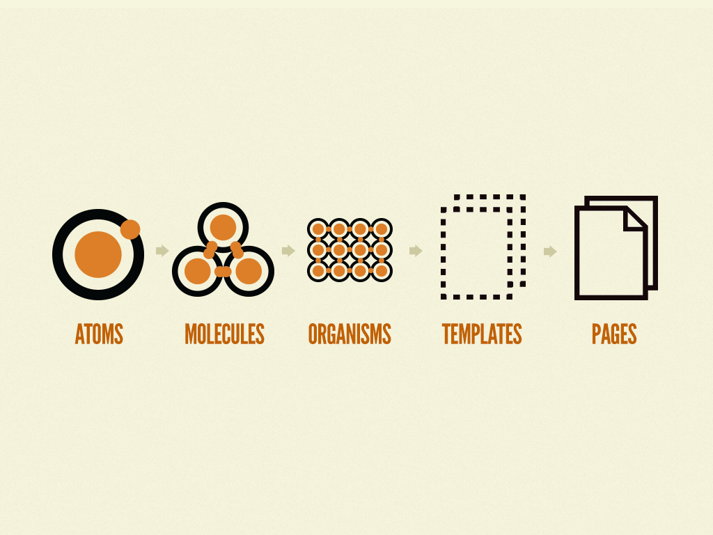

# Frontend

Stack tecnológico:
- React
- Vite
- TypeScript
- TailwindCSS

Gestor de paquetes:
- pnpm

Por lo tanto, para instalar las dependencias, ejecutar:
```bash
pnpm install
```

Para ejecutar el proyecto en modo desarrollo:
```bash
pnpm dev
```

Para ejecutar el proyecto en modo producción:
```bash
pnpm build
```

## Patrón de diseño atómico

Este proyecto utiliza el patrón de diseño atómico para la estructura de los componentes. Recordando que aunque el nombre DICE PATRÓN, NO ES UN PATRÓN DE DISEÑO, sino una forma de organizar los componentes de React.

La estructura de los componentes se organiza de la siguiente manera:

- atoms/
- molecules/
- organisms/
- templates/
- pages/



Los componentes se organizan de la siguiente manera:
- atoms/: componentes atómicos, como botones, inputs, etc.
- molecules/: componentes moleculares, como formularios, etc.
- organisms/: componentes orgánicos, como secciones, etc.
- templates/: componentes de plantilla, como layouts, etc.
- pages/: componentes de página, como vistas, etc.

COMO BUENA PRÁCTICA REALIZAREMOS SKELETONS CUANDO HAYA DEMORAS EN LA CARGA DE DATOS.

- Otra herramient es Storybook para documentar los componentes y poder visualizarlos de manera aislada.